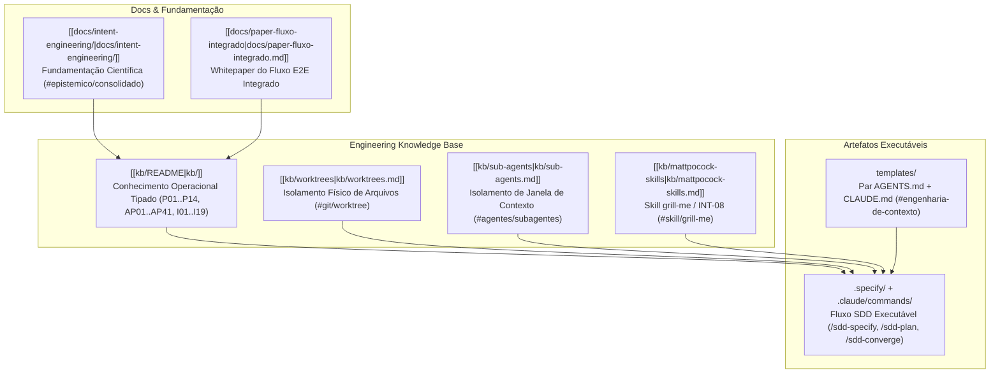

# labs · Engenharia de Sistemas Agênticos

> Base de conhecimento, arquitetura de pipelines e fluxo de trabalho determinístico para engenharia de software **com agentes de IA**.
> Repositório *upstream*: o que está aqui é consumido pelos projetos reais em `C:\workspace\`.
> 
> 📄 **Artigos Científicos & Whitepapers (Múltiplos Formatos)**:
> - 📱 **Página Web HTML (Mobile)**: [whitepaper-labs-resumo-executivo-mobile.html](file:///C:/workspace/labs/docs/whitepaper-labs-resumo-executivo-mobile.html) *(Interativo, Tema Escuro, zero rolagem horizontal)*
> - 📕 **Documento PDF**: [whitepaper-labs-resumo-executivo-mobile.pdf](file:///C:/workspace/labs/docs/whitepaper-labs-resumo-executivo-mobile.pdf) *(Para envio por WhatsApp/E-mail)*
> - 📱 **Markdown Mobile**: [[docs/whitepaper-labs-resumo-executivo-mobile|Edição Mobile Markdown]]
> - 🖥️ **Whitepaper Executivo Desktop**: [[docs/whitepaper-labs-resumo-executivo|Whitepaper Executivo Completo]]
> - 🔬 **Paper do Fluxo Integrado**: [[docs/paper-fluxo-integrado|Paper do Fluxo Integrado E2E]]

---

## 🏷️ Tags & Metadados do Obsidian

#engenharia-agentica #sdd/pipeline #git/worktree #agentes/subagentes #kb/knowledge-base #epistemico/consolidado #skill/grill-me

---

## 🔬 Para que serve

`labs` tem **dois papéis**, e vale saber em qual você está antes de mexer:

| Papel | Onde | Regra |
|---|---|---|
| **Laboratório** | `experiments/` | Protótipos descartáveis. Mudança livre, pode deletar. |
| **Fonte de verdade** | `kb/`, `.specify/`, `.claude/commands/`, `templates/` | Consumido por outros projetos. Trate como biblioteca compartilhada. |

Consequência: **edite sempre aqui, nunca na cópia instalada no projeto consumidor** — cópias que divergem entre harnesses é um anti-padrão catalogado (`[[kb/05-antipadroes#ap-15--cópia-manual-multi-harness|AP-15 · Cópia Manual Multi-Harness]]` / `#antipadrao/ap-15`).

---

## 📊 Visão Geral da Arquitetura em Camadas

Três camadas, da teoria à execução:

- **`[[kb/README|kb/]]`** — 14 documentos numerados + 4 destilações de fontes oficiais. Cada item é **citável por identificador** (`P05`, `AP-14`, `I-09`, `ADR-002`), e o namespace é global no repositório.
- **`.specify/` + `.claude/commands/`** — o fluxo **SDD** (Spec-Driven Development): 10 slash commands que levam de uma frase até código auditado contra a especificação.
- **`templates/`** — o par `AGENTS.md` / `CLAUDE.md` que dá contexto permanente ao agente em qualquer projeto novo.
- **`[[docs/intent-engineering/README|docs/intent-engineering/]]`** — 9 documentos de fundamentação, com **selo epistêmico** em cada afirmação, para separar o que é consolidado do que é hipótese própria.
- **`[[docs/paper-fluxo-integrado|docs/paper-fluxo-integrado.md]]`** — Whitepaper formalizando o ciclo completo de produção: `Task -> Git Worktree (EXE-05) -> sdd-specify + Skill grill-me (INT-08) -> sdd-plan -> Subagentes Workers (CTX-03) -> sdd-converge (AR-02 / I-09) -> Merge`.

---

## 🗂️ Resumo por Tipo de Conteúdo

### `[[kb/README|kb/]]` — Engineering Knowledge Base

Não é documentação linear: é um **grafo de artefatos**, cada tipo respondendo a uma pergunta diferente e envelhecendo em ritmo diferente.

| # | Documento | Responde | Identificadores |
|---|---|---|---|
| 00 | `[[kb/00-taxonomia|00 — Taxonomia]]` | Onde isto se encaixa? | `D0`–`D6` |
| 01 | `[[kb/01-ontologia|01 — Ontologia]]` | Como os conceitos se relacionam? | — |
| 02 | `[[kb/02-glossario|02 — Glossário]]` | O que este termo significa aqui? | — |
| 03 | `[[kb/03-principios|03 — Princípios]]` | **Por que** fazemos assim? | `P01`–`P14` |
| 04 | `[[kb/04-padroes|04 — Padrões]]` | Como resolvo este problema recorrente? | `CTX-` `INT-` `PLN-` `EXE-` `VER-` `LRN-` |
| 05 | `[[kb/05-antipadroes|05 — Anti-padrões]]` | O que falha repetidamente? | `AP-01`–`AP-41` |
| 06 | `[[kb/06-heuristicas-e-invariantes|06 — Heurísticas e Invariantes]]` | O que nunca pode ser violado? | `I-01`–`I-19` · `H-01`–`H-20` |
| 07 | `[[kb/07-modelos-mentais|07 — Modelos Mentais]]` | Como raciocinar sobre isto? | — |
| 08 | `[[kb/08-arquiteturas-e-pipelines|08 — Arquiteturas e Pipelines]]` | Que forma o sistema deve ter? | `AR-01`–`AR-04` · `PL-01`–`PL-05` |
| 09 | `[[kb/09-decisao-estados-algoritmos|09 — Decisão, Estados, Algoritmos]]` | O que fazer **neste ponto**? | `AD-01`–`AD-04` · `ME-01`–`ME-03` · `AL-01`–`AL-05` |
| 10 | `[[kb/10-metricas|10 — Métricas]]` | Como sei se está funcionando? | — |
| 11 | `[[kb/11-adrs|11 — ADRs]]` | Por que **isto** e não aquilo? | `ADR-001`–`ADR-012` |
| 12 | `[[kb/12-rastreabilidade|12 — Rastreabilidade]]` | Isto cobre aquilo? | — |
| 13 | `[[kb/13-bibliografia|13 — Bibliografia]]` | De onde vem a afirmação? | — |

Fora da numeração, destilações das fontes oficiais:
- `[[kb/anthropic-claude-code|Anthropic Claude Code KB]]`
- `[[kb/worktrees|Worktrees KB]]` (`#git/worktree`)
- `[[kb/sub-agents|Sub-agents KB]]` (`#agentes/subagentes`)
- `[[kb/prompt-library|Prompt Library KB]]` — os **52 prompts oficiais** da Anthropic com um índice de gatilho.
- `[[kb/mattpocock-skills|Matt Pocock Skills KB]]` — 21 skills de engenharia absorvidas como padrões (`ADR-011`). É de onde vêm `INT-08` (a entrevista conduzida — *grilling* / `#skill/grill-me`), `PLN-05` (módulo profundo), `PLN-06` (mapa sob névoa), `VER-06` (loop de feedback), `CTX-06`/`CTX-07` e `H-17`/`H-18`.

---

## ⚡ O Fluxo SDD (`.specify/` + `.claude/commands/`)

Dez slash commands em markdown. A ordem é rígida: não se planeja antes de especificar, não se implementa sem tasks.

| # | Comando | Produz | Responde |
|---|---|---|---|
| 0 | `/sdd-constitution` | `.specify/memory/constitution.md` | Princípios inegociáveis do projeto |
| 1 | `/sdd-specify <descrição>` | `specs/NNN-slug/spec.md` | **O QUÊ** e **POR QUÊ** — sem tecnologia |
| 1.5 | `/sdd-clarify` | spec atualizada | Resolve ambiguidades perguntando ao humano (`[[kb/11-adrs#adr-002|ADR-002]]`) |
| 2 | `/sdd-plan` | `specs/NNN-slug/plan.md` | **COMO** — stack, contratos, riscos |
| 3 | `/sdd-tasks` | `specs/NNN-slug/tasks.md` | Passos por história, verificáveis (`[[kb/04-padroes#pln-02--decomposição-baseada-em-histórias|PLN-02]]`) |
| 3.5 | `/sdd-analyze` | relatório | Os artefatos são coerentes **entre si**? |
| 4 | `/sdd-implement` | código | Execução, uma task por vez (`[[kb/04-padroes#exe-04--envelope-de-autonomia-por-task|EXE-04]]`) |
| 5 | `/sdd-converge` | relatório | O **código** satisfaz a spec? (`[[kb/06-heuristicas-e-invariantes#i-09|I-09]]`) |
| — | `/sdd-checklist <dimensão>` | `specs/NNN-slug/checklists/` | A spec está bem escrita? |

---

## 🔗 Rastreabilidade e Artigo Científico Completo

Para uma análise formal com provas epistêmicas, diagramas de sequência Mermaid, comparativos de latência de setup vs. risco, e guias operacionais de integração:

👉 **Consulte a publicação canônica**: `[[docs/paper-fluxo-integrado|Engenharia Sistemática de Sistemas Agênticos (Paper Integrado SDD + Worktree + Subagentes)]]`

---

## ⚙️ Convenções e Invariantes Absolutos

- **A constitution vence** (`[[kb/06-heuristicas-e-invariantes#i-14|I-14]]`). Conflito com ela é reportado ao humano, nunca resolvido em silêncio.
- **Spec não fala de tecnologia.** "React", "Postgres" ou "endpoint" numa spec é vazamento da fase de plan.
- **Ambiguidade vira `[PRECISA ESCLARECER]`, classificada** (`[[kb/03-principios#p04--ambiguidade-é-classificada-por-custo-de-reversão|P04]]`, `[[kb/11-adrs#adr-002|ADR-002]]`). *Bloqueante* quando reverter é caro — trava a fase seguinte. *Não-bloqueante* quando é barato tentar.
- **Histórias são independentemente testáveis**, priorizadas, e a US1 é o MVP.
- **Tasks são agrupadas por história, não por camada** (`[[kb/04-padroes#pln-02--decomposição-baseada-em-histórias|PLN-02]]`).
- **`/sdd-converge` roda em sessão separada** de quem implementou (`[[kb/06-heuristicas-e-invariantes#i-09|I-09]]`, `[[kb/03-principios#p12--verificação-é-independente-da-execução|P12]]`).
- **Numeração é sequencial e imutável** — specs (`001-`) e identificadores da KB. Item errado é corrigido no lugar ou marcado obsoleto; **nunca renumerado**.
- **Toda afirmação nova na KB entra com selo epistêmico** (`#epistemico/consolidado`, `#epistemico/industria`, `#epistemico/oficial`, `#epistemico/campo`).

---

Regras completas de engenharia: [AGENTS.md](AGENTS.md) · camada do Claude Code: [CLAUDE.md](CLAUDE.md).
