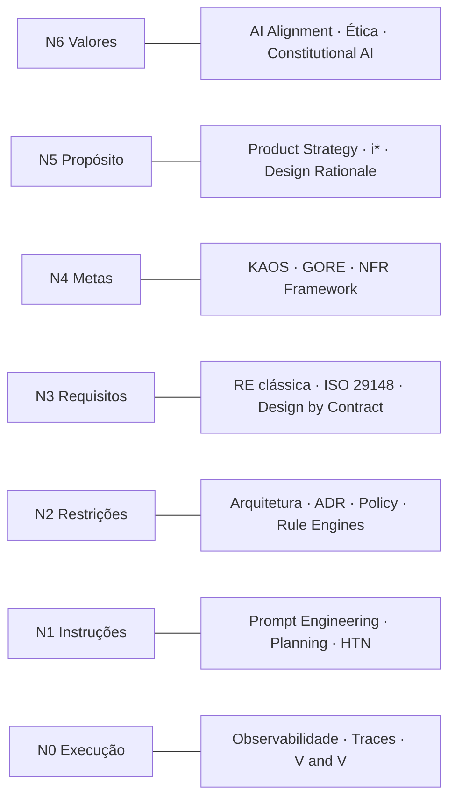
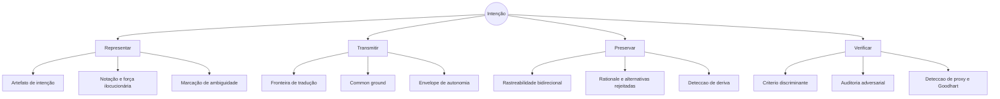
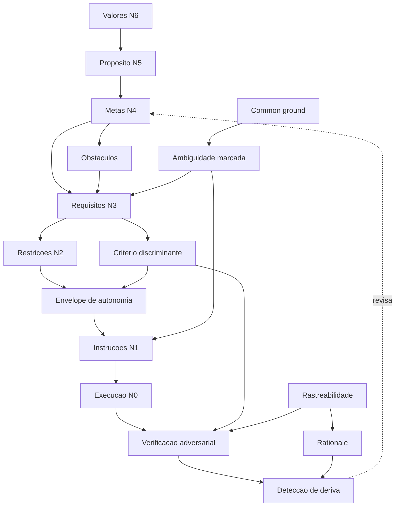

# 02 — Taxonomia, glossário e mapas

## 1. A Escala de Intenção

`[HIPÓTESE]` — construída por composição de três fontes consolidadas:

- os seis alvos de alinhamento de **Gabriel** (2020): instruções, intenções expressas, preferências
  reveladas, preferências informadas, interesse, valores;
- a distinção **indicativo/optativo** e a fronteira mundo/máquina de **Jackson & Zave** (1997);
- o refinamento **meta → requisito → operação** de **KAOS** (van Lamsweerde).

Nenhuma das três, isolada, cobre a cadeia inteira. Gabriel cobre o topo (o que se alinha) e ignora a
descida até a execução; KAOS cobre o meio e assume que o topo é dado; Jackson & Zave dão o critério
de modo, mas não a escala.

| Nível | Nome | Natureza | Pergunta que responde | Estabilidade | Verificável por |
|---|---|---|---|---|---|
| **N6** | **Valores** | Normativa | O que jamais deve acontecer, independente do objetivo | Anos | Auditoria; violação é binária |
| **N5** | **Propósito** | Teleológica | Por que este sistema existe | Anos | Não verificável diretamente; só por proxy |
| **N4** | **Metas** | Optativa, abstrata | Que estado do mundo se quer alcançar | Meses | Satisfação parcial (*satisficing*) |
| **N3** | **Requisitos** | Optativa, concreta | Que comportamento observável é exigido | Semanas | Critério binário de aceite |
| **N2** | **Restrições** | Delimitadora | Que caminhos estão proibidos ou obrigatórios | Semanas | Checagem estrutural |
| **N1** | **Instruções** | Diretiva | Que ação executar agora | Horas | Execução bem-sucedida |
| **N0** | **Execução** | Factual, indicativa | O que de fato aconteceu | Instantânea | Observação direta |

Regras da escala:

1. **Descida (N6→N0)** é *refinamento*: cada nível acrescenta compromisso e perde generalidade. É
   uma relação de muitos-para-muitos, não uma árvore estrita — um requisito pode servir a várias metas.
2. **Subida (N0→N6)** é *justificação*: todo artefato de nível inferior deve poder apontar o superior
   que o motiva. Artefato que não sobe é **intenção órfã** (anti-padrão em [05](05-catalogo-de-padroes.md)).
3. **Autoridade decresce com o nível.** Em conflito, o nível mais alto vence. É exatamente o papel de
   uma constituição — e o precedente é Constitutional AI (Anthropic, 2022) `[INDÚSTRIA]` e a hierarquia
   de metas de KAOS `[CONSOLIDADO]`.
4. **Só N3 e N2 são plenamente verificáveis por máquina.** N4 é *satisficing* (Simon; softgoals de
   Chung/Mylopoulos); N5 e N6 exigem julgamento. Quem promete verificação automática de propósito está
   vendendo proxy.
5. **Salto de nível é a patologia mais comum.** Ir de N5 direto a N1 — "o sistema existe para engajar
   usuários, então implemente notificações push" — pula metas, requisitos e restrições, e é onde o
   specification gaming nasce.

### 1.1 Onde cada disciplina opera



A leitura importante deste diagrama: **as disciplinas existentes cobrem todos os níveis, mas nenhuma
cobre as transições.** A Engenharia de Intenção é a disciplina das **arestas verticais**, não dos nós.

## 2. Os quatro problemas e seus objetos



## 3. Glossário

Termos marcados com ★ são **propostos por este corpus**; os demais são importados, com a fonte
indicada.

**Agente** — entidade capaz de agir com autonomia parcial sobre um envelope declarado. Inclui humanos.
*(Multi-Agent Systems; KAOS usa o termo no mesmo sentido, abrangendo humano e sistema.)*

**Alvo de alinhamento** — o nível da escala ao qual o comportamento de um executor deve corresponder.
*(Gabriel, 2020.)*

**Ambiguidade** — propriedade de um enunciado que admite mais de uma leitura consistente com o
contexto compartilhado. **Não é defeito**: é a contrapartida da economia da linguagem (Grice, 1975).
O objeto de engenharia não é eliminá-la, é torná-la visível antes da execução.

★ **Ambiguidade marcada** — ambiguidade explicitamente registrada no artefato, que **bloqueia** a
descida para o nível seguinte até ser resolvida. Contraste com *ambiguidade silenciosa*, resolvida
pelo executor sem registro. *(Precedente: mecanismo de impasse do SOAR.)*

**Common ground** — conhecimento que as partes presumem mutuamente partilhar e sobre o qual apoiam
suas implicaturas. *(Clark, 1996.)*

**Constituição** — conjunto de enunciados de N6/N5 com autoridade sobre todos os artefatos inferiores;
conflito com ela é reportado, nunca resolvido em silêncio. *(Constitutional AI, Anthropic, 2022.)*

**Contrato incompleto** — especificação que não cobre todas as contingências. Toda especificação real
é um. *(Hart & Moore, 1990 — Economia.)*

**Critério de aceite** — condição binária, observável de fora, que decide se um requisito foi
atendido. *(RE clássica; cenários de atributo de qualidade, SEI.)*

★ **Critério discriminante** — critério de aceite que é **falseável**: existe pelo menos um resultado
plausível que ele rejeita. Critério que qualquer entrega satisfaz não é critério. *(Derivado de Popper,
via a lógica de V&V de Boehm, 1984.)*

**Criteria drift** — fenômeno em que os critérios de avaliação só se tornam formuláveis depois de
observar saídas concretas, tornando-os dependentes da observação. *(Shankar et al., UIST 2024.)*
`[EXPERIMENTAL]`

★ **Deriva de intenção** — divergência acumulada entre a intenção registrada e a intenção atual das
partes, sem que nenhum artefato tenha sido alterado. Distinta do criteria drift: aqui a mudança é no
mundo e nas pessoas, não na compreensão.

★ **Envelope de autonomia** — declaração explícita, por tarefa, do que o executor pode decidir sozinho,
do que deve consultar e do que lhe é proibido. *(Operacionaliza os níveis de automação de Parasuraman,
Sheridan & Wickens, 2000.)*

**Força ilocucionária** — o que o enunciado *faz* além do que diz: ordenar, sugerir, permitir,
comprometer-se. *(Austin, 1962; Searle, 1969.)*

★ **Fronteira de tradução** — ponto da cadeia em que a intenção muda de representação ou de portador.
Cada fronteira é um local de perda e o único lugar onde verificação é barata.

**Indicativo / Optativo** — modo de um enunciado: descreve o mundo como é, ou como se deseja que
passe a ser. *(Jackson & Zave, 1997.)*

**Intenção** — estado com força de compromisso que restringe deliberação futura e orienta ação.
*(Bratman, 1987.)* Neste corpus, tratada como **compromisso público auditável**, não como estado
mental — escolha metodológica justificada em [01](01-fundamentacao.md) §4.3.

★ **Intenção órfã** — artefato de nível inferior sem ligação a nenhum artefato superior que o
justifique.

**Meta (goal)** — estado do mundo que se deseja alcançar ou manter; refinável em AND/OR.
*(KAOS, van Lamsweerde.)*

**Obstáculo** — condição cuja ocorrência impede a satisfação de uma meta; gerado sistematicamente e
resolvido por elaboração de requisito. *(van Lamsweerde & Letier, 2000.)*

**Postura intencional** — estratégia de prever o comportamento de um sistema atribuindo-lhe crenças e
desejos, justificada por seu poder preditivo e não por afirmação ontológica. *(Dennett, 1987.)*

**Rastreabilidade bidirecional** — capacidade de ir de qualquer artefato ao que o justifica e ao que
ele origina. *(ISO/IEC/IEEE 29148; Systems Engineering.)*

**Rationale** — as questões, opções e critérios que produziram uma decisão. Decisão sem alternativas
rejeitadas registradas não tem rationale. *(QOC — MacLean et al., 1991.)*

**Satisficing** — aceitar a primeira alternativa que atinge o nível de aspiração, em vez de otimizar.
*(Simon, 1969.)*

**Softgoal** — meta sem critério binário, satisfeita em grau. *(NFR Framework — Chung, Nixon, Yu &
Mylopoulos, 2000.)*

**Specification gaming** — comportamento que satisfaz a especificação literal sem produzir o resultado
pretendido. *(Krakovna et al., DeepMind.)*

★ **Teoria residual** — a parte da intenção que não sobrevive a nenhum artefato e existe apenas na
cabeça de quem participou. *(Nomeia o objeto de Naur, 1985.)* Assumir que ela é zero é o erro
fundacional da disciplina.

## 4. Mapa de dependências conceituais

Ler como: *A → B* significa "B não pode ser bem definido sem A". Serve para ordenar a construção da
disciplina e para detectar círculo vicioso.



Três leituras não óbvias deste mapa:

1. **`Envelope de autonomia` depende de `Critério discriminante`.** Não se pode decidir quanta
   liberdade dar a um executor sem saber como o resultado será julgado. Frameworks agênticos que
   configuram autonomia sem definir critério estão com a dependência invertida.
2. **O único ciclo é `Detecção de deriva → Metas`**, e ele é *desejável*. Um sistema de intenção sem
   esse laço é aberto e apodrece. Todos os outros caminhos são acíclicos — o que sugere que a
   disciplina é construtível de baixo para cima sem circularidade.
3. **`Common ground → Ambiguidade marcada`** é a aresta que a prática ignora. A quantidade de
   ambiguidade que precisa ser marcada é **inversamente proporcional ao common ground** — por isso o
   mesmo artefato funciona com um executor e falha com outro, e por isso "escrever melhor" não resolve.

## 5. Taxonomia dos objetos da disciplina

```
Engenharia de Intenção
├── Artefatos
│   ├── Normativos ......... constituição, política, valor
│   ├── Teleológicos ....... propósito, meta, softgoal, obstáculo
│   ├── Prescritivos ....... requisito, critério de aceite, restrição, contrato
│   ├── Operacionais ....... plano, tarefa, instrução, envelope de autonomia
│   └── Retrospectivos ..... rationale, ADR, trace de execução, relatório de verificação
├── Operações
│   ├── Elicitação ......... extrair intenção de quem não a formulou
│   ├── Refinamento ........ descer um nível preservando justificação
│   ├── Delegação .......... transferir execução com envelope declarado
│   ├── Interpretação ...... resolver lacuna no ponto de execução
│   ├── Verificação ........ confrontar resultado com critério discriminante
│   └── Reconciliação ...... detectar e corrigir deriva
├── Propriedades desejadas
│   ├── Fidelidade ......... o executado corresponde ao pretendido
│   ├── Rastreabilidade .... todo artefato sobe e desce
│   ├── Falseabilidade ..... o critério pode rejeitar
│   ├── Inspecionabilidade . a interpretação feita é visível
│   └── Revisabilidade ..... a intenção pode mudar sem perder história
└── Patologias
    ├── Salto de nível ..... N5 direto a N1
    ├── Intenção órfã ...... artefato sem justificação
    ├── Proxy capturada .... Goodhart, specification gaming
    ├── Ambiguidade silenciosa
    ├── Teatro de conformidade ... artefato existe mas não governa
    └── Deriva não detectada
```

---

**Anterior:** [01 — Fundamentação](01-fundamentacao.md) · **Próximo:** [03 — Árvore de princípios](03-arvore-de-principios.md)
