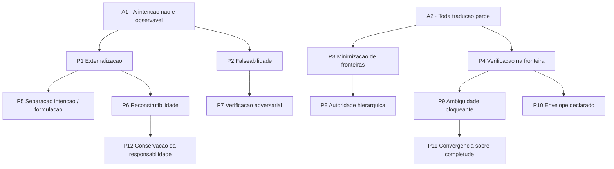

# 03 — Árvore de princípios

Cada princípio traz: **proveniência** (de onde é derivado), **selo epistêmico**, **o que exige na
prática** e **onde deixa de funcionar**. Princípio sem condição de falha declarada é slogan.

A árvore desce de dois axiomas. Tudo o mais é derivado.

---

## Axiomas

### A1 — A intenção não é diretamente observável

`[CONSOLIDADO]` *Proveniência:* Dennett (postura intencional, 1987); Naur (teoria do programa, 1985);
Newell (nível do conhecimento, 1982).

Nem a intenção do humano, nem a "intenção" do agente. Ambas são **inferidas** a partir de
comportamento e de artefatos. Toda a disciplina é construída sobre inferência, não sobre acesso.

*Consequência imediata:* qualquer promessa de "capturar a intenção real do usuário" é falsa por
construção. O que se pode fazer é reduzir o espaço de intenções compatíveis com o que foi registrado.

### A2 — Toda tradução entre representações perde informação

`[CONSOLIDADO]` no domínio formal: a **desigualdade do processamento de dados** (Teoria da Informação,
Shannon; Cover & Thomas) estabelece que processar um sinal não pode aumentar a informação que ele
carrega sobre a fonte.

`[HIPÓTESE]` a transposição para intenção é **analogia, não teorema** — não existe um canal
mensurável nem uma fonte bem definida aqui. Ela é usada como heurística estrutural, e é assim que deve
ser tratada.

*Consequência:* fidelidade total é, no melhor caso, o produto das fidelidades de cada fronteira. Uma
cadeia com seis traduções a 90% entrega cerca de 53%. Isso explica por que cadeias longas de
delegação degradam de forma que parece desproporcional a cada passo individual.

---

## Princípios derivados

### P1 — Externalização

> A intenção só é engenharável na medida em que existe fora da cabeça de quem a tem.

`[CONSOLIDADO]` *Proveniência:* RE clássica; Design Rationale (QOC); Lamport (2015).
*Deriva de:* A1.

**Exige:** que exista um artefato, com autor identificado e data, distinto do código.
**Deixa de funcionar quando:** a teoria residual (Naur) é grande — domínios muito novos, exploratórios,
ou onde a equipe é a mesma e permanece. Nesses casos o custo de externalizar excede o benefício, e
insistir produz *teatro de conformidade*.

### P2 — Falseabilidade

> Um enunciado de intenção só tem valor de engenharia se induz um critério capaz de **rejeitar** algum
> resultado plausível.

`[CONSOLIDADO]` *Proveniência:* Popper (Filosofia da Ciência); Boehm (V&V, 1984); cenários de atributo
de qualidade (SEI/CMU); Design by Contract (Meyer, 1992).
*Deriva de:* A1 — se não se observa a intenção, observa-se sua consequência discriminante.

**Exige:** todo requisito nasce com pelo menos um critério que algum resultado plausível falharia.
"O sistema deve ser rápido" não passa; "p95 abaixo de 200 ms com 1000 req/s" passa.
**Deixa de funcionar quando:** o atributo é irredutivelmente softgoal (elegância, confiança do
usuário). Aqui a resposta honesta é registrar como softgoal e **declarar que a verificação é por
julgamento humano** — não inventar uma métrica proxy, que é justamente como Goodhart entra.

### P3 — Minimização de fronteiras

> Reduza o número de traduções entre a intenção e a execução; onde não puder reduzir, torne a fronteira
> explícita.

`[HIPÓTESE]` *Proveniência:* A2; princípio end-to-end de arquitetura de sistemas (Saltzer, Reed &
Clark, 1984); Intentional Programming (Simonyi) como tentativa histórica.

**Exige:** desconfiar de pipelines com muitos estágios de reformulação. Três documentos entre a
conversa e o código não são necessariamente melhores que um.
**Deixa de funcionar quando:** a redução de fronteiras é obtida colapsando níveis da escala — isso não
elimina a tradução, apenas a torna implícita e não verificável. **Fronteira implícita é pior que
fronteira explícita**, e é este ponto que salva o princípio de virar desculpa para não especificar.
**Falsificação:** comparar retrabalho entre pipelines de 2 e de 5 artefatos, controlando complexidade.

### P4 — Verificação na fronteira

> Toda fronteira de tradução deve ter um teste de correspondência antes de o fluxo seguir.

`[CONSOLIDADO]` *Proveniência:* modelo em V (Systems Engineering); custo do defeito por fase (Boehm);
gates de qualidade.
*Deriva de:* A2 — a fronteira é onde a perda ocorre e, portanto, o único lugar barato para detectá-la.

**Exige:** cada descida de nível termina com uma checagem de cobertura — todo item do nível superior
aparece no inferior, e todo item do inferior sobe.
**Deixa de funcionar quando:** o custo do gate excede o custo do retrabalho que evita. Em tarefas
pequenas e reversíveis, verificar cada fronteira é desperdício — a heurística é calibrar pelo custo de
reverter, não pelo tamanho da tarefa.

### P5 — Separação entre intenção e formulação

> O *que* se quer é artefato durável; *como* se pede a um executor específico é artefato descartável.

`[RECENTE]`, com o suporte empírico mais forte do corpus. *Proveniência:* DSPy (Khattab et al., Stanford,
ICLR 2024) — assinaturas declarativas compiladas em prompts pelo otimizador; separação
política/mecanismo em sistemas operacionais; RFC 9315 (intent declarativo, independente de mecanismo).
*Deriva de:* P1.

**Exige:** que a especificação não contenha formulação otimizada para um modelo. Prompt é saída, não
fonte.
**Por que é o princípio de maior retorno prático:** ele é o que faz o investimento em intenção
sobreviver à troca de modelo. Sem ele, todo o trabalho expira na próxima versão.
**Deixa de funcionar quando:** a tarefa é tão acoplada ao executor que a separação é ficção — casos em
que a capacidade do modelo *define* o que é pedível.

### P6 — Reconstrutibilidade

> Um artefato carrega intenção na medida em que permite a um executor competente **reconstruir as
> alternativas rejeitadas** e o critério que as rejeitou.

`[HIPÓTESE]` *Proveniência:* QOC (MacLean et al., 1991); gIBIS (Conklin & Begeman, 1988); ADR
(Nygard, 2011).
*Deriva de:* P1.

**Exige:** registrar o espaço de escolha, não a escolha. "Usamos Postgres" não carrega intenção;
"usamos Postgres em vez de Mongo porque precisamos de transação multi-tabela" carrega — e permite ao
executor futuro saber quando a decisão deixou de valer.
**Esta é a formulação operacional de "por quê":** o valor de um rationale é medido pela sua capacidade
de dizer **quando ele expira**.
**Deixa de funcionar quando:** não houve alternativa real. Registrar rationale falso é pior que não
registrar. Se a escolha foi a única viável, diga isso — é informação.
**Falsificação:** dar a executores independentes o artefato e medir se convergem na mesma decisão
diante de uma mudança de contexto.

### P7 — Verificação adversarial

> Quem verifica deve tentar refutar, não confirmar.

`[CONSOLIDADO]` *Proveniência:* viés de confirmação (Wason, Psicologia Cognitiva); specification
gaming (Krakovna); prática de red-teaming; Popper.
*Deriva de:* P2.

**Exige:** o verificador procura (a) requisito sem implementação e (b) implementação sem requisito —
o segundo é sistematicamente esquecido e é onde mora o escopo ampliado. Exige também **evidência
citável** (`arquivo:linha`, saída real de comando), nunca o veredito isolado.
**Deixa de funcionar quando:** o verificador é o mesmo agente que executou e compartilha o mesmo
contexto — a independência é a condição de validade, não um detalhe de processo.

### P8 — Autoridade hierárquica

> Em conflito entre níveis, o nível mais alto vence, e o conflito é **reportado**, nunca resolvido em
> silêncio.

`[INDÚSTRIA]` *Proveniência:* Constitutional AI (Anthropic, 2022); hierarquia de metas em KAOS;
hierarquia de normas em Direito.
*Deriva de:* P3 — sem regra de precedência, cada fronteira renegocia tudo.

**Exige:** uma constituição escrita, curta e realmente restritiva, e um executor que **pare** ao
detectar conflito.
**Deixa de funcionar quando:** a constituição é genérica. Uma constituição que nenhuma decisão real
violaria não governa nada — é o *teatro de conformidade*. O teste: se nenhum artigo já barrou uma
decisão que alguém queria tomar, o documento é decorativo.

### P9 — Ambiguidade bloqueante

> Ambiguidade detectada é registrada e **interrompe** a descida de nível até ser resolvida por quem
> tem autoridade.

`[HIPÓTESE]` *Proveniência:* mecanismo de impasse do SOAR (Laird/Newell); interação de iniciativa mista
(Horvitz, Microsoft Research, CHI 1999); implicatura de Grice (a ambiguidade é normal, logo precisa de
protocolo, não de exortação).
*Deriva de:* P4.

**Exige:** notação para ambiguidade e a disciplina de não avançar com marcadores abertos.
**Por que "bloqueante" e não "registrada":** ambiguidade que apenas se registra é ignorada sob pressão.
O bloqueio é o que dá força ao registro.
**Deixa de funcionar quando:** o custo de perguntar excede o custo de errar e refazer — tarefas
pequenas, baratas e reversíveis. Aplicar bloqueio universalmente produz um executor que pergunta demais
e é abandonado. **Este é o princípio com maior risco de dano por excesso.**
**Falsificação:** medir taxa de retrabalho com e sem bloqueio, estratificando por custo de reversão. A
previsão é que o ganho seja positivo apenas acima de um limiar de custo — se for positivo em todos os
estratos, o princípio está subespecificado.

### P10 — Envelope declarado

> A autonomia do executor é declarada **por tarefa**: o que pode decidir, o que deve consultar, o que
> lhe é vedado.

`[CONSOLIDADO]` na origem, `[HIPÓTESE]` na aplicação a agentes. *Proveniência:* níveis de automação
(Sheridan & Verplank, 1978; Parasuraman, Sheridan & Wickens, 2000); direitos residuais de controle
(Hart & Moore — Economia); Klein et al. (2004) sobre direcionabilidade.
*Deriva de:* P4.

**Exige:** que "quanta liberdade este agente tem aqui" seja um campo do artefato, não um traço de
personalidade do sistema.
**Deixa de funcionar quando:** a granularidade da declaração custa mais que o erro que previne, ou
quando o envelope é declarado mas não é aplicável — declarar sem enforcement é teatro.

### P11 — Convergência sobre completude

> A qualidade de um artefato de intenção mede-se pela **taxa de mudança decrescente** sob confronto com
> resultados reais, não pela sua completude inicial.

`[EXPERIMENTAL]` na base, `[HIPÓTESE]` na formulação. *Proveniência:* criteria drift (Shankar et al.,
UIST 2024); elicitação de preferências (Keeney & Raiffa); desenvolvimento iterativo.
*Deriva de:* P9 — se a ambiguidade só aparece ao ver saídas, a especificação não pode ser fechada
antes.

**Exige:** tratar a spec como versionada e viva, e **instrumentar a taxa de revisão** como sinal.
Spec que não muda na primeira execução é suspeita: ou o problema era trivial, ou ninguém a confrontou.
**Reconcilia** o conflito §4.1 de [01](01-fundamentacao.md): especificar antes continua certo;
esperar completude antes de executar é que é errado.
**Deixa de funcionar quando:** o custo de execução exploratória é proibitivo — sistemas críticos,
irreversíveis, regulados. Aí o modelo em cascata volta a ser racional, e é por isso que ele nunca
morreu na aviação e na medicina.
**Falsificação:** se a taxa de revisão da spec não correlacionar com qualidade do resultado final, a
métrica não serve.

### P12 — Conservação da responsabilidade

> Delegar execução não transfere responsabilidade. A responsabilidade só se move por ato explícito de
> quem a detém, e o total permanece constante.

`[CONSOLIDADO]` na base, `[HIPÓTESE]` na formulação como lei de conservação. *Proveniência:* Ironias da
automação (Bainbridge, 1983); teoria principal-agente (Holmström); atribuição de responsabilidade em
KAOS; doutrina jurídica de responsabilidade.
*Deriva de:* P6 e A1.

**Exige:** que toda tarefa delegada tenha um responsável humano nomeado, e que a delegação seja um
registro, não um default.
**Consequência incômoda e correta:** aumentar autonomia sem redistribuir responsabilidade explicitamente
cria uma zona onde ninguém responde — que é exatamente o modo de falha descrito por Bainbridge.
**Deixa de funcionar quando:** a escala torna a nomeação individual impraticável; aí a responsabilidade
migra para papéis e processos, com perda conhecida de eficácia.

---

## Tensões entre princípios

Princípios que nunca colidem não são princípios. Estas são as colisões reais e a regra de arbitragem
proposta:

| Tensão | Colisão | Arbitragem proposta `[HIPÓTESE]` |
|---|---|---|
| **P3 × P4** | Menos fronteiras reduz verificação possível | Fronteira só se elimina se a checagem que ela permitia for absorvida por outra |
| **P9 × P11** | Bloquear por ambiguidade × descobrir critério executando | Bloqueia o que é **caro de reverter**; deixa passar o que é barato e observável |
| **P2 × realidade dos softgoals** | Nem tudo é falseável | Softgoal é declarado como tal e verificado por humano; proxy só com Goodhart declarado |
| **P1 × Naur** | Externalizar × teoria residual irredutível | Externalize o que **expira** (decisão, alternativa, critério); não tente externalizar competência |
| **P8 × P11** | Constituição estável × intenção que evolui | Constituição muda por processo próprio, mais lento, com registro — nunca no meio de uma tarefa |
| **P10 × velocidade** | Declarar envelope custa | Envelope tem default por classe de tarefa; declaração explícita só no desvio |

---

**Anterior:** [02 — Taxonomia](02-taxonomia-e-glossario.md) · **Próximo:** [04 — Árvore de responsabilidades](04-arvore-de-responsabilidades.md)
