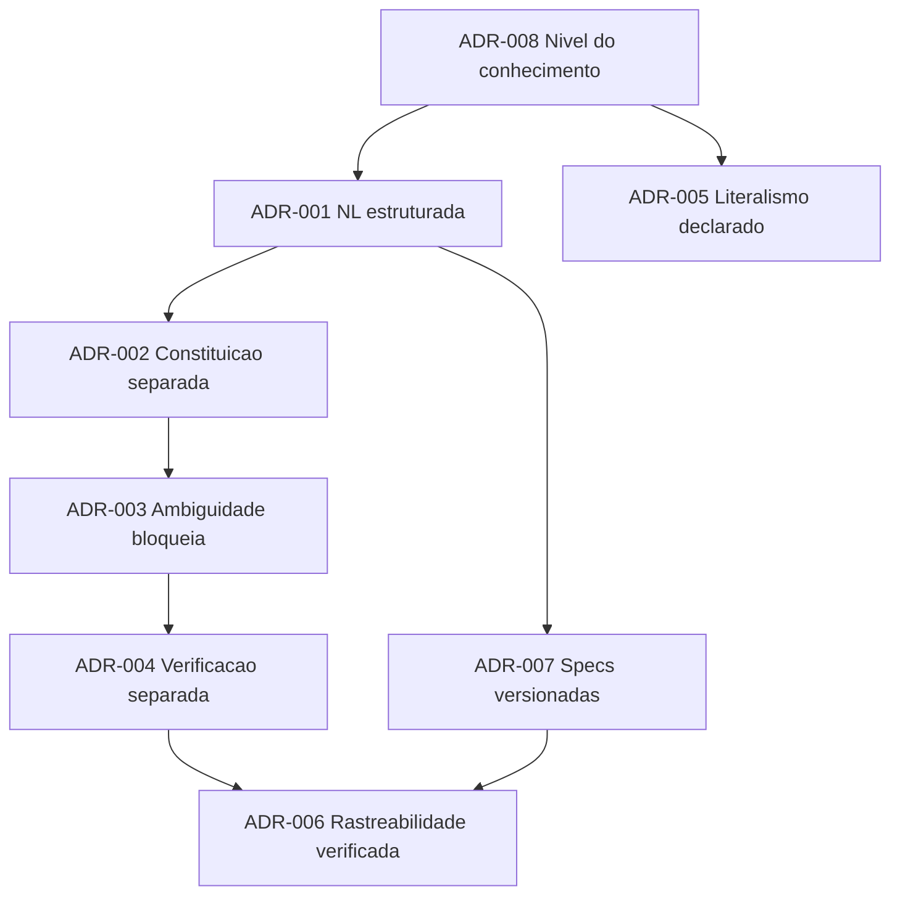

# 06 — Decisões arquiteturais da disciplina

Estas ADRs registram decisões sobre **como a disciplina é construída**, não sobre um sistema
específico. Formato: Nygard (2011) `[CONSOLIDADO]`, estendido com o registro de alternativas
rejeitadas exigido por QOC (MacLean et al., 1991) e pelo princípio P6.

Cada ADR declara **quando deve ser revista** — sem isso, ADR vira sedimento (P6: o valor do rationale
está em dizer quando expira).

---

## ADR-001 · Linguagem natural estruturada como representação primária

**Status:** aceita · **Data:** 2026-08-02

**Contexto.** A intenção precisa de uma forma de representação. O espectro vai de prosa livre a
especificação formal (Z, Alloy, TLA+), passando por DSLs e templates estruturados.

**Decisão.** Linguagem natural **estruturada por seções obrigatórias**, com pontos formais localizados
(contratos, schemas, critérios quantitativos) onde o custo se justifica.

**Alternativas rejeitadas.**

| Alternativa | Por quê não |
|---|---|
| Especificação formal integral (TLA+, Alloy) | Cobre propriedades estruturais e de concorrência, não "isto é o que o usuário queria". Custo de aprendizado exclui o Titular da intenção — que é justamente quem não pode ser excluído (R1) |
| DSL própria de intenção | Precedente de fracasso: Intentional Programming (Simonyi, MSR) exigia ferramenta proprietária e não sobreviveu. Representação que precisa de ferramenta especial morre com a ferramenta `[ACADÊMICO]` |
| Prosa livre | Sem seções obrigatórias não há checagem de completude nem de rastreabilidade |

**Consequências.** Ganha-se acessibilidade ao Titular e legibilidade por agentes LLM (que são melhores
em NL estruturada que em formalismos de nicho). Perde-se verificação automática de consistência — que
passa a depender de PA-09.

**Revisar quando.** Se modelos passarem a produzir e verificar especificações formais com custo humano
próximo de zero, o trade-off inverte.

---

## ADR-002 · Constituição separada dos artefatos de projeto

**Status:** aceita · **Data:** 2026-08-02

**Contexto.** Enunciados de N6–N5 poderiam viver dentro da própria spec.

**Decisão.** Documento separado, com ciclo de vida próprio e mais lento, e autoridade declarada sobre
todos os demais (P8).

**Alternativas rejeitadas.**
- *Seção "princípios" dentro de cada spec* — duplica, diverge entre specs, e perde a autoridade
  hierárquica.
- *Sem constituição, valores implícitos no código e na cultura* — funciona em equipes pequenas e
  estáveis; falha na entrada de agentes, que não têm acesso à cultura tácita (Naur).

**Consequências.** Um artefato a mais para manter. Em contrapartida, a única forma de resolver conflito
entre artefatos sem renegociação caso a caso.

**Revisar quando.** Se, após seis meses, nenhum conflito real tiver sido arbitrado pela constituição —
sinal de AP-10 ou de que o projeto não precisa dela.

---

## ADR-003 · Ambiguidade bloqueia, calibrada por custo de reversão

**Status:** aceita, com reserva · **Data:** 2026-08-02

**Contexto.** Detectada uma ambiguidade, três respostas possíveis: assumir e registrar, assumir em
silêncio, ou parar e perguntar.

**Decisão.** Parar e perguntar — **quando o custo de reverter for alto**. Abaixo do limiar, assumir e
registrar (PA-08).

**Alternativas rejeitadas.**
- *Assumir sempre e registrar* — o registro é lido tarde demais; a suposição já produziu consequência.
- *Bloquear sempre* — produz executor que pergunta demais. Risco real e documentado de abandono da
  ferramenta; ver P9, "maior risco de dano por excesso".

**Consequências.** Exige um julgamento de custo de reversão que hoje é implícito. **Fraqueza conhecida
desta ADR:** o limiar não está operacionalizado. É item da agenda de pesquisa (G3).

**Revisar quando.** Houver dados sobre a relação entre taxa de bloqueio e retrabalho.

---

## ADR-004 · Verificação em contexto separado, com postura de refutação

**Status:** aceita · **Data:** 2026-08-02

**Contexto.** A verificação pode ser feita pelo executor, por outro agente no mesmo contexto, ou por
agente em contexto limpo.

**Decisão.** Contexto separado, prompt de refutação, evidência citável obrigatória, e busca ativa por
implementação sem requisito.

**Alternativas rejeitadas.**
- *Auto-verificação* — AP-11; o verificador herda as premissas do executor.
- *Verificação só por testes automatizados* — cobre N3/N2, não cobre "isto atende à meta".

**Consequências.** Custo adicional por entrega. Justificado apenas acima de um limiar de risco — abaixo
dele, PA-09 diz para deixar o teste ser o verificador.

**Revisar quando.** Surgirem dados sobre taxa de detecção de verificação independente versus
auto-verificação em agentes. Hoje isto é raciocínio por analogia com V&V humana, não evidência.

---

## ADR-005 · Nível de literalismo declarado, não inferido

**Status:** aceita · **Data:** 2026-08-02

**Contexto.** Gabriel (2020) `[CONSOLIDADO]` mostra que a escolha entre alinhar a instruções ou a
intenções é **normativa**, não técnica. Executores hoje resolvem isso por default implícito, que varia
com o modelo e com a formulação.

**Decisão.** O alvo de alinhamento é um campo declarado por tarefa: *literal* (faça exatamente o
pedido, pare se for inviável) ou *interpretativo* (persiga a intenção, reporte o que interpretou).

**Alternativas rejeitadas.**
- *Sempre literal* — produz specification gaming e o clássico "fiz o que você pediu" `[CONSOLIDADO]`.
- *Sempre interpretativo* — transfere autoridade de N3/N4 ao executor sem ato explícito; viola P12.
- *Deixar o executor escolher pelo contexto* — é o estado atual, e é exatamente a fonte da
  imprevisibilidade que a disciplina existe para reduzir.

**Consequências.** Um campo a mais nos artefatos. Torna explícita uma decisão de governança que hoje é
tomada por acidente.

**Revisar quando.** Modelos passarem a expor e justificar seu próprio nível de literalismo de forma
confiável.

---

## ADR-006 · Rastreabilidade obrigatória, mas verificada

**Status:** aceita · **Data:** 2026-08-02

**Contexto.** Rastreabilidade é `[CONSOLIDADO]` em Systems Engineering e degenera em AP-08 na prática.

**Decisão.** Manter a matriz obrigatória **e** submetê-la à verificação adversarial (PA-09), que
confere a matriz contra o código.

**Alternativas rejeitadas.**
- *Rastreabilidade opcional* — sem ela não se detecta intenção órfã nem requisito descoberto.
- *Rastreabilidade obrigatória sem verificação* — é o estado que produz confiança falsa. **Pior que
  não ter**, porque uma matriz completa e errada é lida como garantia.

**Consequências.** A verificação da matriz é barata (é comparação estrutural) e derruba o principal
argumento histórico contra rastreabilidade.

**Revisar quando.** O custo de manutenção da matriz superar o de reconstruí-la sob demanda a partir do
código — cenário plausível se agentes ficarem bons em inferir rastreabilidade retroativamente. Nesse
caso, a matriz vira artefato derivado, não mantido.

---

## ADR-007 · Specs numeradas, imutáveis e versionadas

**Status:** aceita · **Data:** 2026-08-02

**Contexto.** A intenção evolui (P11), e ao mesmo tempo precisa de estabilidade para funcionar como
compromisso (Bratman).

**Decisão.** Cada spec tem número sequencial imutável e histórico versionado. Mudança de intenção
gera **revisão registrada** dentro da spec, ou uma spec nova quando muda a meta — nunca reescrita
silenciosa.

**Alternativas rejeitadas.**
- *Spec como documento vivo sobrescrito* — perde a história, e com ela a capacidade de detectar deriva
  (R5.2) e de aprender com a taxa de revisão (P11).
- *Spec imutável, sem revisão* — nega o criteria drift; produz AP-12.

**Consequências.** A taxa de revisão vira sinal mensurável, o que sustenta P11 empiricamente.

**Revisar quando.** —

---

## ADR-008 · A disciplina opera no nível do conhecimento, não da implementação

**Status:** aceita · **Data:** 2026-08-02

**Contexto.** Ao descrever agentes LLM, é possível operar no nível dos pesos e ativações
(interpretabilidade), no nível do contexto (context engineering), ou no nível de metas e conhecimento
(Newell, 1982).

**Decisão.** Nível do conhecimento. Agentes são descritos por objetivos, conhecimento e envelope; a
postura intencional (Dennett) é adotada como ferramenta preditiva, sem compromisso ontológico.

**Alternativas rejeitadas.**
- *Nível mecanicista* — depende de acesso interno e expira a cada arquitetura; não é acessível ao
  Titular.
- *Nível puramente comportamental* — descreve o que aconteceu, não permite prever o que acontecerá sob
  intenção nova, que é o que a disciplina precisa.

**Consequências.** A disciplina fica **independente de modelo e de fornecedor** — sua propriedade mais
valiosa e o que a distingue de prompt engineering. O custo é não poder explicar *por que* um executor
falhou em um caso concreto, só que falhou.

**Revisar quando.** A interpretabilidade amadurecer a ponto de o nível mecanicista dar previsões
acionáveis a quem escreve specs. Não é o caso hoje.

---

## Grafo de dependência entre as ADRs

ADR-008 é a raiz: se ela cair, quase tudo é reconstruído. É a decisão de maior alcance e a que merece
mais escrutínio.

---

**Anterior:** [05 — Catálogo de padrões](05-catalogo-de-padroes.md) · **Próximo:** [07 — Agenda de pesquisa](07-agenda-de-pesquisa.md)
