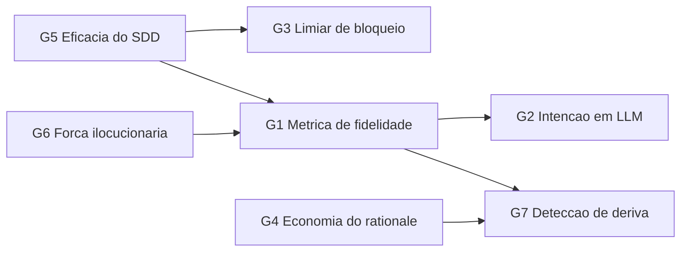

# 07 — Agenda de pesquisa

## 1. Inventário honesto: o que é original neste corpus

Se a disciplina for apresentada como nova sem esta seção, é retórica. Aqui está a separação exata.

### 1.1 O que é importado sem alteração

Escala de níveis (Gabriel; Jackson & Zave; KAOS), refinamento de metas, análise de obstáculos,
atribuição de responsabilidade, rastreabilidade bidirecional, design by contract, ADRs, QOC, atos de
fala, implicatura, common ground, níveis de automação, ironias da automação, contratos incompletos,
satisficing, specification gaming, nível do conhecimento, postura intencional, criteria drift,
separação intenção/formulação (DSPy).

**Isto é a maior parte do corpus, e é assim que deve ser.** Uma disciplina nova cujo conteúdo é
majoritariamente novo é, quase sempre, uma disciplina mal fundamentada.

### 1.2 O que é original — sete proposições

| # | Proposição | Derivada de | Como refutar |
|---|---|---|---|
| **O1** | **Tese do executor interpretativo.** Engenharia de Intenção é RE quando a fidelidade do executor deixa de ser 1 e a interpretação passa a ser silenciosa | Jackson & Zave + specification gaming + Naur | Mostrar que técnicas clássicas de RE, sem modificação, produzem a mesma fidelidade em agentes LLM e em compiladores |
| **O2** | **Escala de Intenção de 7 níveis** com regras de autoridade, verificabilidade e salto | Gabriel + KAOS + Jackson & Zave | Mostrar níveis que se colapsam sem perda, ou uma transição real que a escala não acomoda |
| **O3** | **Degradação multiplicativa da intenção** por fronteira de tradução | Analogia com desigualdade de processamento de dados | Medir fidelidade em cadeias de 2 e 5 fronteiras: se a queda for aditiva ou nula, a analogia não se sustenta |
| **O4** | **Princípio da reconstrutibilidade** — artefato carrega intenção na medida em que permite reconstruir as alternativas rejeitadas e saber quando a decisão expira | QOC + ADR + Naur | Executores independentes com o artefato devem convergir na mesma decisão sob mudança de contexto; se não convergirem, a métrica não mede o que diz |
| **O5** | **Convergência sobre completude** — a qualidade da spec é sua taxa decrescente de revisão, não sua completude inicial | Criteria drift + elicitação de preferências | Se taxa de revisão não correlacionar com qualidade final, a métrica é vazia |
| **O6** | **Conservação da responsabilidade** — delegação não move responsabilidade; só ato explícito move | Bainbridge + principal-agente + KAOS | Encontrar arranjo estável em que a autonomia crescente reduz a responsabilidade humana sem criar zona sem dono |
| **O7** | **Registro de interpretação (R3.4)** como responsabilidade nova do executor | Klein et al. + tese O1 | Se equipes que exigem o registro não detectarem desvios mais cedo, o custo não se paga |

**Nenhuma das sete foi testada.** Todas são falsificáveis, o que é o mínimo exigível de uma proposta
que se apresenta como científica.

## 2. Lacunas com desenho experimental proposto

Retomando L1–L8 de [01](01-fundamentacao.md) §5 e transformando em programa.

### G1 — Métrica de fidelidade de intenção `(L1)`

*Pergunta.* Como medir quanto de uma intenção sobreviveu a uma tradução?

*Desenho.* Titulares produzem uma intenção e, separadamente, um conjunto de julgamentos sobre
resultados candidatos (aceito/rejeitado). A fidelidade de um artefato intermediário é a concordância
entre os julgamentos de executores que só viram o artefato e os julgamentos do Titular. É, em
essência, uma medida de concordância inter-avaliadores aplicada à cadeia de tradução.

*Por que ninguém fez.* RE mede propriedades do documento (completude, consistência), não a
correspondência entre documento e a intenção de quem o originou — que exige acesso ao Titular como
ground truth.

*Risco.* O Titular também deriva (criteria drift), então o ground truth não é estável. Isto precisa ser
medido, não assumido.

### G2 — Intenção em executores sem slot de intenção `(L2)`

*Pergunta.* BDI pressupõe intenção representada explicitamente e inspecionável. Um agente LLM não tem
isso. O que substitui funcionalmente?

*Hipótese a testar.* O contexto ativo + o envelope declarado funcionam como o slot de intenção, e
propriedades clássicas de BDI (persistência, resistência à reconsideração, *commitment strategies*)
podem ser medidas comportamentalmente sobre agentes LLM.

*Desenho.* Tarefas longas com perturbação controlada; medir persistência da meta e taxa de
reconsideração. Comparar com as estratégias de compromisso clássicas (cega, single-minded,
open-minded) da literatura de BDI.

*Valor.* Se as propriedades se transferirem, décadas de teoria de MAS voltam a ser aplicáveis. É a
lacuna de maior retorno teórico do programa.

### G3 — Limiar de bloqueio por ambiguidade `(L4)`

*Pergunta.* Quando perguntar vale mais que assumir? A ADR-003 depende desta resposta e hoje não a tem.

*Desenho.* Estratificar tarefas por custo de reversão; comparar três políticas (bloquear sempre,
assumir e registrar, política calibrada) em retrabalho, tempo total e satisfação.

*Previsão de P9.* Ganho positivo apenas acima de um limiar de custo de reversão. **Se o ganho for
positivo em todos os estratos, o princípio está subespecificado** e precisa ser reformulado.

### G4 — Economia da captura de rationale sob custo marginal baixo `(L5)`

*Pergunta.* O problema de Grudin (1988) sobrevive quando o custo de redigir cai por ordens de
grandeza?

*Desenho.* Longitudinal, 6+ meses: equipes com geração assistida de rationale versus manual. Medir não
a produção inicial, mas a **manutenção ao longo do tempo** — que é onde a captura historicamente morre.

*Valor.* Se a assimetria de incentivo persistir mesmo com custo quase zero, então o gargalo nunca foi o
custo, e uma linha inteira de ferramentas está atacando o problema errado. Este resultado seria
valioso mesmo — especialmente — se for negativo.

### G5 — Eficácia do desenvolvimento dirigido por especificação com IA `(L6)`

*Pergunta.* SDD assistido por IA reduz retrabalho comparado a prompting direto?

*Estado atual.* **Nenhum estudo controlado publicado.** É consenso de indústria com cerca de um ano de
idade, adotado com base em plausibilidade.

*Desenho.* Tarefas pareadas por complexidade; condições SDD completo / spec mínima / prompt direto.
Métricas: retrabalho, defeitos pós-entrega, tempo total, tokens.

*Predição derivada de P11 e do custo da escada (PA-02).* O ganho do SDD deve ser **positivo apenas
acima de um limiar de complexidade e de custo de reversão**, e possivelmente negativo abaixo dele. Se o
resultado for ganho uniforme, o modelo de custo deste corpus está errado.

**Este é o experimento mais acionável para você**, porque o `labs` já tem o fluxo instrumentado.

### G6 — Força ilocucionária em artefatos técnicos `(L7)`

*Pergunta.* Marcar explicitamente ordem / sugestão / restrição / default em specs muda a taxa de
divergência do executor?

*Desenho.* Mesma spec em duas versões, com e sem marcação de força; medir divergência de
interpretação entre executores independentes.

*Origem.* Austin e Searle nunca foram aplicados a formatos de especificação técnica. É uma lacuna
pequena, barata de testar e provavelmente produtiva.

### G7 — Detecção automática de deriva de intenção `(L8)`

*Pergunta.* É possível detectar que uma spec deixou de corresponder à intenção atual sem perguntar ao
Titular?

*Hipótese.* Divergência crescente entre o padrão de decisões recentes e o rationale registrado é sinal
antecedente de deriva.

*Dificuldade.* Sem ground truth barato, e sobreposto a mudança legítima de contexto. É a lacuna mais
difícil da lista e a menos madura.

## 3. Ordem de ataque recomendada

**G5 e G6 primeiro:** baratos, executáveis com o que você já tem no `labs`, e informam todo o resto.
**G1 é o gargalo teórico** — sem métrica de fidelidade, a disciplina não tem como se validar e
permanece um conjunto de boas intuições.

## 4. Critérios para a disciplina se sustentar

`[HIPÓTESE]` — as condições que este corpus se impõe. Se não forem atingidas, o honesto é dizer que
Engenharia de Intenção é um enquadramento útil, e não uma disciplina.

1. **Existe métrica de fidelidade** com concordância inter-avaliadores aceitável (G1).
2. **Pelo menos três das sete proposições originais** resistem a tentativa séria de refutação.
3. **Existe uma predição que a disciplina faz e as disciplinas-mãe não fazem** — hoje a candidata é a
   predição de limiar de G5: RE clássica prevê ganho monotônico da especificação, este corpus prevê
   ganho condicionado ao custo de reversão. **Se essa predição diferencial cair, a disciplina é RE
   com vocabulário novo.**
4. **Os padrões funcionam em contextos que não os originaram** — validação fora do fluxo do `labs`.
5. **O custo total de adoção é menor que o retrabalho evitado**, medido e não presumido.

O critério 3 é o mais importante. Uma disciplina se justifica por prever algo que suas ancestrais não
preveem; sem isso, é taxonomia.

---

**Anterior:** [06 — Decisões arquiteturais](06-decisoes-arquiteturais.md) · **Próximo:** [08 — Bibliografia](08-bibliografia.md)
