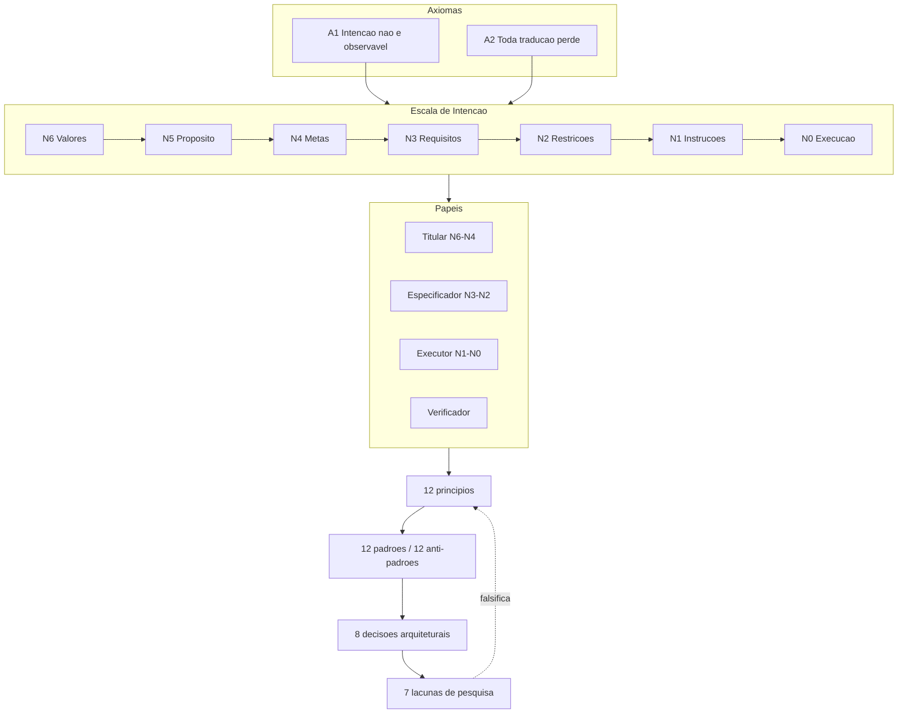

# 09 — Visão integrada

## 1. A disciplina em um parágrafo

Engenharia de Intenção trata da representação, transmissão, preservação e verificação da intenção ao
longo de uma cadeia de executores com autonomia parcial. Ela existe porque o executor final deixou de
ser fiel e passou a ser interpretativo: um compilador nunca preenche lacunas, um agente sempre
preenche — e preenche em silêncio. Toda a disciplina decorre de dois fatos: **a intenção não é
observável** (logo, só se pode restringir o espaço de intenções compatíveis com o que foi registrado)
e **toda tradução perde** (logo, a fidelidade é multiplicativa ao longo da cadeia, e cada fronteira é
simultaneamente o lugar da perda e o único lugar barato de detectá-la).

## 2. A estrutura completa

O laço tracejado é o que torna isto uma disciplina e não uma doutrina: os princípios são
falsificáveis pela agenda que eles próprios geram.

## 3. As sete perguntas que a disciplina responde

| Pergunta | Resposta | Onde |
|---|---|---|
| Intenção de quê? | De um dos sete níveis da escala; o alvo é escolha normativa, não técnica | [02](02-taxonomia-e-glossario.md), ADR-005 |
| Como registrar? | NL estruturada, com formalismo localizado; registrando alternativas rejeitadas | ADR-001, P6 |
| Como transmitir? | Minimizando fronteiras e tornando explícitas as que restam | P3, P4 |
| Quem decide nas lacunas? | Declarado de antemão pelo envelope de autonomia; nunca por omissão | P10, PA-07 |
| Quando parar e perguntar? | Quando reverter for caro; abaixo do limiar, assumir e registrar | P9, ADR-003 |
| Como provar que corresponde? | Critério discriminante + verificação adversarial independente | P2, P7, PA-09 |
| Quem responde? | O Titular; delegar execução não move responsabilidade | P12, [04](04-arvore-de-responsabilidades.md) |

## 4. As três teses que sustentam tudo

**T1 — O executor interpretativo.** É a razão de ser da disciplina. Se cair, isto é Requirements
Engineering com vocabulário novo.

**T2 — A intenção é descoberta, não capturada.** Sustentada por evidência empírica (criteria drift) e
por toda a literatura de elicitação de preferências. Refuta o modelo em cascata sem devolver a razão
ao ágil: especificar continua valendo, **fechar a especificação antes de executar é que não**.

**T3 — A responsabilidade não se delega junto com a execução.** É a tese de governança. Sem ela, a
disciplina vira produtividade; com ela, tem uma posição sobre quem responde quando o agente erra.

## 5. Onde a disciplina é fraca — e é importante que fique escrito

1. **Não tem métrica.** Sem uma medida de fidelidade de intenção (G1), nada aqui pode ser validado.
   Esta é a fraqueza estrutural, não um detalhe.
2. **Nenhuma proposição original foi testada.** As sete são falsificáveis, o que é o mínimo — mas
   falsificável não é validado.
3. **A objeção de Naur não foi respondida, apenas circunscrita.** Se a teoria residual for grande em
   domínios reais, o teto de ganho da disciplina é baixo, e isso não depende de esforço.
4. **O risco de excesso é real.** P9 aplicado sem calibração produz um executor insuportável; PA-02
   aplicado a tarefas triviais produz burocracia. **Uma disciplina de intenção mal calibrada custa mais
   que a ausência dela**, e este corpus não tem, hoje, o limiar operacionalizado.
5. **A predição diferencial ainda não foi testada.** RE clássica prevê ganho monotônico da
   especificação; este corpus prevê ganho condicionado ao custo de reversão. É a única predição que
   distingue a disciplina de sua ancestral. Se ela cair, o honesto é dizer que Engenharia de Intenção é
   RE aplicada a executores generativos — o que ainda seria útil, mas não seria uma disciplina.

## 6. Relação com o K.A.O.S. e com o fluxo SDD do `labs`

O fluxo que você já tem é uma **instância** desta disciplina, e é possível auditá-lo contra ela:

**O que já está certo:**

| Elemento do fluxo | Fundamento |
|---|---|
| `constitution.md` com autoridade sobre os demais | P8, PA-01, precedente em Constitutional AI e KAOS |
| `[PRECISA ESCLARECER]` bloqueante | P9, PA-03 — o mecanismo mais valioso do fluxo |
| Contratos no plan antes do código | P2, PA-05, Design by Contract |
| Alternativas rejeitadas obrigatórias no plan | P6, PA-10, QOC |
| Verificação adversarial com evidência citável | P7, PA-09 |
| Rastreabilidade CA ↔ task | PA-10, ISO 29148 |
| Specs numeradas e imutáveis | ADR-007 |

**As cinco lacunas apontadas na v0.1 foram fechadas** na revisão do fluxo sobre o GitHub Spec Kit
(2026-08-02). Cada uma virou um mecanismo concreto:

| Lacuna original | Onde foi implementada |
|---|---|
| Envelope de autonomia por task (P10 / PA-07) | Seção "Envelope" na spec + campo por task no `tasks-template.md`; `/sdd-implement` obrigado a respeitá-lo |
| Registro de interpretação (R3.4 / PA-08) | Saída obrigatória de `/sdd-implement`, com filtro "outro executor competente escolheria diferente?" |
| Nível de literalismo declarado (ADR-005) | Campo "Modo de interpretação" (`literal` / `interpretativo`) na spec |
| Obstáculos sistemáticos (PA-04) | Seção "Obstáculos" com geração por negação de requisito, e checklist CHK011–CHK015 |
| Calibração por custo de reversão (ADR-003) | Marcadores classificados em **bloqueante** / **não-bloqueante com suposição**, no Artigo V da constitution |

**O que ainda falta**, e é de outra natureza — não são mecanismos, são garantias que artefato nenhum
consegue dar:

1. **R4.3 — executor ≠ verificador** depende de o humano rodar `/sdd-converge` em sessão limpa. O
   comando avisa, mas não pode se impor.
2. **O limiar de "custo alto de reversão"** continua sendo julgamento, não regra. É a fraqueza
   declarada da ADR-003 e o objeto da lacuna de pesquisa G3.
3. **Nenhuma medição.** O fluxo está instrumentado; nada foi medido ainda.

**O que a disciplina diz que você deveria medir**, já que tem o fluxo instrumentado: a taxa de revisão
das specs ao longo da execução (P11) e o retrabalho estratificado por custo de reversão (G5). São os
dois experimentos mais baratos e mais informativos disponíveis para você.

## 7. Estado do documento

- **Versão 0.1**, 2026-08-02.
- **Proporção honesta:** cerca de 80% importado de disciplinas consolidadas, cerca de 20% original —
  e o original é explicitamente marcado, derivado e falsificável.
- **O que falta para a versão 1.0:** métrica de fidelidade (G1) e pelo menos um dos experimentos G5 ou
  G6 executado.

---

**Anterior:** [08 — Bibliografia](08-bibliografia.md) · **Índice:** [README](README.md)
