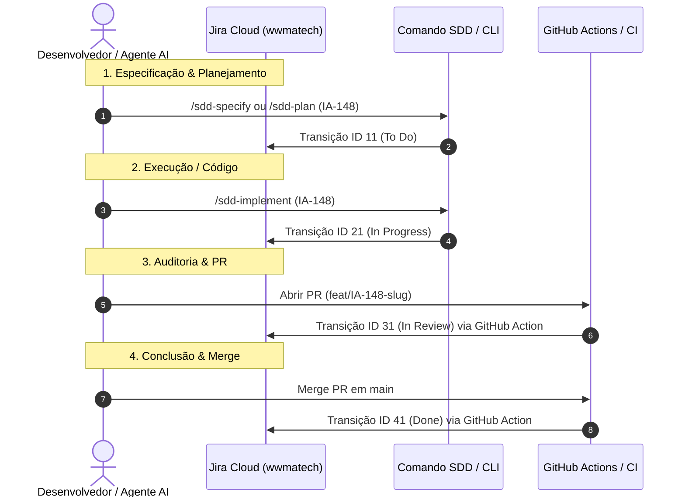

# Arquitetura de Automação do Fluxo Jira + SDD & Agentes AI

> **Instância Jira:** [wwmatech.atlassian.net](https://wwmatech.atlassian.net)  
> **Cloud ID:** `<JIRA_CLOUD_ID>` (configurado via ambiente / MCP)  
> **Repositório:** Upstream `labs`  
> **Última Atualização:** 2026-08-10

---

## 1. Visão Geral da Automação

O objetivo desta automação é sincronizar **automaticamente** os status das tarefas no Jira à medida que o desenvolvedor ou o agente de IA avança pelas etapas do **Fluxo SDD** (Spec-Driven Development) e Git/GitHub.



---

## 2. Matriz de Automação por Camada

| Fase SDD / Git | Trigger | Ação Automatizada | Status Alvo no Jira | ID Transição |
|---|---|---|---|---|
| **Especificação / Planejamento** | `/sdd-specify`, `/sdd-plan` | Script local / Agent Hook | `To Do` | `11` |
| **Desenvolvimento Ativo** | `/sdd-implement` | Script local / MCP Tool | `In Progress` | `21` |
| **Abertura de PR / Review** | Abertura do Pull Request | GitHub Action (`jira-sdd-sync.yml`) | `In Review` | `31` |
| **Merge em Main** | Merge do PR / Push `main` | GitHub Action (`jira-sdd-sync.yml`) | `Done` | `41` |

---

## 3. Componentes da Solução Criada

### A. Script PowerShell de Sincronização Local (`.specify/scripts/sync-jira.ps1`)
Script leve invocável via terminal ou automaticamente por agentes de IA:

```powershell
# Exemplos de uso do script:
pwsh .specify/scripts/sync-jira.ps1 -IssueKey "IA-148" -Stage "todo"        # -> To Do (11)
pwsh .specify/scripts/sync-jira.ps1 -IssueKey "IA-148" -Stage "implement"   # -> In Progress (21)
pwsh .specify/scripts/sync-jira.ps1 -IssueKey "IA-148" -Stage "review"      # -> In Review (31)
pwsh .specify/scripts/sync-jira.ps1 -IssueKey "IA-148" -Stage "done"        # -> Done (41)
```

### B. CI/CD no GitHub Actions (`.github/workflows/jira-sdd-sync.yml`)
Disparado automaticamente ao abrir PR ou ao realizar merge na branch `main`. Extrai a chave do ticket (ex: `IA-148`) diretamente do nome da branch ou mensagem de commit.

### C. Hook nos Agentes AI (Atlassian MCP Tool)
Quando o agente executa comandos como `/sdd-implement` ou `/sdd-converge`, ele utiliza a ferramenta `transitionJiraIssue` nativa do MCP Server do Atlassian para transicionar o ticket sem intervenção manual.
