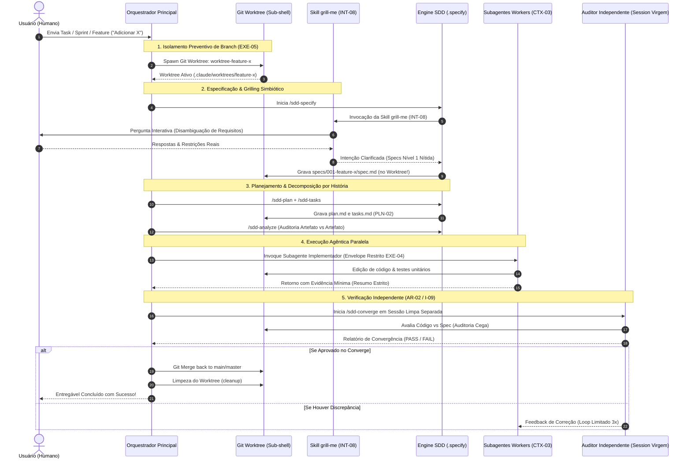

# Engenharia Sistemática de Sistemas Agênticos: Arquitetura de Pipeline Integrado SDD, Isolamento por Worktree, Entrevista Conduzida (Grilling) e Delegação Subagêntica

> **Autor / Origem**: Plataforma de Engenharia Agêntica (`labs`)  
> **Selos Epistêmicos**: `#epistemico/consolidado` `#epistemico/industria` `#epistemico/oficial` `#epistemico/campo`  
> **Conexões KB**: [[kb/08-arquiteturas-e-pipelines|08 — Arquiteturas]], [[kb/worktrees|Worktrees KB]], [[kb/sub-agents|Sub-agentes KB]], [[kb/mattpocock-skills|Matt Pocock Skills]], [[kb/04-padroes|04 — Padrões]], [[kb/06-heuristicas-e-invariantes|06 — Invariantes]]

---

## 1. Resumo Executivo (Abstract)

Este artigo apresenta uma arquitetura determinística e repetível para **desenvolvimento de software orientado a especificações com agentes de Inteligência Artificial (SDD - Spec-Driven Development)**. O problema fundamental abordado é o *vazamento de intenção*, a *contaminação de context window* e a *poluição de ramificações do controle de versão (Git)* durante o ciclo de desenvolvimento iterativo. 

Propomos um protocolo unificado que integra quatro eixos fundamentais:
1. **Isolamento Físico de Arquivos via Git Worktrees** (`[[kb/04-padroes#exe-05--isolamento-por-worktree|EXE-05]]` / `#padrao/exe-05`): Disparo preventivo de checkout isolado ao receber qualquer demanda, impedindo contaminação da ramificação `main`/`master` com artefatos de especificação em rascunho (`specs/NNN-slug/`).
2. **Engenharia de Intenção por Entrevista Conduzida** (`[[kb/04-padroes#int-08--entrevista-conduzida|INT-08]]` / `#skill/grill-me`): Simbiose entre a fase `/sdd-specify` e a skill `grill-me` (`grilling`), extraindo restrições ocultas e calibrando ambiguidades antes de qualquer linha de código.
3. **Delegação Subagêntica de Contexto Isolado** (`[[kb/04-padroes#ctx-03--delegação-para-preservar-contexto|CTX-03]]` / `#agente/subagente`): Execução paralela de tarefas de exploração, geração de testes e implementação via subagentes especializados operando em escopo fechado.
4. **Verificação Independente de Convergência** (`[[kb/08-arquiteturas-e-pipelines#2-ar-02--builder--critic|AR-02]]` / `[[kb/06-heuristicas-e-invariantes#i-09|I-09]]` / `#invariante/i-09`): Auditoria em sessão virgem (`/sdd-converge`) onde o validador possui contexto estritamente separado do executor.

---

## 2. Taxonomia e Ortogonalidade das Dimensões Agênticas

Uma das causas primárias de falha em engenharia agêntica é a **confusão entre isolamento de arquivo e isolamento de contexto** (`[[kb/worktrees#1-o-que-um-worktree-é--e-o-que-ele-não-resolve|Worktrees vs Subagentes]]`). A **Tabela 1** formaliza a ortogonalidade dessas dimensões.

### Tabela 1: Matriz de Ortogonalidade Agêntica
*#agente/taxonomia #epistemico/oficial*

| Abordagem | Dimensão Isolada | Custo de Setup | Mecanismo Primário | Caso de Uso Canônico |
|---|---|---|---|---|
| **Git Worktree** `[[kb/worktrees|link]]` | **Arquivos / Sistema de Arquivos** | ~200–500ms (git) | Checkout Git irmão (`.claude/worktrees/`) | Duas frentes alterando arquivos ao mesmo tempo (`#padrao/exe-05`). |
| **Subagente** `[[kb/sub-agents|link]]` | **Janela de Contexto (Tokens)** | Baixo (nova janela LLM) | `Agent()` tool call | Tarefa lateral verbosa (logs, buscas, testes) (`#padrao/ctx-03`). |
| **Agent Team** | **Coordenação e Lista de Tasks** | Médio | Mensageria Inter-Agente | Fatiamento de projeto multipartite sob liderança. |
| **Dynamic Workflow** | **Pipeline & Scripting** | Médio-Alto | Orquestrador programático | Migrações massivas de 500+ arquivos, audit geral. |

```
                              DIMENSÕES DE ISOLAMENTO
 ┌──────────────────────────────────────────────────────────────────────────────┐
 │                                                                              │
 │    ISOLAMENTO DE ARQUIVOS (Git Worktree)                                    │
 │    └── Previne conflito no disco, mantém main/master limpa                   │
 │                                                                              │
 │    ISOLAMENTO DE CONTEXTO (Subagente)                                       │
 │    └── Previne estouro de tokens, evita poluição da sessão principal         │
 │                                                                              │
 │    ISOLAMENTO DE AUDITORIA (Builder / Critic)                                │
 │    └── Previne auto-confirmação, exige sessão virgem para /sdd-converge     │
 │                                                                              │
 └──────────────────────────────────────────────────────────────────────────────┘
```

---

## 3. Análise Quantitativa e Gráficos de Trade-off (Metrics & Performance)

### 3.1 Custo de Contexto vs. Profundidade de Delegação Agêntica
*#metricas/contexto #agente/subagente*

A delegação sem filtro de resumo consome a janela de contexto principal no retorno dos relatórios (`[[kb/sub-agents#19-contradição-registrada|Hipótese de Consumo]]`). O gráfico abaixo ilustra a retenção da janela de contexto principal vs. o número de subagentes paralelos.

```
Retenção da Janela de Contexto Principal (%)
100% ───────┐ (100% - Início da Sessão)
 90%        └───┐ [Subagente com Resumo Estrito INT-08]
 80%            └───────────────────────────┐ (95% de Retenção Ativa)
 70%
 60%            ┌───────────────────────────┐ [Subagente sem Filtro de Resumo]
 50%            └───┐                       │
 40%                └───┐                   └── (Queda rápida por poluição)
 30%                    └──────────┐
  0% ──────────────────────────────┴───────────────────────────►
     0       2       4       6       8      10    Subagentes Paralelos
```

### 3.2 Latência de Setup vs. Nível de Isolamento de Risco
*#metricas/risco #git/worktree*

```
Nível de Isolamento de Risco (0 - 100)
100 |                                              [Worktree Isolado + Agent SDK]
 80 |                                  [Worktree + Subagente Local]
 60 |                      [Branch Git Simples]
 40 |          [Diretório Direto em Main]
  0 +──────────────────────────────────────────────────────────────────────────►
    0ms       200ms       500ms       1000ms      2000ms    Tempo de Setup (ms)
```

---

## 4. Arquitetura do Pipeline Integrado E2E

### 4.1 Diagrama de Sequência de Iniciação e Execução
*#sdd/pipeline #git/worktree #skill/grill-me #agentes/subagentes*

O diagrama Mermaid a seguir descreve o fluxo exato desencadeado a partir de uma demanda de usuário.



---

## 5. Protocolo Operacional Passo a Passo (Manual do Engenheiro)

### Passo 1: Recebimento da Demanda & Spawning do Worktree (`#git/worktree`)
Assim que o usuário solicita uma task ou mudança no código, o orquestrador **NÃO** edita arquivos na branch principal e **NÃO** cria arquivos de spec diretamente na raiz do workspace principal.

Comando de inicialização via CLI:
```powershell
# Criação do worktree isolado
claude --worktree feature-sdd-workflow
```
*Garantia*: Toda a pasta `specs/NNN-slug/` e arquivos de alteração ficam contidos em `.claude/worktrees/feature-sdd-workflow/`. A branch principal permanece 100% virgem até a convergência final (`[[kb/worktrees#2-uso-mínimo|Worktrees Usage]]`).

### Passo 2: Execução de `/sdd-specify` + Skill `grill-me` (`#sdd/specify` `#skill/grill-me`)
Executa-se o comando `/sdd-specify`. O motor ativa automaticamente a técnica `grill-me` (`[[kb/mattpocock-skills#51-grill-me--grilling--a-entrevista-conduzida--int-08-h-17|INT-08]]`):
- Pergunta ao humano: *"Qual o comportamento exato em caso de erro no componente Y?"*
- Preenche a spec com os selos epistêmicos correspondentes.
- Se houver ambiguidades de alto custo (schema de banco, contratos de segurança), classifica como `[PRECISA ESCLARECER]` Bloqueante (`[[kb/11-adrs#adr-002|ADR-002]]`).

### Passo 3: Planejamento `/sdd-plan` e Decomposição `/sdd-tasks` (`#sdd/plan`)
- `/sdd-plan`: Define a arquitetura técnica sem alterar a spec.
- `/sdd-tasks`: Agrupa as tarefas por História de Usuário (`[[kb/04-padroes#pln-02--decomposição-baseada-em-histórias|PLN-02]]`), nunca por camada técnica.

### Passo 4: Execução com Subagentes (`#agente/subagente`)
A implementação de cada task é delegada a um subagente especializado (`Explore`, `Implementer` ou customizado em `.claude/agents/`):
- Cada subagente opera sob um envelope de autonomia estrito (`[[kb/04-padroes#exe-04--envelope-de-autonomia-por-task|EXE-04]]`).
- O subagente devolve apenas o resumo dos achados e a confirmação dos testes passados (`[[kb/sub-agents#19-contradição-registrada|Mitigação de Poluição]]`).

### Passo 5: Verificação Independente `/sdd-converge` (`#sdd/converge` `#invariante/i-09`)
- Abre-se uma nova sessão (contexto limpo) com o comando `/sdd-converge`.
- O auditor lê a `spec.md` e o código gerado no Worktree.
- Se e somente se o código satisfizer 100% dos critérios da especificação, o relatório de convergência é emitido.

### Passo 6: Merge & Cleanup (`#git/worktree`)
Com o relatório de convergência aprovado:
```bash
git merge worktree-feature-sdd-workflow
git worktree remove .claude/worktrees/feature-sdd-workflow
```

---

## 6. Matriz Rastreabilidade e Conexões com a KB

*#rastreabilidade #kb/index*

- **Princípio P04 (Ambiguidade Calibrada)** ──► `[[kb/03-principios#p04--ambiguidade-é-classificada-por-custo-de-reversão|P04 KB]]`
- **Padrão EXE-05 (Isolamento por Worktree)** ──► `[[kb/04-padroes#exe-05--isolamento-por-worktree|EXE-05 KB]]`
- **Padrão INT-08 (Grilling / Entrevista Conduzida)** ──► `[[kb/04-padroes#int-08--entrevista-conduzida|INT-08 KB]]`
- **Invariante I-09 (Auditor Independente)** ──► `[[kb/06-heuristicas-e-invariantes#i-09|I-09 KB]]`
- **ADR-002 (Tratamento de Ambiguidade)** ──► `[[kb/11-adrs#adr-002|ADR-002 KB]]`
- **Matt Pocock Skills (grill-me)** ──► `[[kb/mattpocock-skills#51-grill-me--grilling--a-entrevista-conduzida--int-08-h-17|Matt Pocock Skills KB]]`

---

## 7. Conclusão

A integração do **SDD com Git Worktrees, Skill Grill-Me e Subagentes** resolve o impasse clássico entre *velocidade agêntica* e *rigor de engenharia*. Ao impedir a poluição prematura da branch principal e a saturação da janela de contexto da LLM, estabelece-se um pipeline no qual a inteligência artificial atua com máxima autonomia dentro de envelopes estritamente verificáveis e seguros.
