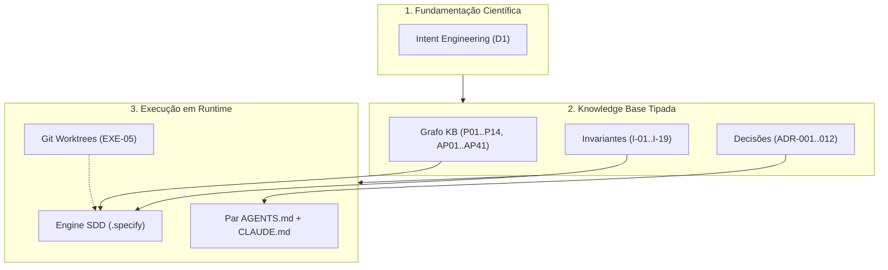
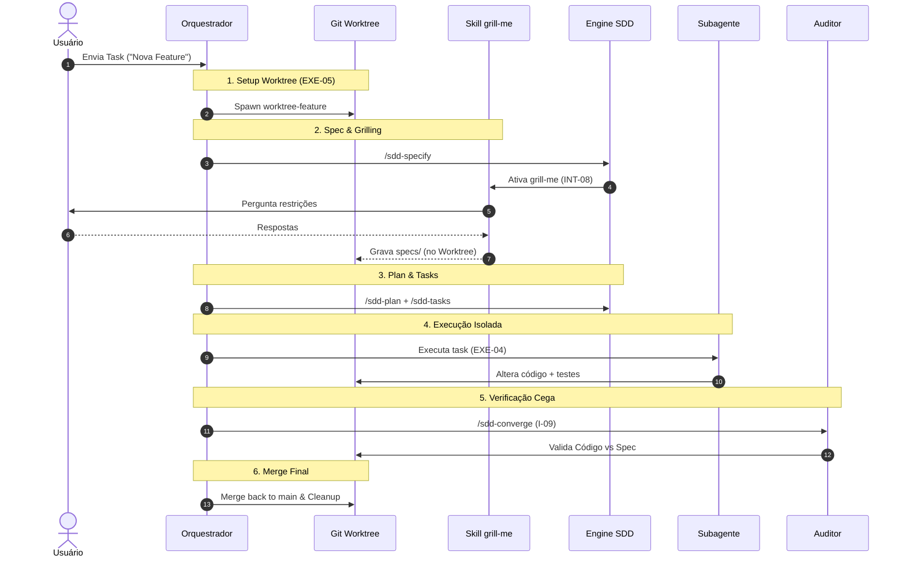

# 📱 Plataforma de Engenharia Agêntica (`labs`)
> **Edição Otimizada para Leitura no Celular**  
> *Versão Executiva, Científica e Autocontida*

---

## 📌 Resumo Executivo

> **Pergunta Fundamental**:  
> *Como fazer um agente de IA entregar software correto de forma repetível e determinística?*

A plataforma **`labs`** rejeita o "prompting ad-hoc" e estabelece um **sistema agêntico em 3 camadas**:

1. 🔬 **Fundamentação Científica**: Alinhamento formal de intenção humano-agente (`[[docs/intent-engineering/|Intent Engineering]]`).
2. 📚 **Knowledge Base Tipada**: Grafo de conhecimento com identificadores imutáveis (`P01..P14`, `AP-01..41`, `I-01..19`, `ADR-001..012`) e selos epistêmicos.
3. ⚡ **Runtime Executável**: Esteira SDD (10 slash commands) integrada a **Git Worktrees (`EXE-05`)**, **Skill `grill-me` (`INT-08`)**, **Subagentes (`CTX-03`)** e **Auditor Virgem (`I-09`)**.

---

## 🏛️ Arquitetura em 3 Camadas



---

## 🏷️ Selos Epistêmicos

Garantem honestidade intelectual sobre a origem de cada afirmação:

* `[CONSOLIDADO]`: Revisado por pares e replicado (ex: janela de atenção finita).
* `[INDÚSTRIA]`: Prática de grandes empresas (ex: Skill *Grilling* `INT-08`).
* `[OFICIAL]`: Documentação do fornecedor (ex: Git Worktrees / Anthropic).
* `[CAMPO]`: Observado em projetos reais (ex: 41 Anti-Padrões `AP-01..41`).
* `[RECENTE]`: Literatura de ~3 anos (ex: arXiv 2508.10146, arXiv 2601.16809).
* `[EXPERIMENTAL]`: Testes com limitações (ex: METR RCT arXiv 2507.09089).
* `[ACADÊMICO]`: Propostas teóricas (ex: modelagem KAOS).
* `[HIPÓTESE]`: Proposta original com regra de refutação (ex: Heurística `H-01`).

---

## 🗺️ Mapa da Knowledge Base (`kb/`)

<details>
<summary><b>👉 Clique aqui para expandir a lista de 14 Documentos Tipados</b></summary>

<br/>

* **00 Taxonomia** (`D0`–`D6`): Classificação das 7 disciplinas agênticas.
* **01 Ontologia**: Grafo de relações conceituais.
* **02 Glossário**: Terminologia técnica padronizada.
* **03 Princípios** (`P01`–`P14`): Fundamentos do sistema (Ex: `P04` Ambiguidade por custo).
* **04 Padrões**: Soluções aprovadas (`CTX-`, `INT-`, `PLN-`, `EXE-`, `VER-`, `LRN-`).
* **05 Anti-Padrões** (`AP-01`–`AP-41`): Modos de falha catalogados.
* **06 Invariantes** (`I-01`–`I-19` · `H-01`–`H-20`): Regras absolutas.
* **07 Modelos Mentais**: Como raciocinar sobre agentes.
* **08 Arquiteturas** (`AR-01`–`AR-04` · `PL-01`–`PL-06`): Topologias e esteiras.
* **09 Decisão** (`AD-01`–`AD-04` · `ME-01`–`ME-03`): Algoritmos de roteamento.
* **10 Métricas**: Métricas de contexto, churn e convergência.
* **11 ADRs** (`ADR-001`–`ADR-012`): Registro imutável de decisões.
* **12 Rastreabilidade**: Matriz requisito → código.
* **13 Bibliografia**: Fontes e links oficiais.
* **Destilações**: `anthropic-claude-code`, `worktrees`, `sub-agents`, `prompt-library`, `mattpocock-skills`, `kbmain-corpus`.

</details>

---

## 🚀 O Fluxo SDD (10 Slash Commands)

Esteira sequencial e rígida de especificação:

```
[0. /sdd-constitution]  ──► Princípios inegociáveis (I-14)
          │
[1. /sdd-specify]       ──► O QUÊ e POR QUÊ (Sem tecnologia)
          │
[1.5 /sdd-clarify]      ──► Desambiguação com humano (P04)
          │
[2. /sdd-plan]          ──► COMO (Stack, contratos, riscos)
          │
[3. /sdd-tasks]         ──► Tarefas por História (PLN-02)
          │
[3.5 /sdd-analyze]      ──► Auditoria Artefato vs Artefato
          │
[4. /sdd-implement]     ──► Código sob envelope (EXE-04)
          │
[5. /sdd-converge]      ──► Auditoria Cega Código vs Spec (I-09)
```

---

## 📐 Matriz de Ortogonalidade Agêntica

Evita a confusão entre **arquivo** e **contexto**:

* 🗂️ **Git Worktree (`EXE-05`)**: Isolamento de **arquivos/disco**. Impede sujeira na branch `main`.
* 🧠 **Subagente (`CTX-03`)**: Isolamento de **tokens/contexto**. Preserva a janela principal.
* 🔍 **Auditor Virgem (`I-09`)**: Isolamento de **avaliação**. Elimina o viés de auto-confirmação.

---

## 🔄 Pipeline Integrado E2E (`PL-06`)

Sequência de produção do recebimento da task ao merge:



---

## 📊 Gráficos de Performance (Layout Narrow)

### Retenção de Contexto Principal
```
100% |─────┐ (Início)
 90% |     └──┐ [Subagente c/ Resumo]
 80% |        └──────────┐ (95% Ativo)
 50% |     ┌─────────────┘
 30% |     └───► (Degradação s/ filtro)
   0 +─────────────────────────►
     0    2    4    6    8   Subagentes
```

### Hierarquia de Portões de Automação
1. 🔒 **CI / Pre-commit**: Garantia Absoluta (0% Falha).
2. 🛑 **Agent Hooks**: Determinístico no ciclo (~1% Falha).
3. 🤖 **Subagente Validador**: Contexto Isolado (~5% Falha).
4. 📋 **Checklist LLM**: Probabilístico (~25% Falha).
5. 📝 **Instrução Markdown**: Advisory (~40%+ Falha).

---

## 📚 Bibliografia & Links Oficiais

<details>
<summary><b>👉 Clique para expandir Fontes, URLs e Papers Citados</b></summary>

<br/>

### Documentação Oficial `[OFICIAL]`
* [Anthropic Best Practices](https://code.claude.com/docs/en/best-practices)
* [Anthropic Worktrees](https://code.claude.com/docs/en/worktrees)
* [Anthropic Sub-agents](https://code.claude.com/docs/en/sub-agents)
* [Anthropic Prompt Library](https://code.claude.com/docs/en/prompt-library)
* [GitHub Spec Kit](https://github.github.io/spec-kit/)

### Pesquisa Acadêmica `[EXPERIMENTAL]`
* **Code Survival**: [arXiv 2601.16809](https://arxiv.org/abs/2601.16809)
* **Agent Frameworks**: [arXiv 2508.10146](https://arxiv.org/html/2508.10146v1)
* **METR Productivity RCT**: [arXiv 2507.09089](https://arxiv.org/abs/2507.09089)
* **Criteria Drift (UIST 2024)**: [arXiv 2404.12272](https://arxiv.org/abs/2404.12272)

### Relatórios de Indústria `[INDÚSTRIA]`
* [DORA 2024 State of DevOps Report](https://cloud.google.com/blog/products/devops-sre/announcing-the-2024-dora-report)
* [GitClear Code Quality 2025](https://www.gitclear.com/ai_assistant_code_quality_2025_research)
* [Thoughtworks / Martin Fowler (Böckeler)](https://martinfowler.com/articles/exploring-gen-ai/sdd-3-tools.html)
* [Red Hat SDD Article](https://developers.redhat.com/articles/2025/10/22/how-spec-driven-development-improves-ai-coding-quality)
* [Matt Pocock Skills Repository](https://github.com/mattpocock/skills)

</details>

---

## 💻 Instalação Rápida (PowerShell 7)

```powershell
# 1. Instalar os Slash Commands globais
pwsh C:\workspace\labs\.specify\scripts\install.ps1

# 2. Instalar no projeto alvo
pwsh C:\workspace\labs\.specify\scripts\install.ps1 -Target C:\workspace\Projeto Alvo

# 3. Copiar o Par de Contexto
Copy-Item C:\workspace\labs\templates\AGENTS.template.md C:\workspace\Projeto Alvo\AGENTS.md
Copy-Item C:\workspace\labs\templates\CLAUDE.template.md C:\workspace\Projeto Alvo\CLAUDE.md
```

---

> 📱 **Plataforma de Engenharia Agêntica (`labs`)**  
> *Versão Mobile-First de Leitura Rápida*
