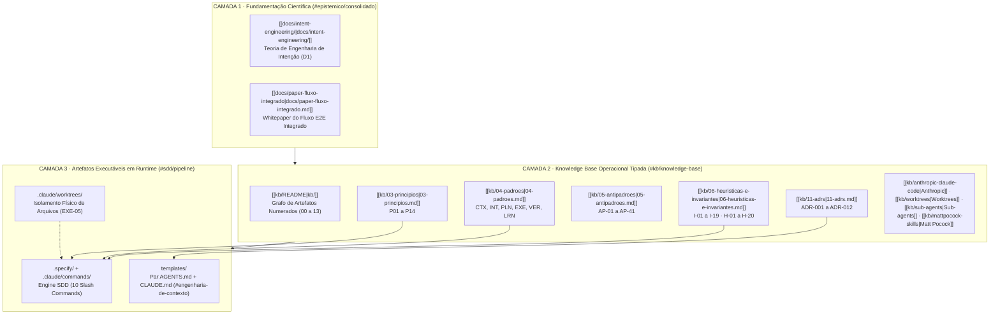
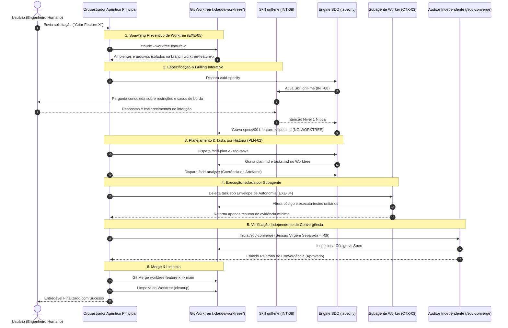

# Plataforma de Engenharia de Sistemas Agênticos (`labs`): Síntese Arquitetural, Base de Conhecimento Tipada, Evidência Científica e Fluxo SDD Determinístico

> **Documento de Apresentação Executiva & Técnica (Shareable Whitepaper)**  
> **Escopo**: Repositório Upstream de Engenharia Agêntica (`C:\workspace\labs`)  
> **Selos Epistêmicos**: `#epistemico/consolidado` `#epistemico/industria` `#epistemico/oficial` `#epistemico/campo` `#epistemico/recente` `#epistemico/experimental`  
> **Conexões do Grafo**: [[kb/README|Graph KB]], [[kb/00-taxonomia|Taxonomia]], [[kb/03-principios|Princípios]], [[kb/04-padroes|Padrões]], [[kb/05-antipadroes|Anti-padrões]], [[kb/06-heuristicas-e-invariantes|Invariantes]], [[kb/08-arquiteturas-e-pipelines|Arquiteturas]], [[kb/11-adrs|ADRs]], [[kb/13-bibliografia|Bibliografia Complete]]

---

## 1. Resumo Executivo (Abstract)

Este whitepaper formaliza a arquitetura e a metodologia do repositório **`labs`**, uma infraestrutura *upstream* desenvolvida para responder à pergunta central da engenharia de software contemporânea: **como fazer um agente de Inteligência Artificial entregar software correto de forma repetível, determinística e sustentável?**

A resposta fundamentada pelo `labs` rejeita o "prompting ad-hoc" e estabelece um **sistema agêntico em 3 camadas**:
1. **Fundamentação Científica & Intenção** (`[[docs/intent-engineering/|docs/intent-engineering/]]`): Formalização teórica do alinhamento de intenção humano-agente.
2. **Knowledge Base Operacional Tipada** (`[[kb/README|kb/]]`): Grafo de conhecimento com identificadores imutáveis (`P01..P14`, `AP-01..41`, `I-01..19`, `ADR-001..012`) respaldados por selos epistêmicos rigorosos.
3. **Artefatos Executáveis & Fluxo SDD** (`.specify/` e `templates/`): Protocolo **Spec-Driven Development** (10 slash commands) integrado a **Git Worktrees (`EXE-05`)**, **Entrevistas Conduzidas (`INT-08` / Skill `grill-me`)**, **Subagentes de Contexto Fechado (`CTX-03`)** e **Auditoria Independente de Convergência (`AR-02` / `I-09`)**.

---

## 2. Visão Geral da Arquitetura em 3 Camadas

O ecossistema `labs` separa rigorosamente a teoria, o conhecimento operacional tipado e a execução em runtime:



---

## 3. O Sistema de Selos Epistêmicos

Toda afirmação, regra ou padrão no `labs` carrega obrigatoriamente um **selo epistêmico**. Selos **nunca se misturam**, garantindo honestidade intelectual sobre a origem do conhecimento:

| Selo Epistêmico | Significado | Exemplo de Aplicação |
|---|---|---|
| `[CONSOLIDADO]` | Revisado por pares e replicado cientificamente | Janela de contexto finita produz degradação de atenção (Hunt & Thomas). |
| `[INDÚSTRIA]` | Consenso de prática em grandes empresas sem estudo controlado | Padrão *Grilling* / Entrevista Conduzida (`INT-08` / Matt Pocock Skills). |
| `[OFICIAL]` | Documentação direta do fornecedor da ferramenta | Comportamento de Git Worktrees e Subagentes na CLI da Anthropic. |
| `[CAMPO]` | Observado empiricamente nos repositórios de produção | Taxonomia de 41 Anti-Padrões (`AP-01..41`) derivados de dados de campo. |
| `[RECENTE]` | Literatura dos últimos ~3 anos (pré-prints, arXiv) | Artigos de arquitetura agêntica (`arXiv 2508.10146`, `arXiv 2601.16809`). |
| `[EXPERIMENTAL]` | Evidência empírica com escopo declarado e limitações | RCT de produtividade agêntica METR (`arXiv 2507.09089`). |
| `[ACADÊMICO]` | Proposta teórica sem adoção massiva na indústria | Modelagem formal de intencionalidade KAOS. |
| `[HIPÓTESE]` | Proposta original do `labs`, com condição clara de refutação | Regra de descarte de plano quando o diff cabe em uma frase (`H-01`). |

---

## 4. O Grafo da Knowledge Base (`kb/`) — Mapeamento Tipado

A KB não é documentação linear: é um **grafo de artefatos com identificadores imutáveis** e namespace global (`AP-14` proíbe nomes colididos).

### Tabela 2: Estrutura Canônica da KB (00 a 13 + Destilações)
*#kb/index #rastreabilidade*

| # | Documento | Responde | Identificadores Principais |
|---|---|---|---|
| 00 | `[[kb/00-taxonomia|00 — Taxonomia]]` | Onde algo se encaixa? | Disciplinas `D0` (Cognitivo) a `D6` (Aprendizado) |
| 01 | `[[kb/01-ontologia|01 — Ontologia]]` | Como os conceitos se relacionam? | Grafo ontológico de intenção e execução |
| 02 | `[[kb/02-glossario|02 — Glossário]]` | O que um termo significa aqui? | Terminologia agêntica padronizada |
| 03 | `[[kb/03-principios|03 — Princípios]]` | **Por que** fazemos assim? | `P01` a `P14` (Ex: `P04` Ambiguidade calibrada por custo) |
| 04 | `[[kb/04-padroes|04 — Padrões]]` | Como resolver problemas recorrentes? | `CTX-`, `INT-`, `PLN-`, `EXE-`, `VER-`, `LRN-` |
| 05 | `[[kb/05-antipadroes|05 — Anti-padrões]]` | O que falha repetidamente? | `AP-01` a `AP-41` (🔴 Grave / 🟡 Moderado) |
| 06 | `[[kb/06-heuristicas-e-invariantes|06 — Invariantes]]` | O que nunca pode ser violado? | `I-01` a `I-19` (Invariantes) · `H-01` a `H-20` (Heurísticas) |
| 07 | `[[kb/07-modelos-mentais|07 — Modelos Mentais]]` | Como raciocinar sobre sistemas agênticos? | Modelos mentais de controle e feedback |
| 08 | `[[kb/08-arquiteturas-e-pipelines|08 — Arquiteturas]]` | Que forma o sistema deve ter? | `AR-01` a `AR-04` · `PL-01` a `PL-06` |
| 09 | `[[kb/09-decisao-estados-algoritmos|09 — Decisão]]` | O que fazer **neste ponto**? | `AD-01` a `AD-04` · `ME-01` a `ME-03` · `AL-01` a `AL-05` |
| 10 | `[[kb/10-metricas|10 — Métricas]]` | Como medir eficácia agêntica? | Retenção de contexto, churn, taxa de convergência |
| 11 | `[[kb/11-adrs|11 — ADRs]]` | Por que **isto** e não aquilo? | `ADR-001` a `ADR-012` (Decisões Arquiteturais Imutáveis) |
| 12 | `[[kb/12-rastreabilidade|12 — Rastreabilidade]]` | Requisito cobre execução? | Matriz de rastreabilidade de ponta a ponta |
| 13 | `[[kb/13-bibliografia|13 — Bibliografia]]` | De onde vem a afirmação? | Bibliografia comentada com links e URLs |
| — | `[[kb/anthropic-claude-code|anthropic-claude-code.md]]` | Como a CLI oficial opera? | `[OFICIAL]` Boas práticas, hooks e limites |
| — | `[[kb/worktrees|worktrees.md]]` | Como isolar checkout git? | `[OFICIAL]` / `[CAMPO]` Isolamento por Worktree (`EXE-05`) |
| — | `[[kb/sub-agents|sub-agents.md]]` | Como isolar janela de contexto? | `[OFICIAL]` / `[CAMPO]` Subagentes e escopos (`CTX-03`) |
| — | `[[kb/prompt-library|prompt-library.md]]` | Qual o prompt oficial? | `[OFICIAL]` 52 prompts indexados por intenção |
| — | `[[kb/mattpocock-skills|mattpocock-skills.md]]` | Como operacionalizar engenharia? | `[INDÚSTRIA]` 21 skills (Grilling `INT-08`, Módulo Profundo `PLN-05`) |
| — | `[[kb/kbmain-corpus|kbmain-corpus.md]]` | Evidências de produção em escala? | `[CAMPO]` Análise de 619 arquivos de acervo agêntico real |

---

## 5. O Fluxo SDD (Spec-Driven Development) Executável

O SDD no `labs` é executado por **10 slash commands em Markdown**, portáveis e desacoplados de runtimes proprietários.

### Tabela 3: Esteira do Fluxo SDD
*#sdd/pipeline #git/worktree*

| Sequência | Slash Command | Artefato Produzido | Pergunta Respondida | Portão de Qualidade |
|---|---|---|---|---|
| **0** | `/sdd-constitution` | `.specify/memory/constitution.md` | Quais os princípios inegociáveis? | `I-14` (Constitution vence sempre) |
| **1** | `/sdd-specify <desc>` | `specs/NNN-slug/spec.md` | **O QUÊ** e **POR QUÊ** (sem tecnologia)? | Spec Nível 1 pura |
| **1.5** | `/sdd-clarify` | `spec.md` atualizada | Qual a resposta para ambiguidades? | `P04` / `ADR-002` (Trava se bloqueante) |
| **2** | `/sdd-plan` | `specs/NNN-slug/plan.md` | **COMO** (stack, contratos, riscos)? | Decisões técnicas explicadas |
| **3** | `/sdd-tasks` | `specs/NNN-slug/tasks.md` | Quais os passos por história? | `PLN-02` (Tarefas agrupadas por História) |
| **3.5** | `/sdd-analyze` | Relatório de Análise | Os artefatos são coerentes entre si? | Auditoria Artefato vs Artefato |
| **4** | `/sdd-implement` | Código no Repositório | Como executar task a task? | `EXE-04` (Envelope de Autonomia por Task) |
| **5** | `/sdd-converge` | Relatório de Convergência | O código satisfaz a especificação? | `AR-02` / `I-09` (Auditor Virgem Independente) |
| **—** | `/sdd-checklist` | `checklists/` | A especificação está completa? | Checklists dimensionais |

---

## 6. Matriz de Ortogonalidade Agêntica: Worktrees vs Subagentes vs Teams

Um dos erros mais dispendiosos em engenharia agêntica é a **confusão entre isolamento de arquivo e isolamento de contexto** (`[[kb/worktrees#1-o-que-um-worktree-é--e-o-que-ele-não-resolve|Worktrees vs Subagentes]]`).

```
                               EIXOS DE ISOLAMENTO AGÊNTICO
 ┌────────────────────────────────────────────────────────────────────────────────┐
 │                                                                                │
 │   1. GIT WORKTREE (Isolamento de Arquivos / Sistema de Arquivos)               │
 │      ├── Garante que edições em disco de uma sessão NÃO tocam outra sessão.    │
 │      └── Previne sujeira de rascunhos de spec (specs/) na branch main/master.   │
 │                                                                                │
 │   2. SUBAGENTE (Isolamento de Janela de Contexto / Tokens)                     │
 │      ├── Janela de contexto separada com prompt de sistema próprio.            │
 │      └── Preserva a sessão principal de ser inundada por logs e buscas.        │
 │                                                                                │
 │   3. AUDITOR INDEPENDENTE (Isolamento de Avaliação / Critic Virgem)            │
 │      ├── Executa em sessão virgem sem histórico compartilhado.                 │
 │      └── Elimina o viés de auto-confirmação (I-09 / P12).                      │
 │                                                                                │
 └────────────────────────────────────────────────────────────────────────────────┘
```

---

## 7. O Pipeline Integrado E2E (`PL-06`): Do Pedido ao Merge

O pipeline de produção em alta escala integra **Git Worktrees (`EXE-05`)**, **Entrevistas Conduzidas (`INT-08` / `grill-me`)**, **Subagentes Workers (`CTX-03`)** e **Auditoria Independente (`I-09`)**:



---

## 8. Gráficos Visuais de Métricas & Performance

### 8.1 Preservação da Janela de Contexto vs. Subagentes Paralelos
*#metricas/contexto #agentes/subagentes*

```
Retenção da Janela de Contexto Principal (%)
100% ───────┐ (Estado Início de Sessão)
 90%        └───┐ [Subagente com Resumo Estrito INT-08]
 80%            └───────────────────────────┐ (95% de Retenção Ativa)
 70%
 60%            ┌───────────────────────────┐ [Subagente Verboso sem Filtro]
 50%            └───┐                       │
 40%                └───┐                   └── (Degradação por Poluição)
 30%                    └──────────┐
  0% ──────────────────────────────┴───────────────────────────►
     0       2       4       6       8      10    Subagentes Paralelos
```

### 8.2 Hierarquia de Confiabilidade dos Portões de Automação
*#metricas/automacao #invariantes*

| Nível | Mecanismo de Portão | Garantia de Execução | Taxa de Falha |
|---|---|---|---|
| **Nível 1** | CI / Pre-commit Hooks | **Absoluta** (Mecânica) | 0% (Bloqueio estrito em falha) |
| **Nível 2** | Hook do Agente (Stop/Tool) | Determinística no ciclo | ~1% (Raras exceções de timeout) |
| **Nível 3** | Validador em Subagente | Alta (Contexto Isolado) | ~5% (Requer veredito tipado) |
| **Nível 4** | Checklist avaliado por LLM | **Baixa** (Probabilística) | ~25% (Risco de falsa aprovação) |
| **Nível 5** | Instrução em Markdown | Advisory (Recomendação) | ~40%+ (Facilmente ignorada por LLM) |

---

## 9. Bibliografia Comentada Completa & Referências de Fontes

Classificada por natureza da evidência, com URLs oficiais e papers acadêmicos citáveis:

### A. Documentação Oficial `[OFICIAL]`
- **Anthropic — Best practices for Claude Code**: [https://code.claude.com/docs/en/best-practices](https://code.claude.com/docs/en/best-practices)  
  *Fonte primária de calibração de contexto, regras de inclusão/exclusão de CLAUDE.md e modas de falha.*
- **Anthropic — Common Workflows**: [https://code.claude.com/docs/en/common-workflows](https://code.claude.com/docs/en/common-workflows)  
  *Receitas operacionais de exploração e comandos de agendamento.*
- **Anthropic — Prompt Library**: [https://code.claude.com/docs/en/prompt-library](https://code.claude.com/docs/en/prompt-library)  
  *Catálogo de 52 prompts parametrizados por papéis e fases de SDLC.*
- **Anthropic — Custom Subagents**: [https://code.claude.com/docs/en/sub-agents](https://code.claude.com/docs/en/sub-agents)  
  *Especificação técnica de subagentes, frontmatter, permissões e isolamento.*
- **Anthropic — Worktrees**: [https://code.claude.com/docs/en/worktrees](https://code.claude.com/docs/en/worktrees)  
  *Documentação de isolamento por checkouts git irmãos.*
- **GitHub — Spec Kit**: [https://github.github.io/spec-kit/](https://github.github.io/spec-kit/) · [Repositório GitHub](https://github.com/github/spec-kit)  
  *Arquitetura de especificação orientada a histórias e fundação rígida.*

### B. Pesquisa Acadêmica `[EXPERIMENTAL]` / `[RECENTE]`
- **Will It Survive? Deciphering the Fate of AI-Generated Code in Open Source** (jan/2026): [arXiv 2601.16809](https://arxiv.org/abs/2601.16809)  
  *Análise de 200 mil unidades de código; refuta a narrativa de código descartável (15,8 p.p. menos modificação).*
- **Agentic AI Frameworks: Architectures, Protocols, and Design Challenges** (IEEE preprint, 2025): [arXiv 2508.10146](https://arxiv.org/html/2508.10146v1)  
  *Taxonomia de memória e limites de papéis estáticos em CrewAI, AutoGen e LangGraph.*
- **METR — Measuring the Impact of Early-2025 AI on Experienced OSS Developer Productivity** (2025): [arXiv 2507.09089](https://arxiv.org/abs/2507.09089)  
  *RCT demonstrando desaceleração de 19% em devs sem processos estruturados em codebases maduros.*
- **Shankar et al. — Who Validates the Validators?** (UIST 2024, Berkeley): [arXiv 2404.12272](https://arxiv.org/abs/2404.12272)  
  *Origem empírica do conceito de criteria drift (P03).*
- **Zamfirescu-Pereira et al. — Why Johnny Can't Prompt** (CHI 2023, Berkeley).

### C. Relatórios & Prática de Indústria `[INDÚSTRIA]` / `[EXPERIMENTAL]`
- **DORA — 2024 Accelerate State of DevOps Report**: [Google Cloud Blog](https://cloud.google.com/blog/products/devops-sre/announcing-the-2024-dora-report)  
  *Demonstra que a adoção de IA sem processos aumenta o tamanho do lote e reduz a estabilidade em -7,2%.*
- **GitClear — AI Copilot Code Quality 2025 Research**: [GitClear Research](https://www.gitclear.com/ai_assistant_code_quality_2025_research)  
  *Estudo em 200M+ linhas mostrando churn 2x maior e acúmulo de dívida técnica.*
- **Thoughtworks / Martin Fowler (Böckeler, B.) — Understanding Spec-Driven Development**: [MartinFowler.com](https://martinfowler.com/articles/exploring-gen-ai/sdd-3-tools.html)  
  *A melhor taxonomia de SDD (spec-first vs spec-anchored vs spec-as-source).*
- **Red Hat — How spec-driven development improves AI coding quality**: [Red Hat Developers](https://developers.redhat.com/articles/2025/10/22/how-spec-driven-development-improves-ai-coding-quality)  
  *Origem do padrão LessonsLearned (LRN-01).*
- **Specmatic — CDD Case Study**: [Specmatic.io](https://specmatic.io/case-studies/case-study-cdd-cut-api-cycle-time-by-75-percent/)  
  *Redução de 75% no tempo de ciclo via especificações orientadas a contrato.*
- **Beam — Spec Driven Development: Build what you mean, not what you guess**: [Beam.ai](https://beam.ai/agentic-insights/spec-driven-development-build-what-you-mean-not-what-you-guess)
- **Matt Pocock — Skills Repository**: [GitHub Repository](https://github.com/mattpocock/skills)  
  *Origem das 21 skills operacionais de engenharia (`INT-08` Grilling, `PLN-05` Módulo Profundo).*

### D. Acervos de Campo `[CAMPO]`
- **`WWMA-Tech/inscreveai-new-project`**: Origem do padrão de 18 perguntas de revisão e PTesting.
- **`Back-End/Wakanda/wakanda-ai/sdd-kit`**: Origem da calibração Express/Standard e faixas de contexto.
- **`Freelancer/K.A.O.S`**: Origem do pipeline cognitivo de 10 estados desacoplado por portas abstratas.
- **`Corpus KbMain`**: Acervo de 619 arquivos analisado em `[[kb/kbmain-corpus|kbmain-corpus.md]]`.

---

## 10. Guia Rápido de Instalação e Adoção em Projetos

Para instalar o fluxo SDD e o par de contexto em qualquer projeto sob Windows + PowerShell 7:

```powershell
# 1. Instalar os Slash Commands globais (.claude/commands)
pwsh C:\workspace\labs\.specify\scripts\install.ps1

# 2. Instalar a estrutura SDD num projeto alvo
pwsh C:\workspace\labs\.specify\scripts\install.ps1 -Target C:\workspace\NovoProjeto

# 3. Instalar o Par de Contexto (AGENTS.md + CLAUDE.md)
Copy-Item C:\workspace\labs\templates\AGENTS.template.md C:\workspace\NovoProjeto\AGENTS.md
Copy-Item C:\workspace\labs\templates\CLAUDE.template.md C:\workspace\NovoProjeto\CLAUDE.md
```

---

## 11. Conclusão e Próximos Passos

O repositório `labs` consolida um avanço decisivo: **eleva o uso de agentes de IA de uma prática artesanal e probabilística para uma disciplina rigorosa de engenharia**. Ao combinar fundamentação teórica, base de conhecimento tipada, isolamento de arquivos por Worktree e verificadores independentes, o `labs` garante entregas corretas, testáveis e auditáveis em qualquer escala.
