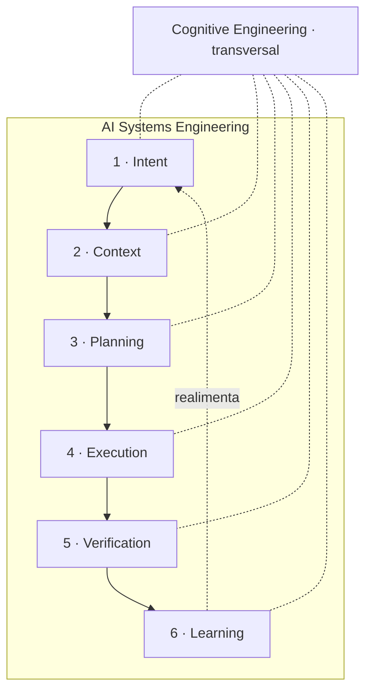

# 00 — Taxonomia

## 1. A cadeia de especialização

Cada nível é **subconjunto próprio** do anterior: tudo que vale acima continua valendo abaixo.

```
Engineering
└── Systems Engineering                    ciclo de vida, V&V, rastreabilidade, requisitos
    └── Software Engineering               software como artefato de engenharia
        └── AI Engineering                 sistemas cujo componente central é um modelo
            └── Agent Engineering          o modelo age: ferramentas, loop, autonomia
                └── AI Systems Engineering  o agente opera dentro de um sistema sócio-técnico
```

**Onde a especialização realmente acontece**, nível a nível:

| Nível | O que acrescenta | O que deixa de ser verdade |
|---|---|---|
| Systems Engineering | Requisito, verificação, validação, rastreabilidade, ciclo em V | — |
| Software Engineering | Código, build, teste automatizado, arquitetura, refatoração | Protótipo físico deixa de ser o custo dominante |
| AI Engineering | Modelo, dados, avaliação estatística, não-determinismo | **A saída deixa de ser reproduzível bit a bit** |
| Agent Engineering | Ferramentas, loop percepção-ação, memória, autonomia | **O sistema deixa de ser uma função e vira um processo** |
| AI Systems Engineering | Humanos no laço, governança, responsabilidade, operação contínua | **O sistema deixa de ter uma fronteira única e clara** |

## 2. Correção ao esboço original `[HIPÓTESE]`

O esboço proposto encadeava:
`Intent → Context → Planning → Execution → Verification → Learning`, com Cognitive Engineering acima
de Intent.

**Isso está estruturalmente errado por dois motivos, e a correção muda como a KB é usada:**

1. **Essas seis não são níveis de especialização — são fases de um ciclo.** Context Engineering não é
   um subconjunto de Intent Engineering; ela *serve* a Intent Engineering, e é servida por ela. Se
   fossem aninhadas, uma mudança em Intent implicaria mudança em todas as demais, o que não é o caso:
   trocar o formato da spec não muda como você mede *context rot*.
2. **Cognitive Engineering não é ancestral, é transversal.** Ela trata de como o executor raciocina —
   atenção, memória, carga cognitiva, viés — e isso incide sobre **todas** as seis fases. Colocá-la no
   topo da cadeia faria dela um pré-requisito de tudo, quando na verdade ela é uma *lente*.

A estrutura correta:



**Teste que distingue as duas leituras** (falsificação da correção): se Context Engineering fosse
subdisciplina de Intent Engineering, não deveria existir problema de contexto sem intenção envolvida.
Mas *context rot* — degradação de atenção em janela longa `[INDÚSTRIA]` — ocorre em tarefas puramente
exploratórias, sem spec alguma. Logo, não é aninhada.

## 3. As sete disciplinas

### D0 · Cognitive Engineering `(transversal)`

**Objeto.** Como o executor — humano ou agente — percebe, atende, lembra, decide e erra.
**Pergunta.** O que a mente que vai executar isto consegue sustentar?
**Herda de.** Cognitive Science, HCI, Cognitive Systems Engineering, arquiteturas cognitivas
(SOAR, ACT-R).
**Objetos próprios.** Janela de contexto, carga cognitiva, atenção, memória de trabalho / episódica /
semântica / procedimental, viés de confirmação, *approval fatigue*, common ground.
**Por que é transversal.** A restrição que mais determina o resultado — "a janela de contexto enche e
o desempenho degrada" `[OFICIAL]` — não pertence a nenhuma fase; ela limita todas.

### D1 · Intent Engineering

**Objeto.** Representar, transmitir, preservar e verificar a intenção.
**Pergunta.** O que se quer, por quê, e como saberemos que foi isso que saiu?
**Herda de.** Requirements Engineering (KAOS, i*, EARS), filosofia da ação, pragmática, alinhamento.
**Objetos.** Constitution, spec, requisito EARS, critério de aceite, propriedade (PROP), obstáculo,
regra de negócio, marcador de ambiguidade, envelope de autonomia.
**Aprofundamento.** [docs/intent-engineering/](../docs/intent-engineering/README.md)

### D2 · Context Engineering

**Objeto.** Curar e manter a informação disponível ao agente durante a inferência.
**Pergunta.** O que o agente precisa ver agora, e o que precisa **não** ver?
**Herda de.** Recuperação de informação, gestão de memória, arquitetura de sistemas (política ×
mecanismo).
**Objetos.** CLAUDE.md em camadas, AGENTS.md, skill, *progressive disclosure*, subagente, compactação,
memory bank, MCP, RAG, orçamento de contexto.
**Distinção que se perde o tempo todo:** Intent é a **carga**; Context é o **transporte**. Uma spec
excelente entregue num contexto poluído falha; um contexto impecável sem intenção clara também.

### D3 · Planning Engineering

**Objeto.** Transformar intenção em uma sequência executável e verificável.
**Pergunta.** Em que ordem, com quais dependências, e onde estão os portões?
**Herda de.** Planning (STRIPS, HTN), gestão de projetos, teoria de escalonamento.
**Objetos.** Plan, task, grafo de dependência, fase, portão (*gate*), estratégia de execução
(sequencial / em lote / paralela), decomposição por história, MVP, checkpoint.

### D4 · Execution Engineering

**Objeto.** Executar respeitando limites, deixando rastro e falhando de forma detectável.
**Pergunta.** Quem pode fazer o quê, com qual salvaguarda, e o que fica registrado?
**Herda de.** Engenharia de automação, teoria de controle, princípio do menor privilégio.
**Objetos.** Envelope de autonomia, *harness* (teste/lint/typecheck/CI), hook, permissão, sandbox,
worktree, commit atômico, registro de interpretação, telemetria.

### D5 · Verification Engineering

**Objeto.** Provar correspondência entre o que se quis e o que se fez.
**Pergunta.** Qual é a evidência, e quem a produziu?
**Herda de.** V&V, testes, métodos formais, epistemologia (falseabilidade).
**Objetos.** Critério discriminante, teste por exemplo, teste por propriedade (PBT), *shrinking*,
revisão adversarial, independência do validador, *quality gate*, cobertura, análise cruzada de
artefatos.

### D6 · Learning Engineering

**Objeto.** Converter execução em conhecimento reutilizável.
**Pergunta.** O que aprendemos que muda a próxima execução?
**Herda de.** Gestão de conhecimento, *organizational learning*, pós-mortem, retrospectiva.
**Objetos.** `LessonsLearned.md`, promoção de padrão, ADR, atualização de constitution, backlog de
dívida, memória de longo prazo, métricas de tendência.
**A disciplina mais negligenciada.** É a que fecha o ciclo — e a evidência de campo mais forte que
temos aponta para ela: *"o gargalo do código gerado por agentes pode não ser a qualidade da geração,
mas as práticas organizacionais que governam sua evolução de longo prazo"* (arXiv 2601.16809)
`[EXPERIMENTAL]`.

## 4. Taxonomia dos artefatos

```
Artefato de AI Systems Engineering
├── Normativo ......... constitution, política, invariante, envelope        (D1, D4)
├── Intencional ....... spec, requisito EARS, PROP, critério, obstáculo     (D1)
├── Contextual ........ CLAUDE.md, AGENTS.md, skill, memory bank, ADR       (D2)
├── Procedimental ..... plan, tasks, grafo de dependência, pipeline         (D3)
├── Operacional ....... hook, harness, permissão, worktree, commit          (D4)
├── Probatório ........ teste, PBT, relatório de verificação, evidência     (D5)
└── Reflexivo ......... lessons learned, métrica, retrospectiva, backlog    (D6)
```

**Regra de colocação** `[HIPÓTESE]`: um artefato pertence à categoria da **pergunta que responde**,
não do formato em que está escrito. Um markdown pode ser qualquer uma das sete. O erro mais comum de
organização é agrupar por formato (`docs/`) em vez de por função — e é o que produz o CLAUDE.md que
tenta ser as sete coisas ao mesmo tempo.

## 5. Classificação de maturidade das disciplinas

| Disciplina | Maturidade | Base consolidada disponível | O que ainda falta |
|---|---|---|---|
| D0 Cognitive | Alta na origem, baixa na aplicação | 50 anos de ciência cognitiva | Transposição para agentes LLM |
| D1 Intent | Alta | RE, KAOS, EARS, i* | Métrica de fidelidade |
| D2 Context | **Baixa** | Nada específico anterior a 2023 | Quase tudo — é a mais nova |
| D3 Planning | Alta na teoria | STRIPS, HTN, PM clássico | Calibração de granularidade para agentes |
| D4 Execution | Média | Automação, controle, DevOps | Envelope declarado e auditável |
| D5 Verification | Alta | V&V, testes, PBT | Verificação de intenção, não só de código |
| D6 Learning | **Baixa** | Gestão de conhecimento | Mecanismo que sobrevive ao problema de Grudin |

D2 e D6 são as fronteiras. As duas pontas do ciclo são as menos maduras — o que é coerente com a
observação de que a indústria otimizou o meio (planejar e executar) e negligenciou as bordas.

---

**Próximo:** [01 — Ontologia](01-ontologia.md)
