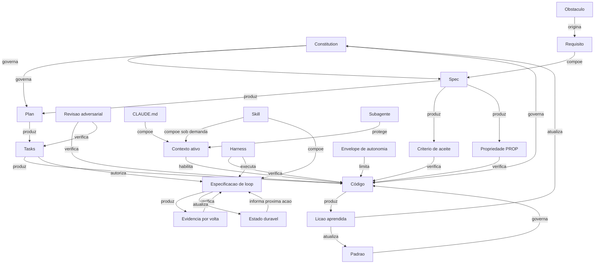

# 01 — Ontologia / Knowledge Graph

Taxonomia diz **onde** um conceito fica. Ontologia diz **como ele se liga aos outros**. É a diferença
entre uma pasta e um grafo — e é o que permite responder "se eu mudar X, o que quebra?".

## 1. Tipos de aresta

| Aresta | Significado | Direção | Teste |
|---|---|---|---|
| `depende-de` | B não funciona sem A | A → B | Remova A: B ainda faz sentido? |
| `usa` | B invoca A, mas sobrevive sem | A → B | Remova A: B degrada, não morre |
| `produz` | A gera B como saída | A → B | B existe porque A rodou |
| `verifica` | A prova alguma coisa sobre B | A → B | A pode reprovar B |
| `substitui` | B torna A desnecessário | A → B | Ter os dois é redundância |
| `complementa` | A e B cobrem partes distintas do mesmo problema | A ↔ B | Ter só um deixa lacuna |
| `conflita-com` | A e B puxam para lados opostos | A ↔ B | Maximizar A piora B |
| `evolução-de` | B é a mesma ideia numa era posterior | A → B | Mesmo problema, novo executor |
| `derivado-de` | B foi construído a partir de A | A → B | B cita A como origem |

`conflita-com` é a aresta mais valiosa e a que quase toda documentação omite. Base de conhecimento sem
conflitos registrados é propaganda.

## 2. Grafo central

## 3. Fichas de conceito

Formato: `depende-de · usa · produz · substitui · complementa · conflita-com · evolução-de`.

---

### Constitution
- **depende-de:** decisão humana de governança
- **produz:** critério de arbitragem entre artefatos
- **complementa:** Spec (constitution é permanente; spec é por mudança)
- **conflita-com:** velocidade de entrega; agilidade percebida
- **evolução-de:** *coding standards* → *rules file* → constitution
- **Nota:** `[CAMPO]` Em `inscreveai`, o papel é dividido entre `CLAUDE.md`, `.agents/AGENTS.md` e
  `.spec/memory/patterns.md` — três fontes, e **duas delas definem `P1`–`P6` com significados
  diferentes**. Isso é o anti-padrão AP-14 (Namespace Colidido).

### Spec
- **depende-de:** Constitution, Titular da intenção
- **produz:** Plan, Critérios de aceite, Propriedades
- **complementa:** Plan (QUÊ × COMO — Nível 1 rígido × Nível 2 flexível)
- **conflita-com:** *criteria drift* (a spec quer fechar; a realidade quer abrir)
- **evolução-de:** SRS → PRD → user story → spec estruturada para agente
- **Sinal de saúde:** taxa de revisão decrescente. Spec que nunca muda é suspeita.

### Requisito EARS
- **depende-de:** Glossário / linguagem ubíqua
- **produz:** Critério de aceite (tipos Event-Driven e Unwanted) · Propriedade (tipos Ubiquitous e
  State-Driven)
- **substitui:** requisito em prosa livre
- **complementa:** Given/When/Then (EARS declara, GWT exemplifica)
- **Regra de derivação** `[CAMPO]` (`spec.template.md` V5 §9): *Ubiquitous* e *State-Driven* são
  candidatos naturais a PROP; *Event-Driven* e *Unwanted* viram critério de aceite. Se um Ubiquitous
  não virar PROP, o motivo fica registrado.

### Propriedade (PROP)
- **depende-de:** Requisito universal ("sempre", "nunca", "qualquer", "independente de")
- **usa:** gerador, *shrinking*
- **verifica:** invariante em todo o espaço de entrada
- **complementa:** teste por exemplo (exemplo prova exemplo; propriedade prova regra)
- **conflita-com:** custo de execução e qualidade do gerador
- **Limite declarado** `[CAMPO]` (`correctness/01-conceito.md`): PBT não pega requisito errado, não
  pega o que o gerador não gera, e não é verificação formal.

### Contexto ativo
- **depende-de:** janela do modelo
- **usa:** CLAUDE.md, skills, arquivos lidos, saídas de comando
- **habilita:** toda execução
- **conflita-com:** ele mesmo em escala — **mais contexto degrada atenção** (*context rot*)
  `[OFICIAL]`
- **Nota:** é o **recurso mais importante a gerenciar**. Quase toda boa prática do Claude Code deriva
  desta única restrição.

### CLAUDE.md
- **depende-de:** projeto
- **compõe:** Contexto ativo — **em toda sessão, sempre**
- **complementa:** Skill (permanente × sob demanda)
- **conflita-com:** ele mesmo — cada linha acrescentada dilui a atenção nas demais
- **Teste de inclusão** `[OFICIAL]`: *"remover esta linha faria o Claude errar?"* Se não, corte.
- **evolução-de:** README → CONTRIBUTING → rules file → CLAUDE.md

### Skill (SKILL.md)
- **depende-de:** metadados (nome + descrição) para ser descoberta
- **usa:** *progressive disclosure* — só metadados no boot; corpo ao ser acionada
- **substitui:** seções condicionais do CLAUDE.md
- **complementa:** Subagente (skill dá conhecimento; subagente dá contexto isolado)
- **Regra:** conhecimento que vale *às vezes* é skill; que vale *sempre* é CLAUDE.md.

### Subagente
- **depende-de:** tarefa delegável e critério de retorno
- **produz:** resumo, sem o custo de contexto da investigação
- **protege:** Contexto ativo do orquestrador
- **complementa:** revisão adversarial (contexto novo = sem viés do autor)
- **conflita-com:** coerência — o subagente não vê o que o principal viu
- **Precedente** `[CAMPO]`: `sdd-kit` tem 11 subagentes especializados e um **Validator Independence
  Protocol** explícito: *"você não pode validar seu próprio código no mesmo contexto"*.

### Plan
- **depende-de:** Spec aprovada
- **produz:** Tasks, Contratos de interface
- **complementa:** Spec (Nível 2 flexível × Nível 1 rígido)
- **conflita-com:** exploração (plano fechado impede descobrir)

### Task
- **depende-de:** Plan, grafo de dependência
- **produz:** código, commit, evidência
- **verifica-por:** critério de aceite próprio + harness
- **conflita-com:** granularidade — task grande esconde bloqueio; task pequena vira burocracia
- **Formatos observados** `[CAMPO]`: `tasks.json` com `depends_on`/`acceptance_criteria`/
  `files_affected`/`tests_required` (sdd-kit) × `tasks.md` com `[P]` e agrupamento por história
  (Spec Kit). O primeiro é melhor para máquina; o segundo, para humano.

### Envelope de autonomia
- **depende-de:** critério de verificação (não se calibra liberdade sem saber como se julga)
- **limita:** Execução
- **complementa:** Harness (envelope é declarativo; harness é enforcement)
- **conflita-com:** velocidade
- **derivado-de:** níveis de automação (Parasuraman, Sheridan & Wickens, 2000) `[CONSOLIDADO]`

### Harness
- **depende-de:** projeto ter teste/lint/build executáveis
- **verifica:** código, automaticamente e sem julgamento de LLM
- **substitui:** parte da revisão humana
- **complementa:** Hook (harness é a checagem; hook é a garantia de que ela roda)
- **Formulação de campo** `[CAMPO]` (`patterns.md` P_Novo3): *"o agente é um engenheiro capaz e cego
  ao contexto; o harness é o ambiente de segurança que restringe seus erros automaticamente"*.

### Especificação de loop
- **depende-de:** meta verificável, Envelope de autonomia, check externo e estados terminais
- **usa:** Harness, Skills, Estado durável
- **produz:** evidência por volta, mudança aceita/rejeitada, próximo candidato
- **complementa:** Task (task declara a unidade; loop declara como iterar sobre evidência)
- **conflita-com:** custo de verificação, context rot, compreensão humana e autonomia sem supervisão
- **não substitui:** Prompt, Spec, Plan, Tasks ou verificação independente
- **derivado-de:** prática de Loop Engineering sistematizada em arXiv 2607.00038 `[RECENTE]`
- **regra:** feedback que não muda a próxima ação implica execução única/agendada, não loop.

### Hook
- **depende-de:** evento do ciclo do agente
- **substitui:** instrução de CLAUDE.md que precisa valer **sempre**
- **conflita-com:** flexibilidade
- **Regra** `[OFICIAL]`: instrução em CLAUDE.md é *advisory*; hook é **determinístico**. Se algo tem de
  acontecer toda vez sem exceção, é hook — não é linha de documento.

### Revisão adversarial
- **depende-de:** contexto separado do executor
- **verifica:** código × plano × spec
- **complementa:** Harness (harness pega o mecânico; revisão pega o semântico)
- **conflita-com:** ela mesma em excesso — *"um revisor instruído a achar lacunas vai reportar
  alguma, mesmo quando o trabalho está correto"* `[OFICIAL]`, o que leva a *over-engineering*
- **Mitigação:** instruir a sinalizar **só** o que afeta correção ou requisito declarado.

### Lição aprendida
- **depende-de:** falha ou surpresa registrada
- **atualiza:** Constitution, Padrão, Skill
- **evolução-de:** post-mortem → retrospectiva → `LessonsLearned.md` consumido pelo agente
- **conflita-com:** o problema de Grudin — quem paga a captura não colhe o benefício
- **Precedente** `[OFICIAL/INDÚSTRIA]` (Red Hat): o prompt de geração instrui o agente a registrar
  erro+correção em `LessonsLearned.md` e **consultá-lo antes de corrigir**. É um laço D6→D2.

---

## 4. Conflitos registrados

O núcleo da ontologia. Cada linha é uma tensão real, não um trade-off retórico.

| # | A | B | Natureza do conflito | Arbitragem proposta |
|---|---|---|---|---|
| X1 | Completude da spec | Custo de revisão | Mais spec = mais markdown para revisar; Böckeler: *"prefiro revisar código a revisar esses markdowns"* | Calibrar por porte da mudança (Lightweight/Standard/Full) |
| X2 | Contexto rico | Atenção do modelo | *Context rot*: janela maior ≠ aderência maior | Progressive disclosure + subagentes |
| X3 | Especificar antes | Descobrir critério executando | *Criteria drift*: critérios dependem de ver saídas | Spec como artefato de convergência, não documento fechado |
| X4 | Autonomia do agente | Responsabilidade humana | Delegar execução não delega responsabilidade | Envelope declarado por task |
| X5 | Rigidez da spec | Inteligência do modelo | *Over-specifying* vira "programar em inglês"; *under-specifying* vira alucinação | Especificação hierárquica: Nível 1 rígido / Nível 2 livre |
| X6 | Rastreabilidade | Custo de manutenção | Matriz completa e errada é pior que ausente | Rastreabilidade **verificada** ou nenhuma |
| X7 | Padrões documentados | Colisão de namespace | `[CAMPO]` `P1`–`P6` significam coisas diferentes em dois arquivos vigentes do mesmo repo | Prefixo de origem obrigatório, e prazo para unificar |
| X8 | Múltiplos harnesses de agente | Sincronização manual | `[CAMPO]` skills duplicadas em `.claude/`, `.agents/`, `.opencode/`, **versões não idênticas** | Fonte única + geração; nunca cópia manual |
| X9 | Processo pesado | Tamanho da mudança | "marreta para quebrar noz" — consenso em 3 fontes independentes | O peso do processo é proporcional ao porte |
| X10 | Verificação exaustiva | Over-engineering | Revisor sempre acha algo | Restringir achados a correção e requisito |
| X11 | Autonomia longa | Custo e erro acumulados | Mais voltas ampliam tanto ganho quanto dano e comprehension debt | Check externo + estados terminais + teto + aprovação no irreversível |

## 5. Consultas que este grafo responde

- *"Se eu mudar a constitution, o que revalidar?"* → tudo que ela `governa`: spec, plan, código —
  e por isso a constitution **não muda no meio de uma task**.
- *"Por que meu CLAUDE.md parou de funcionar?"* → `CLAUDE.md conflita-com ele mesmo`: cada linha nova
  dilui as anteriores.
- *"Onde entra PBT?"* → `Requisito universal → produz → PROP → verifica → código`. Se o requisito não
  é universal, PBT não é a ferramenta.
- *"Posso pular o plan?"* → `Plan produz Contratos`; sem ele, a execução **inventa** os contratos.
- *"Por que a auto-verificação não vale?"* → `Revisão adversarial depende-de contexto separado`.

---

**Anterior:** [00 — Taxonomia](00-taxonomia.md) · **Próximo:** [02 — Glossário](02-glossario.md)
