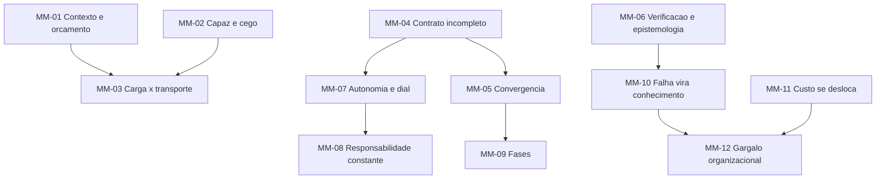

# 07 — Modelos mentais

Um modelo mental não é uma regra: é uma **forma de raciocinar** que gera regras. Quando você acerta o
modelo, as regras se derivam sozinhas; quando erra, decora regras que não compõem.

Formato: enunciado · o que explica · o que prevê · **onde o modelo quebra**.

---

## MM-01 · O contexto é o orçamento, não o texto

**Enunciado.** Trate a janela como um orçamento finito que se gasta e não se recupera dentro da
sessão. Cada arquivo lido, cada saída de comando, cada correção é um débito.

**Explica.** Por que `/clear` melhora o resultado; por que subagente existe; por que CLAUDE.md longo
piora tudo; por que sessão longa fica burra.
**Prevê.** Que aumentar a janela do modelo **não** resolve — só adia. E que a métrica útil não é
"quanto cabe" e sim "quanto do que está lá ainda influencia a saída".
**Quebra quando.** A tarefa exige genuinamente muito contexto simultâneo (refactor global). Aí o
modelo certo é fatiar o problema, não o contexto.

## MM-02 · O agente é um engenheiro capaz e cego ao contexto

**Enunciado.** `[CAMPO]` Assuma competência técnica alta e **conhecimento zero do que não foi dito**.
Nem burro, nem onisciente.

**Explica.** Por que "não explique o que é JWT" e "sim, explique que este projeto usa dois ambientes e
não tem staging" convivem sem contradição.
**Prevê.** Que a instrução útil é sempre sobre o **específico e não-óbvio**, nunca sobre o geral.
**Quebra quando.** O modelo realmente não sabe algo técnico recente (API nova, versão de biblioteca
posterior ao treino). Sintoma: alucinação de API — para o que existem *usage specs* e registries.

## MM-03 · Intenção é carga; contexto é transporte

**Enunciado.** Uma spec excelente entregue num contexto poluído falha. Um contexto impecável sem
intenção clara também. São problemas **diferentes** e se diagnosticam diferente.

**Explica.** Por que "adicionar mais documentação" às vezes piora: você aumentou o transporte sem
melhorar a carga.
**Prevê.** Que os dois modos de falha têm sintomas distintos — carga ruim produz o *resultado errado*
com confiança; transporte ruim produz *inconsistência* e esquecimento.
**Quebra quando.** A intenção só existe implícita no contexto (código legado sem spec). Aí o
transporte **é** a carga, e é por isso que engenharia reversa de spec é valiosa.

## MM-04 · Especificação é contrato incompleto

**Enunciado.** Nenhuma spec cobre todas as contingências — a incompletude é estrutural, não preguiça.
A pergunta de engenharia não é "como eliminar as lacunas" e sim **"quem decide nas lacunas, e isso
fica visível?"**

**Explica.** Por que buscar completude é fútil; por que envelope de autonomia é necessário; por que
registro de interpretação importa.
**Prevê.** Que aumentar o detalhe da spec tem retorno decrescente e depois **negativo** (AP-06).
**Quebra quando.** O domínio é pequeno e fechado o bastante para ser exaustivo (um parser, um
protocolo).

## MM-05 · Spec é artefato de convergência, não documento a completar

**Enunciado.** Meça a spec pela **taxa decrescente de revisão**, não pela completude inicial. Spec que
não muda na primeira execução é suspeita: ou o problema era trivial, ou ninguém a confrontou.

**Explica.** Por que exigir spec fechada antes de executar falha (*criteria drift*); por que o modo
Lite existe.
**Prevê.** Que a segunda feature de um domínio precisa de menos spec que a primeira — o conhecimento
migrou para constitution e padrões.
**Quebra quando.** Execução exploratória é proibida ou cara (regulado, irreversível). Aí a cascata
volta a ser racional — e é por isso que a aviação nunca a abandonou.

## MM-06 · Verificação é epistemologia, não burocracia

**Enunciado.** A pergunta não é "passou?" e sim **"o que essa passagem me autoriza a acreditar?"**.
Um teste que nunca foi visto falhando não autoriza nada.

**Explica.** Por que forçar a falha é obrigatório; por que auto-validação não vale; por que exemplo
não prova regra universal; por que um perfil de teste que desliga a segurança torna decorativa toda
uma suíte.
**Prevê.** Que suítes grandes podem ter cobertura alta e poder de detecção baixo — e que a métrica
honesta é *mutation testing*, não cobertura.
**Quebra quando.** O custo de duvidar excede o custo do defeito (protótipo descartável).

## MM-07 · Autonomia é dial por função, não interruptor por sistema

**Enunciado.** Não existe "o agente é autônomo". Existe: quanta autonomia, **em qual função**
(aquisição de informação / análise / decisão / execução), **nesta tarefa**, dado o custo do erro.

**Explica.** Por que o mesmo agente deve poder escolher nome de variável e não poder rodar migração;
por que permission modes existem em camadas.
**Prevê.** Que autonomia global mal calibrada produz **operador degradado**: o humano perde prática e
precisa intervir exatamente na situação mais difícil, quando está menos preparado (Bainbridge, 1983).
**Quebra quando.** As tarefas são homogêneas e de baixo risco — aí um default global basta e a
granularidade só custa.

## MM-08 · Delegar execução não delega responsabilidade

**Enunciado.** A responsabilidade só se move por ato explícito de quem a detém. O total é constante.

**Explica.** Por que "o agente decidiu" nunca é explicação final; por que toda spec precisa de um
humano nomeado.
**Prevê.** Que aumentar autonomia sem redistribuir responsabilidade explicitamente cria uma zona onde
ninguém responde — e é ali que os incidentes acontecem.
**Quebra quando.** A escala torna a nomeação individual impraticável; aí migra para papel e processo,
com perda conhecida de eficácia.

## MM-09 · Pense em fases, não em conversas

**Enunciado.** O trabalho tem fases com **entradas e saídas** definidas. Uma conversa longa que
atravessa fases é o modo de falha padrão.

**Explica.** Por que sessão nova para executar a spec; por que Writer/Reviewer em sessões separadas;
por que `/clear` entre tarefas.
**Prevê.** Que a qualidade cai perto de transições de fase feitas dentro da mesma sessão — a fase
seguinte herda o ruído da anterior.
**Quebra quando.** A tarefa é genuinamente uma exploração contínua onde a história tem valor.

## MM-10 · Falha vira conhecimento ou vira recorrência

**Enunciado.** Toda falha tem exatamente dois destinos. Se não virar padrão, pergunta de revisão,
teste ou artigo de constitution, ela volta.

**Explica.** Por que `LessonsLearned.md` funciona; por que P_Novo4–21 nasceram de auditoria; por que
retrospectiva sem destino é ritual.
**Prevê.** Que a taxa de recorrência de classe de defeito é o melhor indicador único de maturidade de
uma equipe com agentes.
**Quebra quando.** A falha foi genuinamente única. Registre como nota, não como padrão — padrão falso
polui tanto quanto padrão ausente.

## MM-11 · O custo se desloca, não desaparece

**Enunciado.** SDD custa **mais** no início (tokens e horas na spec antes de existir código) e
**menos** ao longo do ciclo. A pergunta certa é sempre TCO, nunca velocidade da primeira entrega.

**Explica.** Por que a percepção de velocidade engana — METR mediu desenvolvedores **19% mais lentos**
com IA em codebases maduros, *acreditando* estar ~20% mais rápidos `[EXPERIMENTAL]`.
**Prevê.** O "muro dos três meses": dívida acumulada por uso não-estruturado vira arrasto de
manutenção. Consistente com DORA 2024 (estabilidade −7,2%) e GitClear (churn ~2×, duplicação em alta,
refatoração em queda) `[EXPERIMENTAL]`.
**Quebra quando.** O software é genuinamente descartável (script de uma vez, protótipo de demo). Ali o
TCO é o custo de escrever, e vibe coding é a escolha racional.

## MM-12 · O gargalo é organizacional, não geracional

**Enunciado.** A qualidade do que o modelo gera deixou de ser o limitante. O limitante é o processo
que governa a evolução do que foi gerado.

**Explica.** Por que times com o mesmo modelo obtêm resultados muito diferentes.
**Evidência.** `[EXPERIMENTAL]` Análise de sobrevivência em 201 projetos open-source, 200 mil unidades
de código: código autorado por agente **sobrevive mais** que o humano (16% menos risco de modificação),
refutando a narrativa do "código descartável". Conclusão dos autores: *"o gargalo do código gerado por
agentes pode não ser a qualidade da geração, mas as práticas organizacionais que governam sua evolução
de longo prazo"*.
**Prevê.** Que investir em D6 (Learning) rende mais que trocar de modelo.
**Quebra quando.** O modelo é genuinamente incapaz da tarefa — aí é geracional mesmo.

---

## Como os modelos se relacionam

**Os dois de maior alcance:** MM-01 gera quase toda a prática de Context Engineering. MM-12 é o que
justifica a existência desta base de conhecimento — se o gargalo fosse o modelo, nada aqui importaria.

---

**Anterior:** [06 — Heurísticas e invariantes](06-heuristicas-e-invariantes.md) · **Próximo:** [08 — Arquiteturas e pipelines](08-arquiteturas-e-pipelines.md)
