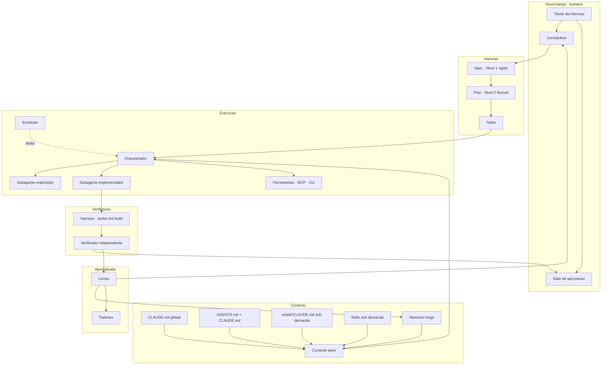
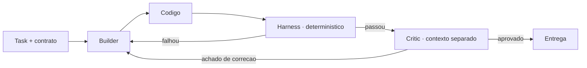
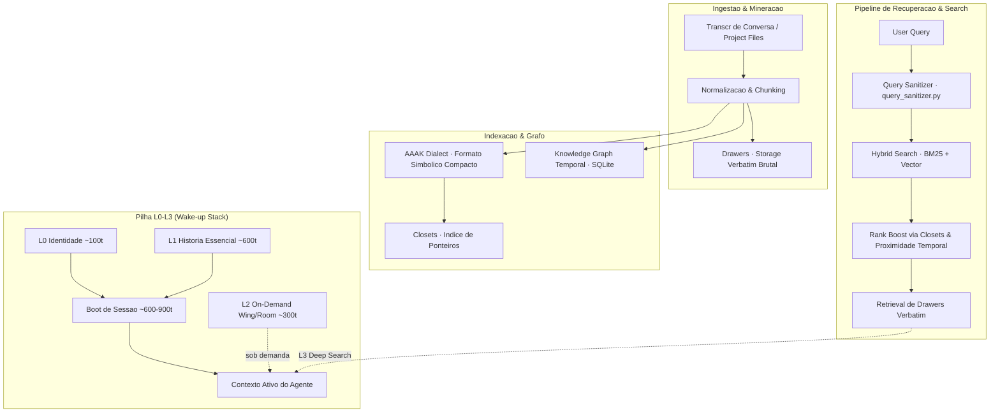
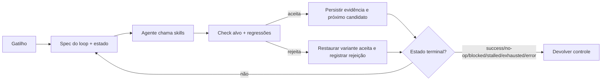
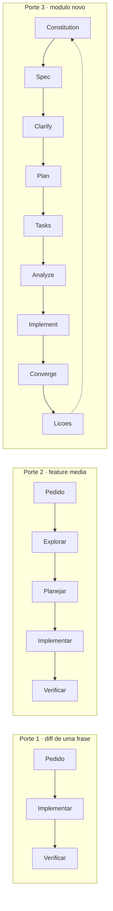
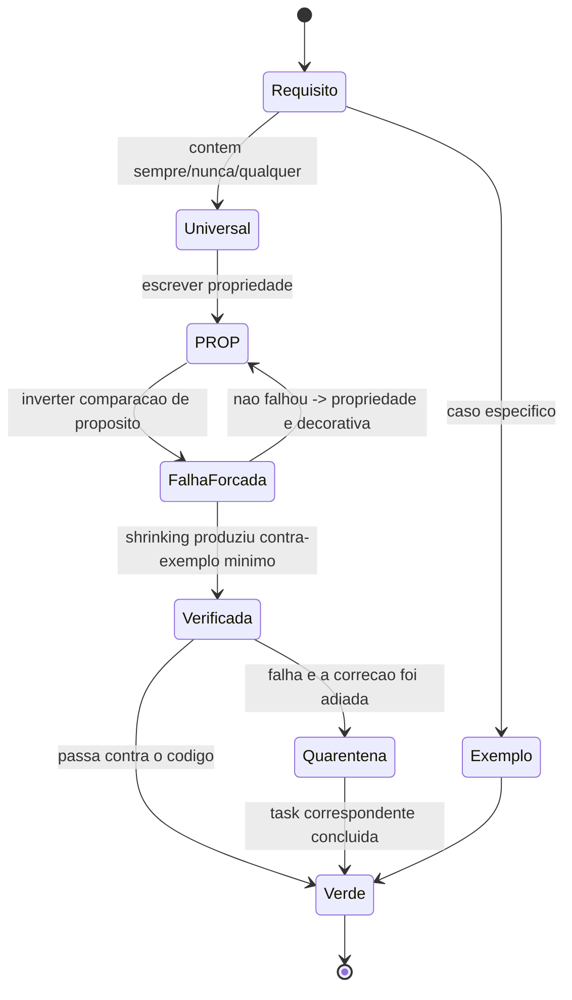
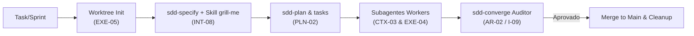
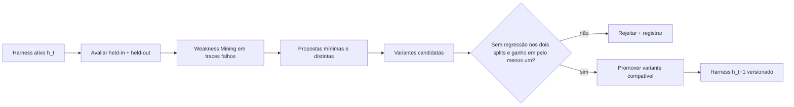

# 08 — Arquiteturas de referência e pipelines

## 1. Arquitetura de referência AR-01 · Sistema Agêntico em Camadas

Síntese das arquiteturas observadas (Claude Code, Spec Kit, sdd-kit, K.A.O.S, frameworks do arXiv
2508.10146). Cada camada tem um invariante próprio.

**Invariante de cada camada:**

| Camada | Invariante | Se violado |
|---|---|---|
| Governança | A aprovação é humana e nomeada | Responsabilidade evapora |
| Intenção | Nível 1 não é alterado pelo executor | Specification gaming |
| Contexto | Nada carregado sem necessidade | Context rot |
| Execução | Nenhuma ação fora do envelope | Dano irreversível |
| Verificação | O verificador ≠ executor | Auto-confirmação |
| Aprendizado | Toda lição tem destino | Recorrência |

**Duas propriedades que a maioria das implementações não tem:**
1. **O laço Learning → Intent existe.** Sem ele a arquitetura é linear e não aprende.
2. **Contexto é camada, não arquivo.** Desenhá-lo como um arquivo produz AP-02.

## 2. AR-02 · Builder / Critic

**Regras que fazem funcionar:**
- O Critic roda em **contexto separado** — sem isso é AP-20.
- O harness vem **antes** do Critic: o mecânico é mais barato que o semântico.
- O Critic reporta **só** o que afeta correção ou requisito declarado (VER-05), senão produz AP-24.
- Existe limite de iterações. `[CAMPO]` 3–5 por fase, com escalonamento obrigatório ao atingir o
  máximo — iterar indefinidamente também é modo de falha.

## 3. AR-03 · Frota especializada

`[CAMPO]` Observada no `sdd-kit`: 11 subagentes com papéis fixos (explorer, system-designer,
implementer, small/large-test-writer, debugger, validator-runner, layer-analyzer, backlog-manager,
project-wizard) + 7 skills de domínio.

**Quando vale.** Volume alto e repetitivo; papéis com ferramentas genuinamente diferentes.
**Limitação conhecida** `[RECENTE]` (arXiv 2508.10146): *"a maioria dos frameworks impõe papéis
estáticos, o que limita adaptabilidade — uma vez atribuído um papel, o agente não muda de comportamento
durante a execução"*. Some-se a isso a ausência de **descoberta em tempo de execução**: as interações
precisam ser definidas estaticamente.
**Custo escondido.** Cada agente é um artefato a manter e sincronizar (AP-15).

## 4. AR-04 · Topologias de orquestração multi-agente

`[CAMPO]` Destilado de um framework de decisão observado em produção
([kbmain-corpus.md](kbmain-corpus.md) §2.5). AR-01 a AR-03 descrevem **formas concretas**; AR-04 é o
eixo que as classifica e diz **qual escolher**.

| Dimensão | Supervisor | Enxame | Quadro-negro | Esteira |
|---|---|---|---|---|
| Controle | centralizado | descentralizado | espaço compartilhado | sequencial |
| Melhor para | auditabilidade, <10 agentes | resiliência, exploração | convergência multi-especialista | processamento em fases |
| Modo de falha | ponto único | degradação graciosa | fatos obsoletos/conflitantes | estágio bloqueia tudo |
| Depuração | **alta** | **baixa** (emergente) | média | alta |
| Comece aqui? | **sim** | não | não | junto ao supervisor |

**As três regras que carregam o padrão:**

1. **Comece centralizado.** Topologia descentralizada exige maturidade que não se pula, e sua
   depuração é emergente — portanto cara exatamente quando você mais precisa dela.
2. **O supervisor cuida só de roteamento, estado e decisão — nunca de lógica de domínio.** Violar isso
   cria o *agente-deus*: o orquestrador acumula regras de negócio e vira o gargalo que ele existia
   para evitar. É a violação mais comum.
3. **O quadro-negro exige mecanismo de esquecimento.** Sem descarte, o espaço compartilhado vira
   rascunho ruidoso e os agentes passam a raciocinar sobre fatos vencidos.

**Escada de maturidade de tolerância a falha** — o nível exigido é **propriedade da topologia
escolhida**, não uma decisão separada: básico (erro + log) → resiliente (retry, alternativa) →
recuperável (checkpoint) → redundante (validação múltipla, voto) → auto-curativo (decaimento de
confiança, canário). Enxame só é viável a partir do quarto degrau.

**Relação com o resto.** AR-02 (Builder/Critic) é um supervisor de dois papéis; AR-03 (frota) é um
supervisor com roteamento estático — e a limitação de papéis fixos de arXiv 2508.10146 é exatamente o
que o enxame resolve, ao custo da depuração. **Nenhuma das topologias dispensa EXE-07** (disjuntor):
laço sem teto é laço sem fim em qualquer uma delas.

**Não usar quando.** Um agente resolve. A escolha de topologia só existe a partir de dois — e a
pergunta anterior, quase sempre pulada, é se a decomposição em agentes se justifica (CTX-03).

## 5. AR-05 · Arquitetura Local-First de Palácio da Memória (MemPalace)

`[CAMPO]` Mapeada do sistema [MemPalace](mempalace-memory-system.md). Resolve o dilema entre estourar a janela de contexto com o histórico completo (`AP-04`) e sofrer de amnésia a cada nova sessão (`AP-11`), sem dependência de APIs externas de nuvem.

**Regras que fazem funcionar:**
- **Armazenamento Verbatim Imutável (Drawers)**: As falas e conteúdos originais nunca são resumidos ou alterados no nível do armazenamento base (`CTX-11`).
- **Índice Simbólico Denso (Closets/AAAK)**: Um dialeto compacto que permite ao LLM varrer centenas de ponteiros consumindo pouquíssimos tokens.
- **Wake-up em 4 Camadas (L0–L3)**: Boot com L0 (Identidade) e L1 (História Essencial) custando ~600–900 tokens (economiza >95% do contexto); L2 e L3 só entram sob demanda (`CTX-10`).
- **Hooks de Persistência Assíncronos**: Desencadeados em eventos `pre-compact`, `stop` e `session-end` (`EXE-09`).

## 5.1. AR-06 · Loop Externo Verificável

`[RECENTE]` Arquitetura da especificação de loop que opera o harness sem confundir-se com seu ciclo
interno:

**Invariantes arquiteturais.** Feedback escolhe a próxima ação · maker ≠ checker quando houver
juiz-LLM · erro/budget nunca viram sucesso · memória está em disco · teto e detector de estagnação
são obrigatórios · o envelope da task vale em toda volta.
**Composição.** Task fornece unidade autorizada; skill fornece capacidade; harness fornece ambiente e
checks; loop fornece política temporal.
**Não usar quando.** H-21 reprova a triagem.

## 6. Comparativo das arquiteturas de contexto observadas

| Dimensão | Claude Code `[OFICIAL]` | Spec Kit `[INDÚSTRIA]` | Kiro `[INDÚSTRIA]` | sdd-kit `[CAMPO]` | InscreveAI `[CAMPO]` |
|---|---|---|---|---|---|
| Memória de projeto | CLAUDE.md em camadas | `constitution.md` | *steering* (product/structure/tech) | `PROJECT.md` + standards | CLAUDE.md + AGENTS.md + `.spec/memory/` |
| Unidade de spec | livre / `SPEC.md` | `specs/NNN-slug/` (branch por spec) | requirements → design → tasks | `wip/YYYYMMDD-nome/` 4 fases | `.spec/changes/SPEC-NNN/` |
| Tasks | livre | `tasks.md` com `[P]` e histórias | lista ligada aos requisitos | `tasks.json` com `depends_on` | `tasks.md` |
| Sob demanda | skills, subdir/CLAUDE.md | — | — | skills | skills (×3 cópias) |
| Portão | plan mode, hooks | checklists (avaliados por LLM) | revisão por documento | validadores shell + subagente | gate humano `/spec-review` |
| Calibração | "pule o plano se…" | — | — | Express/Standard × Lite/Full | Lightweight/Standard/Full |

**Leitura.** Os dois que mais acertam em calibração (sdd-kit e InscreveAI) são de campo, não oficiais.
Os dois que mais acertam em portão determinístico são Claude Code (hooks) e sdd-kit (validadores
shell). **Nenhum** tem enforcement mecânico do envelope de autonomia por task — é a lacuna comum.

## 6. Pipelines

### PL-01 · Ciclo canônico (por porte)

**A escolha do porte é a decisão de maior alavancagem de todo o fluxo** — errar para cima produz
AP-03; errar para baixo produz AP-16.

### PL-02 · Research → Plan → Implement

`[CAMPO]` Padrão registrado nas suas notas, e o mesmo que a Anthropic descreve sem nomear:

1. Um agente/thread dedicado **pesquisa**: lê documentação, arquivos do projeto, entende a estrutura,
   e **itera com o dev** para definir a abordagem.
2. O conhecimento adquirido é condensado em **markdown**.
3. Esses markdowns viram **contexto de novos agentes**.

O ponto não óbvio: o valor não está na pesquisa, está no **artefato condensado**. A pesquisa é cara e
descartável; o markdown é barato e reutilizável. É D6 alimentando D2.

### PL-03 · Reverse engineering (brownfield)

`[CAMPO]` Quatro fases com honestidade epistêmica embutida:

| Fase | Saída |
|---|---|
| 1 Extração | dados brutos de docs + código |
| 2 Validação cruzada básica | `DOCUMENTATION_GAPS.md` com % de cobertura |
| 2.5 Validação profunda | `DISCREPANCIES_REPORT.md` com diffs campo a campo |
| 3 Síntese | specs com **5 níveis de confiança**: VERIFIED / PARTIAL / CODE_ONLY / DOCS_ONLY / UNKNOWN |

**O que copiar disto:** a fase 2.5 e os níveis de confiança. Documentação gerada por agente sem marca
de confiança é indistinguível de alucinação — e brownfield é justamente onde a tentação de inventar é
maior.

### PL-04 · Ciclo de correção com propriedade

Estado ausente por construção: *"afrouxada até passar"*. Não existe transição para ele.

### PL-05 · Pipeline cognitivo do kernel

`[CAMPO]` K.A.O.S: **Observe → Understand → Recall → Reason → Plan → Execute → Reflect → Learn →
Update**, com portas abstratas (`ModelPort`, `MemoryPort`, `ToolPort`) desacoplando o pipeline dos
provedores concretos.

**Mapeamento para as sete disciplinas** — e o resultado é notável:

| Estágio | Disciplina |
|---|---|
| Observe, Understand | D2 Context |
| Recall | D2 + D6 (memória) |
| Reason | D0 Cognitive |
| Plan | D3 Planning |
| Execute | D4 Execution |
| Reflect | D5 Verification |
| Learn, Update | D6 Learning |

**Falta o estágio de D1 (Intent).** No K.A.O.S a intenção vive em `mind/intent.py` e `mind/goals.py`,
**fora** do pipeline — o que é uma escolha defensável (a intenção persiste entre ciclos e não é uma
etapa) mas merece ser explícita, porque significa que nenhum estágio do pipeline é responsável por
**verificar** se a intenção foi preservada. É a mesma lacuna do AR-01 sem o laço de aprendizado.

### PL-06 · Pipeline Integrado SDD + Worktree + Grilling + Subagentes

`[CAMPO]` Formalizado no whitepaper `[[docs/paper-fluxo-integrado|paper-fluxo-integrado.md]]`. É a integração do ciclo SDD completo com isolamento preventivo em controle de versão e entrevista de intenção:

**Diferencial Operacional**: O Git Worktree é disparado **na recepção da tarefa**, isolando rascunhos de especificação (`specs/NNN-slug/`) e impedindo que a branch principal seja poluída durante a fase de entrevista/grilling (`[[kb/mattpocock-skills#51-grill-me--grilling--a-entrevista-conduzida--int-08-h-17|INT-08]]`).

### PL-07 · Self-Harness

`[EXPERIMENTAL]` Pipeline de arXiv 2606.09498 para modificar somente o harness, mantendo fixos
modelo, evaluator, ambiente, budget e corpus:

**Portão.** `Δheld_in ≥ 0 ∧ Δheld_out ≥ 0 ∧ max(Δheld_in, Δheld_out) > 0`.
**Separações.** Evaluator diagnostica; proposer sugere; promotion gate decide. O evidence bundle
descreve mecanismo recorrente, não prescreve edição.
**Limite.** Sem holdout invisível e evaluator fixo, o pipeline não mede melhoria; produz AP-49.
**Ativação.** Passar no benchmark autoriza a hipótese, não a mutação de harness compartilhado — a
promoção ainda respeita aprovação, lineage e rollback.

## 7. Automação — o que deve ser mecânico

Hierarquia de confiabilidade, do mais forte ao mais fraco:

| Nível | Mecanismo | Garantia |
|---|---|---|
| 1 | CI / pre-commit | **Absoluta** — não passa sem |
| 2 | Hook do agente | Determinística no ciclo (Stop hook cede após 8 bloqueios) |
| 3 | Validador em subagente | Alta — contexto isolado, veredito tipado |
| 4 | Checklist avaliado por LLM | **Baixa** — *"interpretado por IA, sem garantia de 100%"* |
| 5 | Instrução em markdown | Advisory |

**Regra de projeto** `[HIPÓTESE]`: todo fluxo precisa de **pelo menos um portão de nível 1 ou 2**. Um
fluxo cujos portões são todos de nível 4–5 produz AP-32 (falsa sensação de controle) — muitos
artefatos, nenhuma garantia.

---

**Anterior:** [07 — Modelos mentais](07-modelos-mentais.md) · **Próximo:** [09 — Decisão, estados e algoritmos](09-decisao-estados-algoritmos.md)
