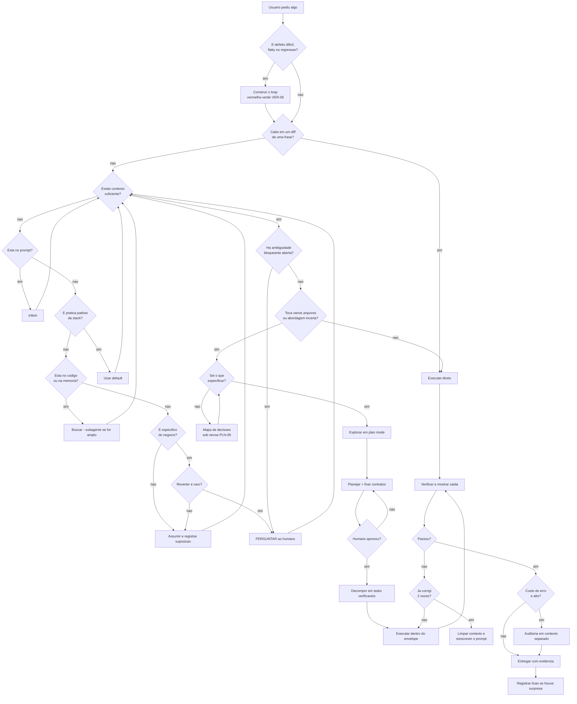
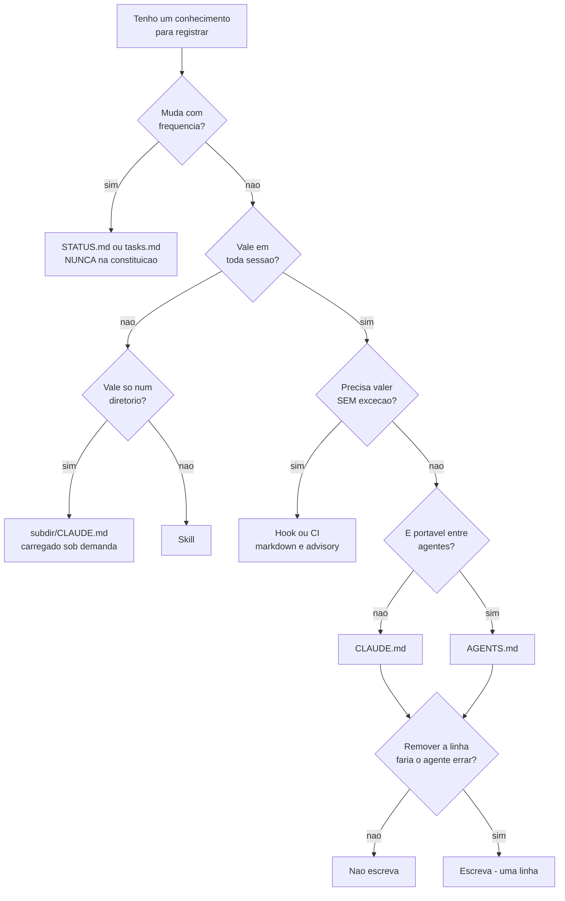
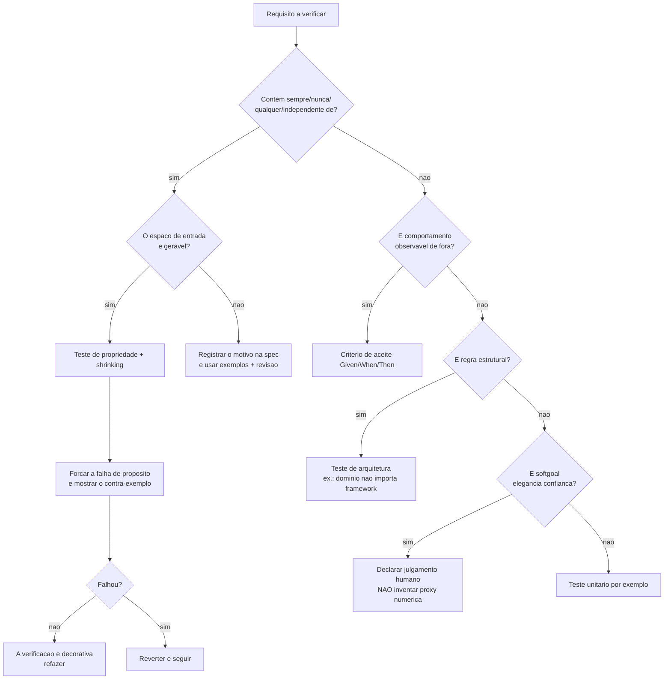
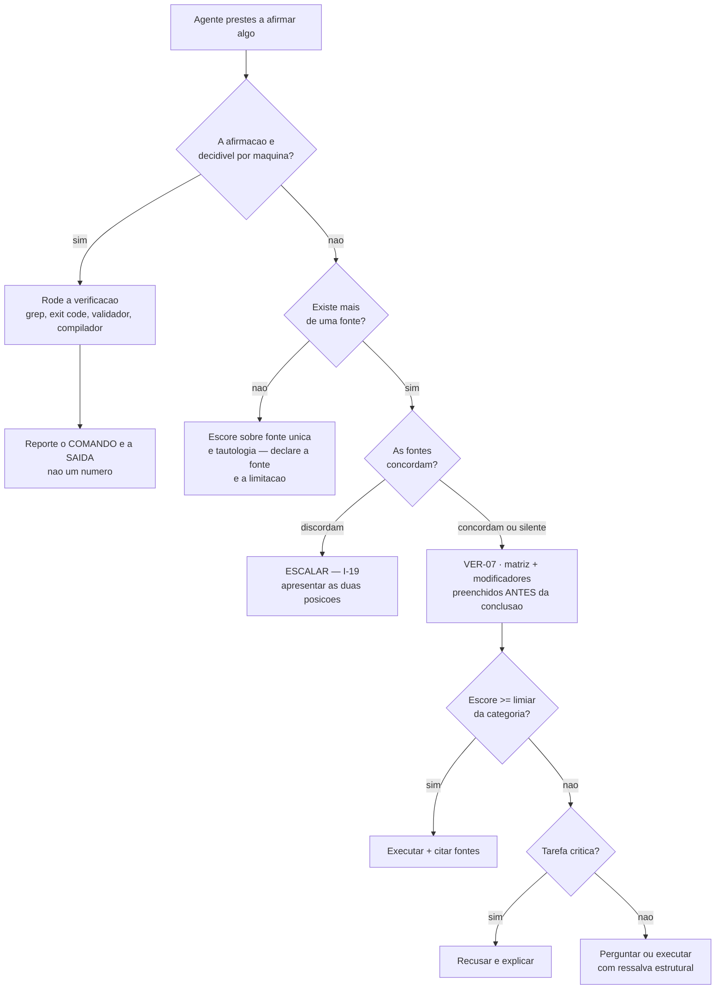
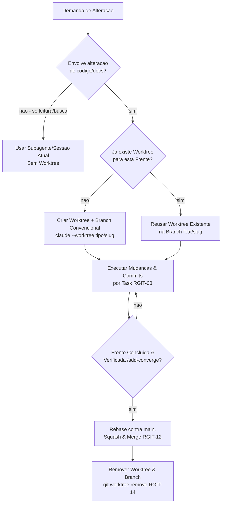
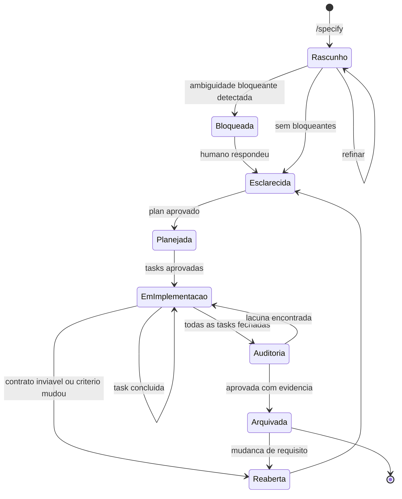
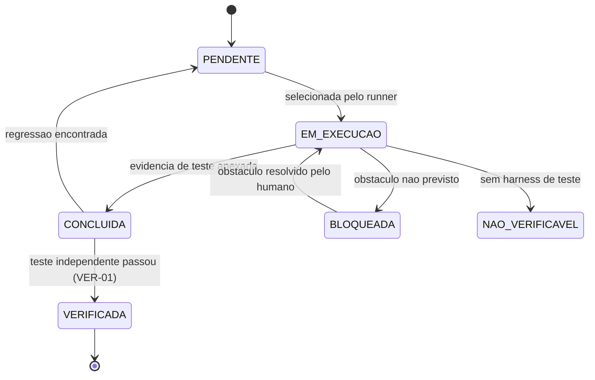
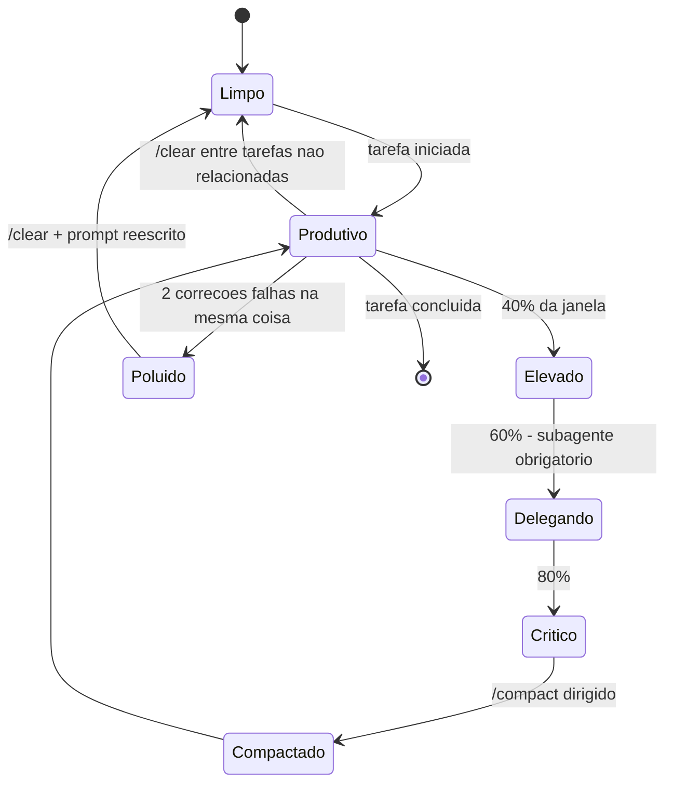
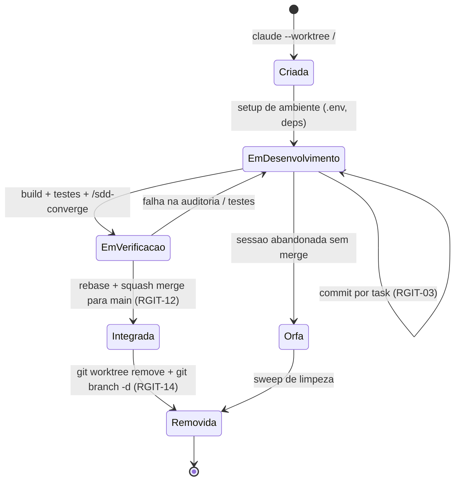

# 09 — Árvores de decisão, máquinas de estado e algoritmos conceituais

Procedimentos. Diferente de princípio (por quê) e de padrão (como): aqui é **o que fazer, agora,
neste ponto**.

---

# Parte I — Árvores de decisão

## AD-01 · Do pedido do usuário à ação

Refinamento da árvore que você esboçou, com dois acréscimos: **calibração por porte** e **custo de
reversão** — sem eles a árvore trata typo e módulo novo do mesmo jeito.



**Os seis nós que mais mudam o resultado:**
- `É defeito difícil?` — sem o loop determinístico primeiro, todo o resto da árvore roda no escuro (H-18).
- `Sei o que especificar?` — o nó que impede spec confiante e errada sobre escopo nebuloso.
- `Cabe em um diff de uma frase?` — evita AP-03 e AP-16 de uma vez.
- `Reverter é caro?` — é o que separa bloquear de assumir. Sem ele: AP-09 ou AP-19.
- `Já corrigi 2 vezes?` — o laço `X→U` sem esse corte é o modo de falha mais comum em sessão longa.
- `Custo do erro é alto?` — auditoria independente não é grátis; aplicá-la sempre produz AP-24.

## AD-02 · Onde este conhecimento deve morar



## AD-03 · Que tipo de verificação usar



O nó `K` é o mais desobedecido: sob pressão de "precisamos de uma métrica", inventa-se uma proxy — e
daí nasce AP-05 do corpus de intenção (proxy capturada, Goodhart).

## AD-04 · Escore de confiança ou evidência reproduzível?

`[CAMPO]` Aplica-se **antes** de VER-07, e é a pergunta que o corpus de origem só aprendeu a fazer
tarde. Ver [kbmain-corpus.md](kbmain-corpus.md) §2.6.



**O nó `B` é o que muda tudo, e é pulado por default.** Escore existe para quando não se pode testar;
onde há predicado, o número não acrescenta informação e **subtrai**, porque tem aparência de rigor sem
o ser — é AP-38. A regra de bolso é H-19.

**O nó `D` merece ênfase:** o formato da evidência importa. "Verifiquei e está correto" não é evidência;
o comando executado mais sua saída é — porque é **reproduzível por quem lê**, que é a única propriedade
que distingue verificação de afirmação.

**O nó `N` não é "executar com um aviso no fim".** A ressalva precisa ser **estrutural**: aviso textual
anexado a uma resposta confiante não funciona, porque o leitor ancora na resposta e desconta o aviso.
Abaixo do limiar, a resposta sai da posição de resposta e vira inventário do que se sabe, do que não se
sabe, e uma pergunta.

## AD-05 · Árvore de decisão Git e Worktree

`[CONSOLIDADO]` Aplica-se a todo pedido de alteração para determinar o fluxo de isolamento, branching e commits.



---

# Parte II — Máquinas de estado

## ME-01 · Ciclo de vida de uma spec



**Transições que a maioria dos fluxos não modela, e deveria:**
- `EmImplementacao → Reaberta` — descobrir na implementação que o contrato é inviável é **normal**.
  Sem essa transição, o executor "conserta" o contrato em silêncio (AP-21).
- `Auditoria → EmImplementacao` — auditoria que não pode reprovar não é auditoria.
- `Arquivada → Reaberta` — sem ela, `spec-anchored` é impossível e o fluxo é só `spec-first`.

## ME-02 · Ciclo de vida de uma task

```mermaid
stateDiagram-v2
    [*] --> Pendente
    Pendente --> Bloqueada: dependencia nao satisfeita
    Bloqueada --> Pendente: dependencia concluida
Processos com estados discretos e transições válidas.

## ME-01 · Estado da especificação

```mermaid
stateDiagram-v2
    [*] --> Rascunho: /sdd-specify
    Rascunho --> Rascunho: /sdd-clarify (preenche lacunas)
    Rascunho --> Esclarecida: 0 bloqueantes abertos (ADR-002)
    Esclarecida --> Planejada: /sdd-plan + /sdd-tasks
    Planejada --> EmImplementacao: /sdd-implement (task a task)
    EmImplementacao --> Implementada: todas as tasks concluidas
    Implementada --> Convergida: /sdd-converge aprovado (I-09)
    Convergida --> [*]

    EmImplementacao --> Planejada: desvio estrutural encontrado
    Rascunho --> Abandono: spec recusada pelo humano
    Abandono --> [*]
```

## ME-02 · Estado da task individual



`NaoVerificavel` é um estado **de primeira classe**, não um atalho para `Concluida`. Colapsar os dois
é como o "trust-then-verify gap" entra no processo.

## ME-03 · Estado do contexto da sessão



`Poluido` **não** se resolve compactando — a compactação preserva as abordagens falhas. Só `/clear`
com prompt reescrito sai desse estado.

## ME-04 · Ciclo de vida de Frente/Worktree

`[CONSOLIDADO]` Estado do checkout isolado por frente de trabalho (`RGIT-11`).



---

# Parte III — Algoritmos conceituais

Pseudocódigo de decisão. Não é código: é a política, escrita de forma inequívoca.

## AL-01 · Resolver lacuna de informação

```
resolver_lacuna(lacuna, contexto):
    se lacuna ∈ prompt_do_usuario:            devolve inferir(prompt)
    se lacuna ∈ defaults_da_stack:            devolve default(stack)
    se lacuna ∈ codebase:
        se escopo_da_busca é amplo:           devolve delegar_subagente(busca)
        senao:                                devolve buscar(codebase)
    se lacuna é especifica_do_negocio:
        se custo_de_reverter(lacuna) alto:    devolve perguntar_humano(lacuna)   # bloqueia
        senao:                                devolve assumir_e_registrar(lacuna)
    devolve marcar_UNKNOWN(lacuna)            # nunca inventar
```

Última linha é o **protocolo anti-invenção**: o caminho de saída padrão é `UNKNOWN`, jamais um palpite
plausível.

## AL-02 · Decidir o peso do processo

```
calibrar(mudanca):
    r = custo_de_reverter(mudanca)      # baixo | medio | alto
    n = arquivos_afetados(mudanca)
    c = certeza_da_abordagem(mudanca)   # alta | baixa

    se r == alto:                       devolve FULL          # custo do erro domina o tamanho
    se n == 1 e c == alta:              devolve DIRETO
    se n <= 5 e c == alta:              devolve PLANO_LEVE
    devolve PADRAO
```

A primeira linha é a que quase todo framework erra: calibrar por **tamanho** em vez de por **custo do
erro** faz uma linha alterada no cálculo de dinheiro ser tratada como typo.

## AL-03 · Ciclo de execução de task

```
executar(task, envelope, contratos):
    verificar_precondicoes(task.depends_on)
    para cada decisao em implementar(task):
        se decisao ∉ envelope.decide_sozinho:
            se decisao ∈ envelope.vedado:        aborta_e_reporta()
            senao:                               pedir_aprovacao(decisao)
        se decisao contradiz contratos:          para_e_reporta()   # nunca "corrigir" o contrato
        se decisao preenche lacuna da spec:      registrar_interpretacao(decisao)

    resultado = rodar(task.verificacao)
    se resultado == NAO_EXECUTAVEL:              marcar(NAO_VERIFICAVEL); reportar()
    se resultado == FALHA:                       corrigir(); repetir()     # nunca desabilitar teste
    se resultado == SUCESSO:                     marcar(CONCLUIDA, evidencia=resultado.saida)
```

## AL-04 · Verificação adversarial

```
auditar(entrega, spec, plan, constitution):
    exigir(contexto_atual ≠ contexto_de_execucao)      # senao a auditoria nao vale

    achados = []
    para cada criterio em spec.criterios:
        e = buscar_evidencia_no_codigo(criterio)        # arquivo:linha ou saida de comando
        se e ausente:               achados += LACUNA(criterio)
        se e nao_executavel:        achados += NAO_VERIFICADO(criterio)

    para cada unidade em entrega.codigo:                # a busca esquecida
        se unidade nao mapeia para nenhum requisito:
            achados += EXCEDENTE(unidade)               # escopo ampliado

    para cada artigo em constitution:
        se violado e nao_declarado_no_plan:
            achados += DESVIO_NAO_DECLARADO(artigo)

    devolve filtrar(achados, afeta_correcao_ou_requisito_declarado)   # evita over-engineering
```

O `filtrar` final é obrigatório. Sem ele, a auditoria sempre encontra algo e o resultado é AP-24.

## AL-05 · Promover falha a conhecimento

```
aprender(incidente):
    se incidente é unico e nao generalizavel:    registra_nota(); retorna

    padrao = generalizar(incidente)              # a CLASSE, nao o caso
    destino = escolher_destino(padrao):
        regra universal e mecanizavel        -> teste / hook / CI     # mais durável
        regra que exige julgamento           -> pergunta de revisao
        principio que muda decisoes futuras  -> artigo de constitution
        conhecimento de area especifica      -> skill

    escrever(destino, padrao, evidencia=incidente)
    se destino == pergunta_de_revisao:  anexar(checklist_de_review)
    verificar(destino aplicado a um caso real)    # senao é AP-33, teatro
```

A última linha é o que separa aprendizado de arquivamento: **se o novo padrão não muda nenhuma decisão
concreta, ele não foi aprendido.**

---

**Anterior:** [08 — Arquiteturas e pipelines](08-arquiteturas-e-pipelines.md) · **Próximo:** [10 — Métricas](10-metricas.md)
