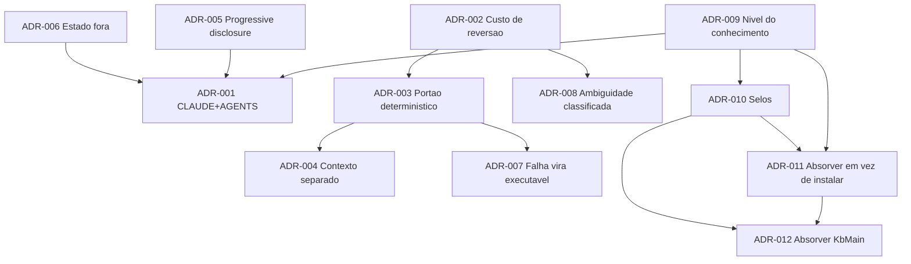

# 11 — Catálogo de decisões arquiteturais

Formato: **Problema → Alternativas → Critérios → Trade-offs → Escolha → Consequências → Revisar
quando**. O último campo é o que impede uma ADR de virar sedimento: rationale só vale se disser
**quando expira**.

Estas ADRs são sobre **como a disciplina se organiza**, não sobre um sistema específico.

---

## ADR-001 · Um par CLAUDE.md + AGENTS.md, sem duplicação

**Problema.** O mesmo conhecimento de projeto precisa servir a mais de um harness de agente. Onde ele
mora?

**Alternativas.**

| # | Alternativa | Avaliação |
|---|---|---|
| A | Só CLAUDE.md | Amarra ao fornecedor; inútil para Cursor/Codex/OpenCode |
| B | Só AGENTS.md | Perde o específico do Claude Code (skills, hooks, plan mode, worktrees) |
| C | Os dois, com conteúdo duplicado | **Produz AP-14** — observado em campo, com `P1`–`P6` significando coisas diferentes nos dois |
| D | **AGENTS.md portátil + CLAUDE.md fino que o importa** | Escolhida |

**Critérios.** Portabilidade · ausência de duplicação · custo de contexto · descobribilidade.

**Trade-offs.** Um nível de indireção (`@AGENTS.md`) × uma regra mora em um lugar só.

**Escolha.** D. `AGENTS.md` carrega comandos, arquitetura, convenções, invariantes, fluxo e envelope.
`CLAUDE.md` importa e acrescenta apenas: verificação com saída real, calibração por porte, regras de
contexto/subagente, ponteiros de skills e comandos, peculiaridades do ambiente.

**Consequências.** Todo identificador citável (padrão, regra) precisa ser **globalmente único no
repositório**. Renumerar é preferível a documentar a colisão.

**Revisar quando.** O padrão `AGENTS.md` for absorvido nativamente pelo Claude Code, ou você passar a
usar um só agente.

---

## ADR-002 · Calibração por custo de reversão, não por tamanho

**Problema.** Qual peso de processo aplicar a uma mudança?

**Alternativas.** (A) Workflow único — refutado independentemente por três fontes. (B) Calibrar por
tamanho (linhas/arquivos/dias). (C) **Calibrar por custo de reverter**, com tamanho como sinal
secundário.

**Critérios.** Custo do erro · atrito · previsibilidade.

**Trade-offs.** (B) é objetivo e fácil de automatizar, mas trata uma linha no cálculo de dinheiro como
typo. (C) exige julgamento, e é o julgamento certo.

**Escolha.** C. Regra: `se custo_de_reverter == alto → processo completo`, **antes** de olhar tamanho.

**Consequências.** O agente precisa saber quais áreas do sistema têm custo de reversão alto — isso vira
uma linha do AGENTS.md, não um julgamento improvisado.

**Revisar quando.** Houver dados internos correlacionando peso de processo e retrabalho por estrato.

---

## ADR-003 · Portão determinístico obrigatório em todo fluxo

**Problema.** Como garantir que uma regra é de fato aplicada?

**Alternativas.** (A) Instrução em markdown. (B) Checklist avaliado pelo próprio agente. (C) Validador
em subagente isolado. (D) **Hook/CI determinístico.**

**Critérios.** Garantia · custo de setup · flexibilidade.

**Trade-offs.** A e B são baratos e **não garantem nada** — *"interpretados por IA, sem garantia de
100%"*. D garante e é rígido.

**Escolha.** Todo fluxo precisa de **pelo menos um portão de nível 1–2** (CI ou hook). Níveis 3–5
complementam, nunca substituem.

**Consequências.** Regra que não pode ser mecanizada precisa ser declarada como **heurística**, não
como invariante. Isso obriga a honestidade sobre o que realmente é obrigatório.

**Revisar quando.** Surgir mecanismo de enforcement semântico confiável.

---

## ADR-004 · Verificação em contexto separado, sempre que o custo do erro for alto

**Problema.** Quem verifica a entrega?

**Alternativas.** (A) O próprio executor. (B) Outro agente no mesmo contexto. (C) **Contexto
separado.** (D) Humano.

**Critérios.** Independência · custo · profundidade.

**Trade-offs.** A é grátis e inválida (AP-20). B compartilha as premissas. C é o mínimo estruturalmente
válido. D é o mais forte e o menos escalável.

**Escolha.** C como padrão para entrega de custo de erro alto; harness (determinístico) para todo o
resto; D nos portões de negócio.

**Consequências.** O achado da auditoria precisa ser **filtrado** por "afeta correção ou requisito
declarado" — senão a independência vira over-engineering (AP-24).

**Revisar quando.** Houver dados sobre taxa de detecção de verificação independente × auto-verificação
em agentes. Hoje isso é analogia com V&V humana, não medição.

---

## ADR-005 · Progressive disclosure como padrão de empacotamento de conhecimento

**Problema.** Como distribuir conhecimento sem pagar contexto por conhecimento não usado?

**Alternativas.** (A) Tudo no arquivo permanente. (B) Documentos longos referenciados por caminho.
(C) **Skills com metadados no boot e corpo sob demanda.** (D) RAG sobre a documentação.

**Critérios.** Custo de contexto · confiabilidade de acionamento · simplicidade.

**Trade-offs.** A é confiável e caro. C é barato e **não garante acionamento** (depende da qualidade da
`description`). D é potente e acrescenta infraestrutura.

**Escolha.** C como padrão; A só para o que vale sempre; D quando o corpus não cabe em skills.

**Consequências.** Artefato carregado de uma vez tem orçamento: **acima de ~20 KB, quebre em núcleo +
`references/`**. Isso reprova diretamente comandos de 60–97 KB observados em campo (AP-27).

**Revisar quando.** O custo de contexto deixar de ser o limitante — o que ainda não aconteceu, apesar
das janelas maiores.

---

## ADR-006 · Estado volátil fora dos arquivos de contexto permanente

**Problema.** Onde registrar "o que está em andamento"?

**Alternativas.** (A) No CLAUDE.md. (B) Em arquivo próprio referenciado. (C) Só no rastreador
externo. (D) Derivar do git/tasks.

**Critérios.** Frescor · custo de contexto · esforço de manutenção.

**Trade-offs.** A é conveniente e **envelhece silenciosamente** — o agente age sobre um retrato falso e
ninguém percebe. D é sempre fresco e menos legível.

**Escolha.** B como padrão (`STATUS.md`/`tasks.md`), com D onde for derivável. O arquivo permanente
**aponta** onde está a verdade; não a repete.

**Consequências.** Regra de redação: se uma frase do arquivo permanente pode ficar falsa amanhã sem
ninguém editar nada, ela está no arquivo errado.

**Revisar quando.** —

---

## ADR-007 · Falha vira artefato executável antes de virar documento

**Problema.** Onde colocar o que se aprendeu com um incidente?

**Alternativas.** (A) Comentário no PR. (B) Documento de lições. (C) Pergunta de checklist de review.
(D) **Teste/hook/CI.** (E) Artigo de constitution.

**Critérios.** Durabilidade · custo · abrangência.

**Trade-offs.** A morre. B depende de alguém ler. C depende de alguém revisar. D é permanente e não
depende de ninguém. E muda decisões futuras mas não pega a ocorrência.

**Escolha.** Ordem de preferência: **D → C → E → B**. Só desça um degrau quando o de cima for
genuinamente impossível.

**Consequências.** Uma parte das lições vira código, o que é mais caro no momento e infinitamente mais
barato no acumulado. O precedente de campo mais forte é a regra de arquitetura convertida em **teste**
(o núcleo de domínio que falha se importar framework).

**Revisar quando.** —

---

## ADR-008 · Marcação de ambiguidade classificada, não binária

**Problema.** Como tratar informação faltante?

**Alternativas.** (A) Assumir em silêncio. (B) Sempre perguntar. (C) Assumir e registrar.
(D) **Classificar: bloqueante × não-bloqueante com suposição registrada.**

**Critérios.** Atrito × risco.

**Trade-offs.** A produz AP-19. B produz AP-09 e faz a ferramenta ser abandonada. C é seguro e permite
que erro caro passe. D exige um julgamento por marcador.

**Escolha.** D. Bloqueante quando reverter é caro (schema, contrato público, dado, segurança); caso
contrário, suposição registrada nas premissas.

**Consequências.** A spec precisa de um estado por marcador (aberta/resolvida) e de um portão que o
leia. **Fraqueza conhecida:** o limiar de "caro" continua sendo julgamento.

**Revisar quando.** Houver medição de retrabalho por política de bloqueio, estratificada por custo de
reversão.

---

## ADR-009 · Nível do conhecimento como nível de descrição

**Problema.** Em que nível descrever o agente ao escrever regras para ele?

**Alternativas.** (A) Mecanicista (pesos, ativações). (B) Contexto (o que está na janela).
(C) **Nível do conhecimento** (objetivos + conhecimento + envelope). (D) Puramente comportamental.

**Critérios.** Independência de modelo · poder preditivo · acessibilidade ao humano não-especialista.

**Trade-offs.** A expira a cada arquitetura e é inacessível ao titular da intenção. D descreve o
passado e não prevê o futuro. C prevê sem exigir acesso interno — o argumento de Newell (1982).

**Escolha.** C.

**Consequências.** A KB fica **independente de modelo e de fornecedor** — sua propriedade mais valiosa,
e o que a distingue de prompt engineering. Custo: não explica *por que* um executor falhou num caso
concreto, só que falhou.

**Revisar quando.** A interpretabilidade der previsões acionáveis a quem escreve specs. Não é o caso.

---

## ADR-010 · Selos epistêmicos obrigatórios em toda afirmação

**Problema.** Como impedir que consenso de indústria, evidência experimental e opinião se misturem?

**Alternativas.** (A) Bibliografia no fim. (B) Citação inline. (C) **Selo por afirmação.**

**Critérios.** Rastreabilidade · atrito de escrita · utilidade para quem consome.

**Trade-offs.** A e B dizem *de onde veio*; só C diz **quanto peso a afirmação suporta**. C é mais
trabalhoso e é o único que impede a mistura.

**Escolha.** C, com oito selos, incluindo `[CAMPO]` para observação nos repositórios próprios e
`[HIPÓTESE]` com condição de falsificação obrigatória.

**Consequências.** Escrever fica mais lento. Em compensação, é possível perguntar *"o que aqui é
evidência e o que é aposta?"* e obter resposta — que é a única coisa que separa uma base de
conhecimento de uma coleção de opiniões bem escritas.

**Revisar quando.** —

---

## ADR-011 · Absorver disciplinas externas na KB, em vez de instalar o conjunto

**Problema.** Um conjunto externo de skills maduro — [mattpocock/skills](https://github.com/mattpocock/skills),
21 skills — cobre lacunas reais deste corpus. Instalamos, forkamos, ou destilamos?

**Alternativas.**

| # | Alternativa | Avaliação |
|---|---|---|
| A | Instalar o plugin gerenciado (`claude plugins install`) | Atualiza sozinho, mas 21 comandos passam a disputar gatilho com os 9 `sdd-*` — AP-14 no espaço de nomes de skill. O próprio autor alerta que instalar plugin **e** `skills.sh` deixa tudo duplicado |
| B | Forkar via `skills.sh` para dentro de `.claude/` | Arquivos editáveis, mas `.claude/commands/` é **upstream** de quatro projetos reais: cada projeto consumidor herdaria o conjunto inteiro sem ter pedido |
| C | Ignorar | Perde cinco lacunas identificadas, três delas sem cobertura alguma aqui |
| D | **Destilar na KB com identificador citável** | Escolhida |

**Critérios.** Custo de contexto por sessão · efeito nos projetos consumidores · rastreabilidade da
afirmação · esforço de manutenção.

**Trade-offs.** A e B dão comportamento de graça e cobram governança; D cobra escrita e não dá
comportamento nenhum — o conhecimento só age se alguém rotear até ele. O que decide é ADR-009: o nível
certo do conhecimento aqui é **descrição** (padrão, heurística), porque `labs` é a fonte de verdade que
outros projetos consomem, e conhecimento descrito viaja para os quatro; um plugin instalado, não.

**Escolha.** D. A destilação vira [mattpocock-skills.md](mattpocock-skills.md), com cinco padrões, três
anti-padrões e duas heurísticas citáveis (§7 de lá). O que foi lido e **recusado** fica registrado na §6
da mesma página — sem isso a destilação vira propaganda.

**Consequências.** A destilação **não se atualiza sozinha**: envelhece a partir da data de leitura
(2026-08-02) e precisa de releitura datada, exatamente como as destilações oficiais. Em troca, cada
afirmação importada carrega selo `[INDÚSTRIA]` e é distinguível do que é `[OFICIAL]` ou `[CAMPO]` —
o que uma instalação não permitiria. Abre precedente: fonte não-oficial entra na KB **se** cobrir lacuna
nomeada e vier com o registro do que foi recusado.

**Revisar quando.** O conjunto externo virar dependência real de algum projeto em `C:\workspace\`, ou o
Claude Code passar a resolver colisão de nome entre plugin e comando de projeto de forma explícita.

---

## ADR-012 · Absorver o corpus KbMain por destilação, sem importar a frota de agentes

**Problema.** Um acervo pessoal em produção — 619 arquivos, 493 de KB em 36 domínios, 58 agentes, um
dossiê metodológico e um kit de verificação — cobre lacunas reais desta KB e, diferente de qualquer
fonte anterior, **traz evidência do que apodreceu**. Importamos, destilamos, ou ignoramos?

**Alternativas.**

| # | Alternativa | Avaliação |
|---|---|---|
| A | Importar a frota de 58 agentes para `.claude/agents/` | Mesma objeção de ADR-011, agora com 58 itens: `.claude/` é upstream de quatro projetos reais. Pior — ~12 são vendor-locked e 6 são inseparáveis de um produto educacional de terceiro. Colisão de gatilho garantida com os 9 `sdd-*` (AP-14) |
| B | Copiar a árvore `kb/` do corpus para cá | Duplicaria 36 domínios majoritariamente vendor-específicos, e a estrutura de origem tem defeitos documentados (7 domínios fora do registro, dois templates mortos). Importaria a doença junto com a cura |
| C | Ignorar | Perde o único acervo `[CAMPO]` disponível que documenta **os próprios modos de apodrecimento** — evidência que nenhuma fonte oficial oferece |
| D | **Destilar na KB com identificadores citáveis, incluindo o que foi recusado** | Escolhida |

**Critérios.** Efeito nos projetos consumidores · custo de contexto por sessão · rastreabilidade da
afirmação · **e um critério novo, que ADR-011 não precisou**: separabilidade do material sensível.

**Trade-offs.** O critério novo é o que decide. O corpus contém identidade de cliente com esquema de
dados sensíveis, endpoint de produção com identificadores acionáveis, documentação corporativa restrita
e regras comerciais proprietárias. **A alternativa B tornaria a KB — que é upstream de quatro projetos —
um vetor de propagação desse material.** A destilação permite absorver a engenharia e deixar o resto
para trás por construção, não por diligência: o que não foi escrito não pode vazar.

**Escolha.** D. A destilação vira [kbmain-corpus.md](kbmain-corpus.md): cinco padrões (CTX-08, CTX-09,
EXE-07, VER-07 e a arquitetura AR-04), quatro anti-padrões (AP-38 a AP-41), duas heurísticas (H-19,
H-20), um invariante (I-19) e uma árvore de decisão (AD-04). O que foi **recusado** está na §5 de lá,
e o manuseio do material sensível na §7 — sem as duas, a destilação seria propaganda.

**Consequências.** Confirma o precedente de ADR-011 e o estende em três pontos:

1. **Fonte `[CAMPO]` de terceiro é admissível**, desde que a distinção entre observar e endossar fique
   explícita. O corpus é evidência de que algo foi feito, não de que foi feito certo — daí AP-38 a
   AP-41 saírem do mesmo acervo que fornece VER-07.
2. **O selo `[CAMPO]` passa a ter duas origens** — projetos do titular e acervos de terceiros
   observados. A distinção fica no cabeçalho de cada destilação, não no selo, porque criar um selo novo
   violaria ADR-010 (selos não se multiplicam por conveniência).
3. **Material sensível vira critério de decisão de ADR**, não etapa de revisão posterior. É a diferença
   entre não vazar por processo e não vazar por arquitetura.

O inventário sensível completo **não vive nesta KB** — fica no relatório de análise que acompanhou a
leitura, fora do que é consumido pelos projetos. Aqui só a categoria e a lição de engenharia (§7 de lá).

## Grafo de dependência

**ADR-009 é a raiz.** Se ela cair, quase tudo é reconstruído. **ADR-003 é a de maior efeito prático**:
é a que separa fluxo com garantia de fluxo com aparência de garantia.

**ADR-011 → ADR-012 é a única cadeia de precedente da lista.** ADR-011 decidiu *como* absorver
conhecimento externo; ADR-012 aplicou a decisão a um caso com uma variável nova (material sensível) e
a estendeu. Precedente que sobrevive ao segundo caso é precedente; ao primeiro, é só uma decisão.

---

**Anterior:** [10 — Métricas](10-metricas.md) · **Próximo:** [12 — Rastreabilidade](12-rastreabilidade.md)
