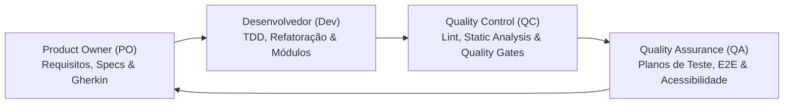
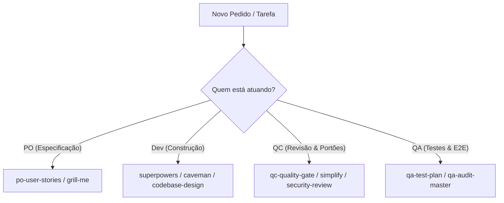

# Catálogo Extensivo de Agent Skills do GitHub — Matriz Completa (PO, QA, QC e Dev)

> Fonte: Mapeamento de repositórios do GitHub, blogs da indústria e acervos open-source (`JuliusBrussee/caveman`, `anthropics/claude-code`, `obra/superpowers`, `mattpocock/skills`, `VoltAgent/awesome-agent-skills`, `subinium/awesome-claude-code`, `Piebald-AI/claude-code-system-prompts`, `qaskills.sh`).
> Versão Ampliada — 2026-08-08.
> Selos Epistêmicos: `[OFICIAL]` Anthropic/GitHub · `[INDÚSTRIA]` Prática aberta com alta adoção · `[CONSOLIDADO]` Literatura técnica validada · `[CAMPO]` Padrões do repositório/projetos reais.

Este documento traz a matriz completa de **Agent Skills** organizadas por **papéis no ciclo de desenvolvimento de software**: **Product Owner (PO)**, **Quality Assurance (QA)**, **Quality Control (QC)** e **Desenvolvedor (Dev)**.

---

## 1. Visão Geral dos Papéis no Ciclo Agêntico

---

## 2. Skills por Papel

### 2.1 Product Owner (PO) & Product Manager (PM) — Especificação & Alinhamento de Produto

> Guia detalhado do acervo de produto: [`pm-agent-skills.md`](pm-agent-skills.md).

| Skill / Comando | Origem / Estrelas | O que faz | Selo | Template no `labs` |
|---|---|---|---|---|
| `pm-prd-spec` | Snyk / Enterpret / PM Skills | Elabora PRDs (Product Requirement Documents), RFCS e especificações funcionais completas com user flows e análise de riscos. | `[CONSOLIDADO]` | [`pm-prd-spec/SKILL.md`](../templates/skills/pm-prd-spec/SKILL.md) |
| `pm-feedback-analyzer` | Enterpret / Snyk | Ingestão e clustering de feedback de usuários, tickets e pesquisas em JTBD (Jobs-to-be-Done) e matrizes de dor. | `[INDÚSTRIA]` | [`pm-feedback-analyzer/SKILL.md`](../templates/skills/pm-feedback-analyzer/SKILL.md) |
| `pm-strategy-prioritization` | Snyk / `phuryn/pm-skills` | Priorização de iniciativas por RICE, ICE e Kano Model, teardowns de concorrentes e roadmaps de produto. | `[CONSOLIDADO]` | [`pm-strategy-prioritization/SKILL.md`](../templates/skills/pm-strategy-prioritization/SKILL.md) |
| `pm-jira-linear-stories` | Mohit / `phuryn/pm-skills` | Quebra épicos em User Stories prontas para Jira/Linear com critérios de aceite em Gherkin (`Given/When/Then`). | `[INDÚSTRIA]` | [`pm-jira-linear-stories/SKILL.md`](../templates/skills/pm-jira-linear-stories/SKILL.md) |
| `pm-metrics-north-star` | Mohit / Enterpret | Define a North Star Metric, árvore de métricas de suporte, especificações de telemetria e planos de teste A/B. | `[CONSOLIDADO]` | [`pm-metrics-north-star/SKILL.md`](../templates/skills/pm-metrics-north-star/SKILL.md) |
| `pm-release-gtm` | Snyk / `phuryn/pm-skills` | Redação de Release Notes técnicas/executivas, changelogs internos e comunicações de Go-To-Market (GTM). | `[INDÚSTRIA]` | [`pm-release-gtm/SKILL.md`](../templates/skills/pm-release-gtm/SKILL.md) |
| `po-user-stories` | GitHub / Community | Converte ideias brutas em PRDs, User Stories estruturadas com critérios de aceite em Gherkin (`Given/When/Then`) e mapeamento de riscos. | `[INDÚSTRIA]` | [`po-user-stories/SKILL.md`](../templates/skills/po-user-stories/SKILL.md) |
| `grill-me` | `mattpocock/skills` (1.5k+ ★) | Entrevista socrática implacável de 8 regras para resolver ambiguidades de produto antes da engenharia tocar no código. | `[INDÚSTRIA]` | [`grill-me/SKILL.md`](../templates/skills/grill-me/SKILL.md) |
| `wayfinder` | `mattpocock/skills` | Mapeia projetos complexos envoltos em incerteza em tickets de decisão desbloqueados. | `[INDÚSTRIA]` | `kb/mattpocock-skills.md` |
| `to-spec` / `to-tickets` | Spec Kit / GitHub | Transforma conversas e reuniões em specs versionadas (`spec.md`) e tickets tracer-bullet. | `[OFICIAL]` | `.claude/commands/sdd-specify.md` |

---

### 2.2 Quality Assurance (QA) — Garantia de Qualidade & Testes

| Skill / Comando | Origem / Estrelas | O que faz | Selo | Template no `labs` |
|---|---|---|---|---|
| `unit-testing-suite` | GitHub / Community | Suíte completa de testes unitários (Jest, Vitest, PyTest, Go) seguindo padrão AAA (Arrange-Act-Assert), mocks limpos e cobertura de bordas. | `[INDÚSTRIA]` | [`unit-testing-suite/SKILL.md`](../templates/skills/unit-testing-suite/SKILL.md) |
| `e2e-playwright-cypress` | Playwright / Cypress | Automação E2E com Page Object Model (POM), esperas determinísticas sem flakiness, testes visuais e execução CI. | `[INDÚSTRIA]` | [`e2e-playwright-cypress/SKILL.md`](../templates/skills/e2e-playwright-cypress/SKILL.md) |
| `api-contract-testing` | GitHub / OpenAPI | Validação de contratos de API REST/GraphQL, validação de schemas JSON, testes de integração de banco e status HTTP. | `[INDÚSTRIA]` | [`api-contract-testing/SKILL.md`](../templates/skills/api-contract-testing/SKILL.md) |
| `qa-test-plan` | `qaskills.sh` / GitHub | Gera planos de teste exaustivos (caminho feliz, casos negativos, limites, testes de carga) e scaffolds de automação E2E (Playwright/Cypress). | `[INDÚSTRIA]` | [`qa-test-plan/SKILL.md`](../templates/skills/qa-test-plan/SKILL.md) |
| `web-mcp-e2e-tester` | MCP / Playwright / DevTools | Auditoria automatizada de sites via MCP: captura erros de console JS, requisições de rede 4xx/5xx, screenshots e auditoria Lighthouse. | `[OFICIAL]` | [`web-mcp-e2e-tester/SKILL.md`](../templates/skills/web-mcp-e2e-tester/SKILL.md) |
| `qa-audit-master` | Master Prompts (`labs`) | Protocolo completo de auditoria integrando QA, DevTools, E2E, UX/UI e conformidade WCAG 2.2 AA. | `[CAMPO]` | `templates/master-prompts/qa-audit-master-prompt.md` |

---

### 2.3 Quality Control (QC) — Controle & Portões de Qualidade

| Skill / Comando | Origem / Estrelas | O que faz | Selo | Template no `labs` |
|---|---|---|---|---|
| `sonarqube-static-analysis` | SonarQube / SonarCloud | Auditoria de portão de qualidade contra SonarQube: complexidade cognitiva (>15), duplicidade de código, code smells e vulnerabilidades OWASP. | `[CONSOLIDADO]` | [`sonarqube-static-analysis/SKILL.md`](../templates/skills/sonarqube-static-analysis/SKILL.md) |
| `code-review-bug-hunter` | GitHub / Anthropic | Auditoria rigorosa de código em 2 eixos (especificação vs padrões) para detectar erros de lógica, concorrência, vazamento de memória e falhas de segurança. | `[INDÚSTRIA]` | [`code-review-bug-hunter/SKILL.md`](../templates/skills/code-review-bug-hunter/SKILL.md) |
| `qc-quality-gate` | GitHub / `labs` | Audita o código antes do merge contra portões de qualidade: cobertura mínima, zero erros de lint/typecheck, conformidade arquitetural. | `[CAMPO]` | [`qc-quality-gate/SKILL.md`](../templates/skills/qc-quality-gate/SKILL.md) |
| `/simplify` | Anthropic Claude Code (1k+ ★) | Trilha multi-agente paralela de refatoração: reuso de código, qualidade/legibilidade e eliminação de sobre-engenharia. | `[OFICIAL]` | [`simplify/SKILL.md`](../templates/skills/simplify/SKILL.md) |
| `security-review` | Anthropic Official | Subagente isolado que revisa o código contra vulnerabilidades OWASP Top 10, vazamento de segredos e injeções. | `[OFICIAL]` | `kb/prompt-library.md#run-a-security-review` |
| `review-a-pull-request` | GitHub CLI / Anthropic | Revisa PRs lendo o diff e os call-sites no codebase completo para detectar problemas transversais. | `[OFICIAL]` | `kb/prompt-library.md#review-a-pull-request` |

---

### 2.4 Desenvolvedor (Dev) — Execução, Arquitetura & Performance

| Skill / Comando | Origem / Estrelas | O que faz | Selo | Template no `labs` |
|---|---|---|---|---|
| `caveman` | `JuliusBrussee/caveman` (1k+ ★) | Estilo telegráfico conciso para cortar 65-75% de tokens de prosa mantendo código 100% exato. | `[INDÚSTRIA]` | [`caveman/SKILL.md`](../templates/skills/caveman/SKILL.md) |
| `superpowers` | `obra/superpowers` (2k+ ★) | Framework senior TDD-first, design socrático e auditoria rigorosa contra "vibe coding". | `[INDÚSTRIA]` | [`superpowers/SKILL.md`](../templates/skills/superpowers/SKILL.md) |
| `diagnosing-bugs` | `mattpocock/skills` (1.5k+ ★) | Workflow de depuração empírica em 6 passos (repro determinística, encolhimento, hipóteses ranqueadas, instrução). | `[INDÚSTRIA]` | [`diagnosing-bugs/SKILL.md`](../templates/skills/diagnosing-bugs/SKILL.md) |
| `codebase-design` | `mattpocock/skills` / Ousterhout | Guia de design para criar módulos profundos e interfaces limpas com seams de teste. | `[CONSOLIDADO]` | [`codebase-design/SKILL.md`](../skills/codebase-design/SKILL.md) |

---

### 2.5 Designer & UI/UX Engineer — Design System, Estética & Prototipagem

| Skill / Comando | Origem / Estrelas | O que faz | Selo | Template no `labs` |
|---|---|---|---|---|
| `design-system-tokens` | GitHub / `DESIGN.md` | Sistema de design canônico: criação de `DESIGN.md`, tokens CSS (paletas HSL, tipografia fluida, espaçamentos) e regras anti-AI-slop. | `[INDÚSTRIA]` | [`design-system-tokens/SKILL.md`](../templates/skills/design-system-tokens/SKILL.md) |
| `premium-frontend-ui` | GitHub Community | Interfaces de alto impacto visual: dark mode profundo, glassmorphism, degradês harmônicos, tipografia moderna e responsividade fluida. | `[CAMPO]` | [`premium-frontend-ui/SKILL.md`](../templates/skills/premium-frontend-ui/SKILL.md) |
| `motion-design-css` | GitHub Community | Micro-animações CSS e transições de alta performance (keyframes, transform GPU-accelerated, física de mola em hover/clicks). | `[INDÚSTRIA]` | [`motion-design-css/SKILL.md`](../templates/skills/motion-design-css/SKILL.md) |
| `design-to-code-proto` | GitHub / Anthropic | Conversão de mockups, wireframes e screenshots em protótipos funcionais HTML/CSS/JS e React com paridade visual. | `[OFICIAL]` | [`design-to-code-proto/SKILL.md`](../templates/skills/design-to-code-proto/SKILL.md) |

---

## 3. Matriz de Decisão: Qual Skill Usar em Cada Etapa?

---

## 4. Templates Disponíveis em `templates/skills/`

1. **PO**: [`po-user-stories/SKILL.md`](file:///c:/workspace/labs/templates/skills/po-user-stories/SKILL.md)
2. **QA**: [`qa-test-plan/SKILL.md`](file:///c:/workspace/labs/templates/skills/qa-test-plan/SKILL.md)
3. **QC**: [`qc-quality-gate/SKILL.md`](file:///c:/workspace/labs/templates/skills/qc-quality-gate/SKILL.md)
4. **Dev (Token Compression)**: [`caveman/SKILL.md`](file:///c:/workspace/labs/templates/skills/caveman/SKILL.md)
5. **Dev (Multi-Agent Refactor)**: [`simplify/SKILL.md`](file:///c:/workspace/labs/templates/skills/simplify/SKILL.md)
6. **Dev (Senior TDD Framework)**: [`superpowers/SKILL.md`](file:///c:/workspace/labs/templates/skills/superpowers/SKILL.md)
7. **Dev (Empirical Debugging)**: [`diagnosing-bugs/SKILL.md`](file:///c:/workspace/labs/templates/skills/diagnosing-bugs/SKILL.md)
8. **Dev (Deep Module Design)**: [`codebase-design/SKILL.md`](file:///c:/workspace/labs/templates/skills/codebase-design/SKILL.md)
9. **PO/Dev (Socratic Interview)**: [`grill-me/SKILL.md`](file:///c:/workspace/labs/templates/skills/grill-me/SKILL.md)

---

**Ver também:** [mattpocock-skills.md](mattpocock-skills.md) · [prompt-library.md](prompt-library.md) · [README.md](README.md)
