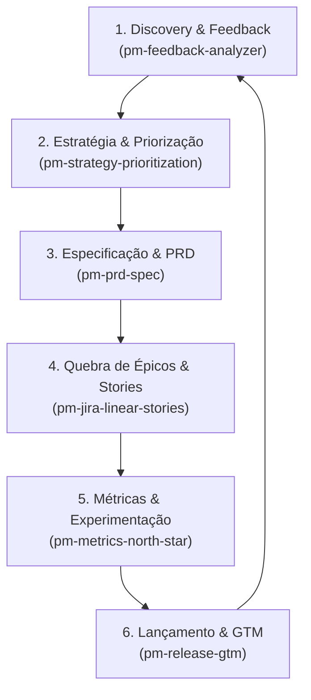

# Acervo de PM Agent Skills & Engenharia de Produtos com IA

> Fontes Primárias: Snyk (`7 Claude Skills for Product Managers`), Enterpret (`Claude Skills for Product Managers Guide`), Mohit/Medium (`12 Claude Skills for PMs`), GitHub (`phuryn/pm-skills`), Tera (`Claude.md, Projects e Skills para Product Managers` por Felipe Bedê - Afya).
> Versão: 2026-08-09.
> Selos Epistêmicos: `[INDÚSTRIA]` Prática de produto com alta adoção no ecossistema agêntico · `[CONSOLIDADO]` Literatura e frameworks consagrados de Product Management · `[CAMPO]` Padrões operacionais do repositório/projetos reais · `[OFICIAL]` Especificação Anthropic/GitHub.

---

## 1. Visão Geral do Ciclo Agêntico de Produto (PM Lifecycle)

A engenharia agêntica de produto transforma a atuação do Product Manager (PM) e do Product Owner (PO) através de rotinas assistidas por IA que cobrem desde a descoberta de problemas até o pós-lançamento.



---

## 2. Catálogo das 6 PM Agent Skills Fundamentais

| Skill | Escopo & Entregáveis | Estágio do Ciclo | Selo Epistêmico | Caminho do Template |
|---|---|---|---|---|
| `pm-prd-spec` | Elaboração de PRDs (Product Requirement Documents), RFCS, especificações funcionais com requisitos funcionais/não-funcionais, edge cases e diagramas de fluxo. | Especificação | `[CONSOLIDADO]` | [`pm-prd-spec/SKILL.md`](../templates/skills/pm-prd-spec/SKILL.md) |
| `pm-feedback-analyzer` | Ingestão e clustering de feedback bruto (entrevistas, tickets de suporte, reviews da App Store/Play Store, pesquisas NPS) mapeados em JTBD (Jobs-to-be-Done) e matrizes de dor vs frequência. | Discovery | `[INDÚSTRIA]` | [`pm-feedback-analyzer/SKILL.md`](../templates/skills/pm-feedback-analyzer/SKILL.md) |
| `pm-strategy-prioritization` | Avaliação de hipóteses via RICE, ICE e Kano Model, análise de concorrentes (Teardown), mapa de diferenciação e definição de roadmaps estratégicos. | Estratégia | `[CONSOLIDADO]` | [`pm-strategy-prioritization/SKILL.md`](../templates/skills/pm-strategy-prioritization/SKILL.md) |
| `pm-jira-linear-stories` | Decomposição de épicos e visões de alto nível em User Stories granulares com critérios de aceite em Gherkin (`Given/When/Then`), estimativas e mapeamento de dependências técnicas. | Execução | `[INDÚSTRIA]` | [`pm-jira-linear-stories/SKILL.md`](../templates/skills/pm-jira-linear-stories/SKILL.md) |
| `pm-metrics-north-star` | Definição da North Star Metric, Input Metrics (árvore de métricas), especificações de instrumentação de telemetria/eventos e desenho de testes A/B. | Métricas | `[CONSOLIDADO]` | [`pm-metrics-north-star/SKILL.md`](../templates/skills/pm-metrics-north-star/SKILL.md) |
| `pm-release-gtm` | Redação de Release Notes técnicas e executivas, changelogs internos, comunicações de Go-To-Market (GTM) para vendas/CS e checklists de lançamento. | Lançamento | `[INDÚSTRIA]` | [`pm-release-gtm/SKILL.md`](../templates/skills/pm-release-gtm/SKILL.md) |

---

## 3. Configuração de Contexto de Produto em Repositórios (`AGENTS.md` / `CLAUDE.md`) `[CAMPO]`

Conforme sintetizado no estudo da Tera (Felipe Bedê / Afya), a eficácia das **PM Agent Skills** exige que o agente entenda o contexto de negócios do produto diretamente no repositório.

### Padrão de Seção `[PRODUCT CONTEXT]` para `AGENTS.md` / `CLAUDE.md`:

```markdown
## Product Context & Persona

- **Produto**: [Nome do Produto / Sistema]
- **Modelo de Negócio**: [SaaS B2B / B2C / Marketplace / API Core]
- **Público-Alvo (ICP)**: [Desenvolvedores, Gestores Financeiros, Médicos, etc.]
- **North Star Metric**: [Ex: Retenção de 30 dias / MRR / Tarefas Concluídas por Semana]
- **Stakeholders Chave**: [Engenharia, Design, Vendas, Customer Success]
- **Rituais de Squad**: [Sprints Quinzenais, Dailies, Planning por OKRs]
- **Glossário de Domínio**:
  - `Termo A`: Definição técnica/de negócio.
  - `Termo B`: Definição de domínio.
```

---

## 4. Integração com o Fluxo SDD (Spec-Driven Development) `[CAMPO]`

As **PM Skills** conectam a fase de **Intenção** do produto com a fase de **Engenharia de Especificação** no fluxo SDD:

| Etapa PM | Skill Correspondente | Comando SDD de Transição | Artefato Gerado |
|---|---|---|---|
| Descoberta | `pm-feedback-analyzer` | `/sdd-specify` | Base para `spec.md` |
| Especificação | `pm-prd-spec` | `/sdd-specify` | `specs/NNN-slug/spec.md` |
| Validação de Premissas | `grill-me` | `/sdd-clarify` | Ambiguidade resolvida |
| Planejamento Técnico | `pm-jira-linear-stories` | `/sdd-plan` | `specs/NNN-slug/plan.md` |
| Quebra de Trabalho | `pm-jira-linear-stories` | `/sdd-tasks` | `specs/NNN-slug/tasks.md` |

---

## 5. Referências & Leituras Recomendadas `[INDÚSTRIA]`

- **Snyk**: *7 Claude Skills for Product Managers* — Práticas de integração de ferramentas e automação de fluxos de PM.
- **Enterpret**: *Claude Skills for Product Managers: The Complete Guide* — Análise de voz do cliente e agrupamento de sinais de produto.
- **Mohit (Medium)**: *12 Claude Skills for Product Managers* — Prompts estruturados para Jira, Figma e instrumentação de produto.
- **phuryn/pm-skills (GitHub)**: *PM Skills Marketplace* — Coleção aberta de competências agênticas para gestão de produto.
- **Tera (Felipe Bedê)**: *Claude.md, Projects e Skills para Product Managers* — Arquitetura de contextualização viva de produto para LLMs.

---

**Ver também:** [github-agent-skills.md](github-agent-skills.md) · [00-taxonomia.md](00-taxonomia.md) · [03-principios.md](03-principios.md)
