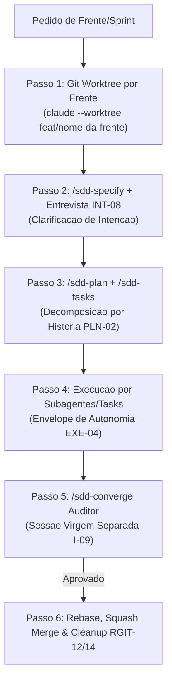

# 🚨 REGRA INVARIANTE ABSOLUTA: PIPELINE AUTOMÁTICO DE FRENTE (WORKTREE + SDD + GRILLING)

> **PRECEDÊNCIA MÁXIMA**: Esta regra SOBREPÕE qualquer outra instrução genérica ou pedido informal.
> **APLICAÇÃO AUTOMÁTICA**: Sempre que o usuário solicitar uma nova funcionalidade, sprint, história, bugfix relevante ou alteração que implique modificar código ou especificações, o agente DEVE EXECUTAR O PROTOCOLO DE 6 PASSOS ABAIXO AUTOMATICAMENTE.

---

## ⛔ INVARIANTE ZERO: ISOLAMENTO PREVENTIVO POR FRENTE (NUNCA NA MAIN)

* **É ESTRITAMENTE PROIBIDO** criar especificações (`specs/NNN-slug/`), alterar código ou rodar testes diretamente na branch principal (`main`/`master`).
* Todo e qualquer trabalho novo nasce em um **Git Worktree isolado por Frente de Trabalho** (`EXE-05`, `RGIT-11`).
* O nome da branch DEVE seguir estritamente a convenção de Conventional Branches (`RGIT-05`): `<tipo>/<slug>` (ex.: `feat/001-autenticacao`, `fix/login-redirect`). **É PROIBIDO usar os prefixos `spec/` ou `sdd/` no nome da branch ou título.**

---

## 🔄 PROTOCOLO OBRIGATÓRIO DE 6 PASSOS



### Passo 1: Git Worktree Preventivo por Frente de Trabalho (`EXE-05`, `RGIT-11`)
Antes de criar qualquer arquivo de spec ou editar qualquer linha de código:
```bash
# Entrar obrigatoriamente num checkout isolado da frente de trabalho (usando prefixo RGIT-02)
claude --worktree feat/<nome-da-frente>
```
*Garantia*: Todos os rascunhos de `specs/NNN-slug/` e edições de arquivo ficam contidos em `.claude/worktrees/`. A branch principal `main`/`master` permanece 100% virgem e limpa.

### Passo 2: Especificação & Entrevista Conduzida (`sdd-specify` + `/sdd-clarify` / `INT-08`)
Dentro do Worktree da frente:
1. Executar o comando `/sdd-specify`.
2. Executar a entrevista de intenção (`/sdd-clarify` ou alinhamento direto com o usuário `INT-08`).
3. Entrevistar o usuário com perguntas diretas sobre casos de borda, restrições ocultas e comportamentos em falha.
4. Classificar qualquer ambiguidade de alto custo (schema de banco, contratos de API, segurança) como `[PRECISA ESCLARECER]` Bloqueante (`ADR-002`).

### Passo 3: Planejamento & Tasks por História (`sdd-plan` + `sdd-tasks` / `PLN-02`)
1. Executar `/sdd-plan` para definir a arquitetura técnica sem alterar a spec.
2. Executar `/sdd-tasks` para agrupar as tarefas **por História de Usuário** (US1 = MVP), nunca por camada técnica.
3. Executar `/sdd-analyze` para auditar a coerência entre os artefatos gerados.

### Passo 4: Execução de Tasks (`CTX-03` / `EXE-04`)
1. Executar as tasks da frente no mesmo Worktree, realizando um **commit por task concluída** (`RGIT-03`) com Conventional Commits (`RGIT-02`).
2. Delegar pesquisas complexas para subagentes em contexto isolado.
3. Exigir retorno de evidência mínima (resumo dos testes passados).

### Passo 5: Verificação Independente `/sdd-converge` (`AR-02` / `I-09`)
1. Iniciar uma **nova sessão limpa e virgem** (sem histórico do executor) com o comando `/sdd-converge`.
2. O agente auditor avalia se o código gerado no Worktree satisfaz 100% dos critérios da especificação.

### Passo 6: Rebase, Squash Merge & Cleanup (`RGIT-12`, `RGIT-14`)
Somente após a aprovação expressa do relatório `/sdd-converge`:
```bash
# Rebase da branch local contra a main
git rebase main
# Squash e merge para a branch principal
git checkout main
git merge --squash feat/<nome-da-frente>
git commit -m "feat(modulo): mensagem descritiva unificada"
# Limpeza obrigatoria do worktree e branch temporaria
git worktree remove .claude/worktrees/feat-<nome-da-frente>
git branch -D feat/<nome-da-frente>
```

---

## 📋 BLOCO COPIÁVEL PARA O SEU `AGENTS.md` / `CLAUDE.md` / AGENTE DE IA

Copie o trecho abaixo e cole no topo do arquivo de instruções do seu agente:

```markdown
## 🚨 REGRA INVARIANTE: PROTOCOLO AUTOMÁTICO DE FRENTE (WORKTREE + SDD)

SOBREPÕE QUALQUER OUTRA INSTRUÇÃO GENÉRICA. Toda mudança de código ou especificação DEVE seguir esta esteira:

1. **WORKTREE POR FRENTE (EXE-05 / RGIT-11)**: Nunca edite arquivos nem crie specs na branch `main`. Crie e entre em um Worktree isolado por frente (`claude --worktree feat/<nome>`) ANTES de qualquer ação.
2. **SPEC + CLARIFY (INT-08)**: No Worktree, rode `/sdd-specify` e `/sdd-clarify` para sanar ambiguidades com o usuário antes de planejar.
3. **PLAN & TASKS (PLN-02)**: Rode `/sdd-plan` e `/sdd-tasks` agrupando tarefas por História de Usuário.
4. **EXECUÇÃO & COMMITS (RGIT-02/03)**: Execute as tarefas com commit por task concluída no formato Conventional Commit.
5. **AUDITORIA INDEPENDENTE (I-09)**: Valide a entrega rodando `/sdd-converge` em uma sessão limpa virgem (Auditor ≠ Executor).
6. **SQUASH MERGE & CLEANUP (RGIT-12/14)**: Faça o squash merge para a branch principal e limpe o worktree após aprovação no `/sdd-converge`.
```
