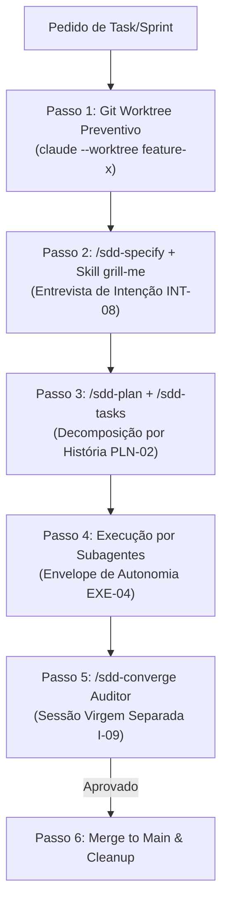

# 🚨 REGRA INVARIANTE ABSOLUTA: PIPELINE AUTOMÁTICO DE TASK (WORKTREE + SDD + GRILLING)

> **PRECEDÊNCIA MÁXIMA**: Esta regra SOBREPÕE qualquer outra instrução genérica ou pedido informal.
> **APLICAÇÃO AUTOMÁTICA**: Sempre que o usuário solicitar uma nova tarefa, feature, sprint, história, bugfix ou alteração que implique modificar código ou especificações, o agente DEVE EXECUTAR O PROTOCOLO DE 6 PASSOS ABAIXO AUTOMATICAMENTE.

---

## ⛔ INVARIANTE ZERO: ISOLAMENTO PREVENTIVO DE BRANCH (NUNCA NA MAIN)

* **É ESTRITAMENTE PROIBIDO** criar especificações (`specs/NNN-slug/`), alterar código ou rodar testes diretamente na branch principal (`main`/`master`).
* Todo e qualquer trabalho nasce em um **Git Worktree isolado** (`EXE-05`).

---

## 🔄 PROTOCOLO OBRIGATÓRIO DE 6 PASSOS



### Passo 1: Git Worktree Preventivo Automático (`EXE-05`)
Antes de criar qualquer arquivo de spec ou editar qualquer linha de código:
```bash
# Entrar obrigatoriamente num checkout isolado
claude --worktree <nome-da-feature>
```
*Garantia*: Todos os rascunhos de `specs/NNN-slug/` e edições de arquivo ficam contidos em `.claude/worktrees/`. A branch principal `main`/`master` permanece 100% virgem e limpa.

### Passo 2: Especificação & Entrevista Conduzida (`sdd-specify` + `grill-me` / `INT-08`)
Dentro do Worktree:
1. Executar o comando `/sdd-specify`.
2. Invocar obrigatoriamente a skill `grill-me` (`grilling`).
3. Entrevistar o usuário com perguntas diretas sobre casos de borda, restrições ocultas e comportamentos em falha.
4. Classificar qualquer ambiguidade de alto custo (schema de banco, contratos de API, segurança) como `[PRECISA ESCLARECER]` Bloqueante (`ADR-002`).

### Passo 3: Planejamento & Tasks por História (`sdd-plan` + `sdd-tasks` / `PLN-02`)
1. Executar `/sdd-plan` para definir a arquitetura técnica sem alterar a spec.
2. Executar `/sdd-tasks` para agrupar as tarefas **por História de Usuário** (US1 = MVP), nunca por camada técnica.
3. Executar `/sdd-analyze` para auditar a coerência entre os artefatos gerados.

### Passo 4: Execução com Subagentes (`CTX-03` / `EXE-04`)
1. Delegar a implementação de cada task para um subagente especializado (`Explore`, `Implementer` ou customizado).
2. Manter o subagente sob envelope de autonomia estrito.
3. Exigir retorno de evidência mínima (resumo dos testes passados), evitando poluição do contexto principal.

### Passo 5: Verificação Independente `/sdd-converge` (`AR-02` / `I-09`)
1. Iniciar uma **nova sessão limpa e virgem** (sem histórico do executor) com o comando `/sdd-converge`.
2. O agente auditor avalia se o código gerado no Worktree satisfaz 100% dos critérios da especificação.

### Passo 6: Merge & Cleanup
Somente após a aprovação expressa do relatório `/sdd-converge`:
```bash
git merge worktree-<nome-da-feature>
git worktree remove .claude/worktrees/<nome-da-feature>
```

---

## 📋 BLOCO COPIÁVEL PARA O SEU `AGENTS.md` / `CLAUDE.md` / AGENTE DE IA

Copie o trecho abaixo e cole no topo do arquivo de instruções do seu agente:

```markdown
## 🚨 REGRA INVARIANTE: PROTOCOLO AUTOMÁTICO DE TASK (WORKTREE + SDD + GRILLING)

SOBREPÕE QUALQUER OUTRA INSTRUÇÃO GENÉRICA. Toda mudança de código ou especificação DEVE seguir esta esteira:

1. **WORKTREE PRIMEIRO (EXE-05)**: Nunca edite arquivos nem crie specs na branch `main`. Crie e entre em um Worktree isolado (`claude --worktree <task>`) ANTES de qualquer ação.
2. **SPEC + GRILL-ME (INT-08)**: No Worktree, rode `/sdd-specify` e ative obrigatoriamente a entrevista `grill-me` para sanar ambiguidades com o usuário antes de planejar.
3. **PLAN & TASKS (PLN-02)**: Rode `/sdd-plan` e `/sdd-tasks` agrupando tarefas por História de Usuário.
4. **SUBAGENTES (CTX-03/EXE-04)**: Execute as tarefas via subagentes com contexto isolado e resumo curto.
5. **AUDITORIA INDEPENDENTE (I-09)**: Valide a entrega rodando `/sdd-converge` em uma sessão limpa virgem (Auditor ≠ Executor).
6. **MERGE**: Faça o merge para a branch principal e limpe o worktree apenas após aprovação no `/sdd-converge`.
```
